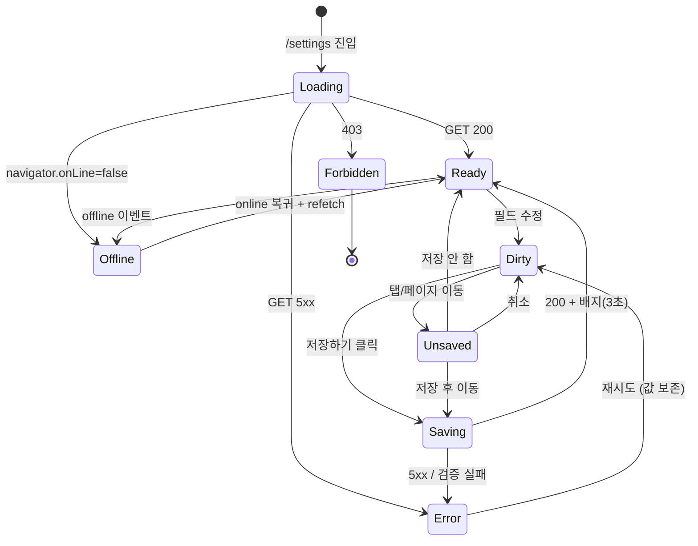

# SCR-080 센터 설정 — 기본화면 (마스터)

> 이 문서는 **화면 마스터 스펙**입니다. `01~07` 상태 문서는 이 문서를 상속(override/delta)합니다.
> 🚨 **설정 도메인 플래그십**: 센터 기본 정보/영업시간/알림/테마/물품을 4탭으로 관리. **owner 이상**만 접근 가능(공통.md §2.2).

---

## 0. 메타 & 원천 참조

| 항목 | 값 |
|------|----|
| 화면 ID | SCR-080 |
| 화면명 | 센터 설정 |
| 도메인 | D09-설정관리 |
| 경로 | `/settings` |
| Next.js Route Group | `(main)` |
| 파일 경로 | `src/app/(main)/settings/page.tsx` |
| 페이지 컴포넌트 | `SettingsPage` |
| 역할 | `superAdmin`, `primary`, `owner` (필수) / `manager` 이하 차단 |
| 우선순위 | P1 (운영 필수) |
| 플랫폼 | 데스크톱(우선) / 태블릿 / 모바일 |
| 멀티테넌트 | ✅ `branchId` 컨텍스트 강제 |

### 원천 문서 링크
| 문서 | 경로 | 섹션 |
|---|---|---|
| 화면설계서 | `docs/화면설계서/설정관리.md` | §SCR-080 센터 설정 |
| 기능명세서 | `docs/기능명세서/설정관리.md` | §1. 센터 설정 |
| 공통 UI 패턴 | `docs/화면설계서/공통.md` | §2.2 권한, §3 공통 UI, §4 다이얼로그 |
| 에러코드정의서 | `docs/에러코드정의서.md` | §공통(E401·E403·E500·E503), §설정(E900xxx) |
| 권한 매트릭스 | `docs/다이어그램/10_권한매트릭스/R1_역할화면_매트릭스.md` | `/settings` owner 이상 |
| 다이어그램 F1 진입 | `docs/다이어그램/D09_설정관리/SCR-080_센터설정/F1_진입.md` | 권한 체크 → 데이터 로드 |
| 다이어그램 F2 메인 | `docs/다이어그램/D09_설정관리/SCR-080_센터설정/F2_메인.md` | 탭 전환 / 편집 / 저장 |
| 다이어그램 F3 버튼액션 | `docs/다이어그램/D09_설정관리/SCR-080_센터설정/F3_버튼액션.md` | BTN_SAVE, BTN_ADDR_SEARCH, BTN_LOGO_UPLOAD |
| 다이어그램 F5 모달트리거 | `docs/다이어그램/D09_설정관리/SCR-080_센터설정/F5_모달트리거.md` | DLG-080-001 미저장 경고 |
| 다이어그램 F6 상태별 | `docs/다이어그램/D09_설정관리/SCR-080_센터설정/F6_상태별.md` | 로딩/정상/변경됨/저장중/에러/권한없음/오프라인 |
| 다이어그램 F7 권한 | `docs/다이어그램/D09_설정관리/SCR-080_센터설정/F7_권한.md` | owner/manager 분기 |
| 다이어그램 F8 에러 | `docs/다이어그램/D09_설정관리/SCR-080_센터설정/F8_에러.md` | 저장 실패, 네트워크 |

---

## 1. 화면 목적 (Why)

하나의 **지점**(`branchId`) 기본 설정을 한 화면에서 통합 관리하는 **운영 본부**.
- 4개 탭(기본정보/알림설정/테마설정/물품관리)으로 역할을 분리.
- 미저장 변경사항을 명확히 알리고, 탭 전환·이탈 시 경고로 데이터 손실을 방지.
- 저장 후에는 인라인 배지(3초)로 완료를 표시하여 사용자 피드백을 최소 지연으로 제공.
- 본사(super/primary)는 지점 선택 후 해당 지점 설정을 편집할 수 있다.

---

## 2. 화면 레이아웃 (Wireframe)

### 2.1 풀뷰 (데스크톱 1440px)

```
┌─────────────────────────────────────────────────────────────────────────┐
│ AppLayout                                                                │
│ ┌──Sidebar──┐ ┌──Main Content──────────────────────────────────────────┐│
│ │            │ │ ┌── PageHeader ────────────────────────────────────┐ ││
│ │  설정      │ │ │ 센터 설정                      [⚠ 저장되지 않음]  │ ││
│ │  > 센터설정 │ │ │ 지점: {branchName}              [✅ 저장 완료]    │ ││
│ │  > 권한설정 │ │ └───────────────────────────────────────────────────┘ ││
│ │  > 키오스크 │ │ ┌── TabBar (4탭, pill) ──────────────────────────┐ ││
│ │  > IoT     │ │ │ [ℹ️ 기본정보] [🔔 알림설정] [🎨 테마] [📦 물품] │ ││
│ │            │ │ └───────────────────────────────────────────────────┘ ││
│ │            │ │ ┌── TabPanel (활성 탭의 컨텐츠) ────────────────────┐ ││
│ │            │ │ │                                                   │ ││
│ │            │ │ │  (기본정보) 로고 + 센터명/사업자번호/연락처/주소 +│ ││
│ │            │ │ │   업종 체크박스(11종) + 평일/주말 영업시간        │ ││
│ │            │ │ │                                                   │ ││
│ │            │ │ │  (알림설정) 8항목 Toggle (푸시4 + 이메일2 + SMS2) │ ││
│ │            │ │ │                                                   │ ││
│ │            │ │ │  (테마설정) 모드 3버튼 + 주요색 + 강조색 + 폰트3  │ ││
│ │            │ │ │                                                   │ ││
│ │            │ │ │  (물품관리) 4종 × {재고, 일일제한, 잔여}          │ ││
│ │            │ │ │                                                   │ ││
│ │            │ │ └───────────────────────────────────────────────────┘ ││
│ │            │ │ ┌── Sticky Footer (저장 영역) ─────────────────────┐ ││
│ │            │ │ │                                 [취소]  [저장하기] │ ││
│ │            │ │ └───────────────────────────────────────────────────┘ ││
│ └────────────┘ └──────────────────────────────────────────────────────┘│
└─────────────────────────────────────────────────────────────────────────┘
```

### 2.2 영역/치수 표

| 영역 | 위치 | 치수 | 역할 |
|------|------|------|------|
| PageHeader | 상단 | `h-16`, padding `px-6 py-4` | 제목 + 상태 배지 |
| 상태 배지 | Header 우측 | `h-8 px-3 rounded-full` | 미저장/저장완료 인디케이터 |
| TabBar | Header 하단 | `h-12`, `border-b border-gray-200` | 4탭 pill, 활성 `bg-blue-50 text-blue-700` |
| TabPanel | 중앙 | `max-w-4xl`, `space-y-6`, `p-6 lg:p-8` | 폼 컨텐츠 |
| Form Field | TabPanel 내부 | `h-11 rounded-lg` | 인풋 표준 |
| Checkbox 그리드(업종) | 기본정보 | `grid grid-cols-2 md:grid-cols-4 gap-3` | 11종 |
| Toggle Row(알림) | 알림설정 | 각 `h-14 flex justify-between` | 항목 레이블 + 토글 |
| Color Picker | 테마 | `size-10 rounded-full` | 브랜드/강조 색 |
| Sticky Footer | 하단 고정 | `sticky bottom-0`, `h-16 bg-white border-t` | 저장/취소 |

---

## 3. 디자인 토큰

### 3.1 색상
| 역할 | 클래스 | Hex | 용도 |
|---|---|---|---|
| bg.page | `bg-gray-50` | #F9FAFB | 페이지 배경 |
| bg.card | `bg-white rounded-xl ring-1 ring-gray-100 shadow-sm` | — | 섹션 카드 |
| tab.active | `bg-blue-50 text-blue-700 ring-1 ring-blue-100` | — | 선택된 탭 |
| tab.inactive | `text-gray-600 hover:bg-gray-100` | — | 기본 탭 |
| badge.dirty.bg | `bg-amber-50 text-amber-800 ring-1 ring-amber-200` | — | ⚠ 미저장 |
| badge.saved.bg | `bg-emerald-50 text-emerald-700 ring-1 ring-emerald-200` | — | ✅ 저장완료 |
| input.default | `border-gray-300 focus:ring-2 focus:ring-blue-500 focus:border-blue-500` | — | 입력 기본 |
| input.error | `border-red-300 focus:ring-red-500` | — | 검증 실패 |
| btn.primary | `bg-blue-600 hover:bg-blue-700 active:bg-blue-800 disabled:bg-blue-400` | #2563EB | 저장 |
| btn.secondary | `bg-white text-gray-700 border border-gray-300 hover:bg-gray-50` | — | 취소/보조 |
| toggle.on | `bg-blue-600` | #2563EB | 토글 ON |
| toggle.off | `bg-gray-200` | #E5E7EB | 토글 OFF |
| color.swatch.ring | `ring-2 ring-offset-2 ring-gray-900` | — | 선택된 색상 표시 |

### 3.2 타이포그래피
| 토큰 | 스타일 | 용도 |
|---|---|---|
| page.title | `text-2xl font-bold tracking-tight text-gray-900` | "센터 설정" |
| page.subtitle | `text-sm text-gray-500` | 지점 경로 |
| section.title | `text-base font-semibold text-gray-900` | 탭 내 섹션 |
| field.label | `text-sm font-medium text-gray-700` | 필드 라벨 |
| field.help | `text-xs text-gray-500` | 보조 설명 |
| field.error | `text-sm text-red-600` | 검증 실패 |
| tab.label | `text-sm font-medium` | 탭 텍스트 |
| badge.dirty | `text-xs font-medium` | ⚠ 미저장 |
| badge.saved | `text-xs font-medium` | ✅ 저장완료 |

### 3.3 간격/반경/그림자
| 토큰 | 값 |
|---|---|
| card.radius | `rounded-xl` (12px) |
| input.radius | `rounded-lg` (8px) |
| card.padding | `p-6 lg:p-8` |
| field.gap | `space-y-4` |
| section.gap | `space-y-6` |
| footer.shadow | `shadow-[0_-1px_2px_rgba(0,0,0,0.04)]` |

### 3.4 모션
| 토큰 | 값 |
|---|---|
| tab.transition | `transition-colors duration-150` |
| badge.fadeIn | `animate-[fadeIn_150ms_ease-out]` |
| badge.saved.fadeOut | 3초 후 `opacity-0 transition-opacity duration-300` |
| form.save.pulse | `animate-pulse` (저장 중) |
| prefers-reduced-motion | 모든 transition 100ms로 축소 / animate-pulse 제거 |

---

## 4. 반응형 규칙

| BP | 폭 | TabBar | TabPanel | Footer | 업종 체크박스 |
|---|---|---|---|---|---|
| Mobile <640 | 100% | 가로 스크롤 (whitespace-nowrap) | `p-4`, `space-y-4` | sticky h-14 | 2열 |
| Tablet 640~1024 | 100% | 고정 4탭 | `p-6`, `max-w-2xl` | sticky h-16 | 3열 |
| Desktop ≥1024 | sidebar+main | 고정 4탭 | `p-8`, `max-w-4xl` | sticky h-16 | 4열 |
| XL ≥1440 | max container | 좌측 정렬 | `max-w-4xl` | — | 4열 |

모바일 키보드 오픈 시 Sticky Footer가 가려지지 않도록 `safe-area-inset-bottom` 적용.

---

## 5. 🔐 역할별(RBAC) 매트릭스

> `●` = 표시+수정, `○` = 표시만(읽기), `—` = 미표시/차단
> 접근 자체가 owner 이상만 가능. manager 이하는 `06-권한없음` 상태로 전환 또는 사이드바 항목 자체가 미노출.

| 요소 | superAdmin | primary | owner | manager | fc | trainer | staff | front |
|---|:---:|:---:|:---:|:---:|:---:|:---:|:---:|:---:|
| **페이지 접근** | ● | ● | ● | — | — | — | — | — |
| **지점 전환 드롭다운** | ●(전 지점) | ●(소속 브랜드) | —(본인 지점 고정) | — | — | — | — | — |
| **기본정보 탭** | ● | ● | ● | — | — | — | — | — |
| ─ 센터명/사업자번호 | ● | ● | ● | — | — | — | — | — |
| ─ 주소/연락처 | ● | ● | ● | — | — | — | — | — |
| ─ 업종(11종) | ● | ● | ● | — | — | — | — | — |
| ─ 영업시간 | ● | ● | ● | — | — | — | — | — |
| ─ 로고 업로드 | ● | ● | ● | — | — | — | — | — |
| **알림설정 탭** | ● | ● | ● | — | — | — | — | — |
| **테마설정 탭** | ● | ● | ● | — | — | — | — | — |
| **물품관리 탭** | ● | ● | ● | — | — | — | — | — |
| **저장 버튼** | ● | ● | ● | — | — | — | — | — |
| **취소 버튼** | ● | ● | ● | — | — | — | — | — |

권한 규칙:
1. `manager` 이하가 URL로 `/settings` 진입 → 서버 403 → `06-권한없음` 전용 렌더
2. 사이드바 메뉴도 owner 이상에게만 노출
3. 감사로그: `AUDIT.SETTINGS_UPDATE`(key별 before/after) 기록

---

## 6. 컴포넌트 트리

```
<AppLayout role={user.role}>
  <Sidebar menu={settingsMenu} />
  <MainContent>
    <PageHeader title="센터 설정" subtitle={`지점: ${branchName}`}>
      {canSwitchBranch(role) && <BranchSwitcher value={branchId} onChange={switchBranch} />}
      <DirtyBadge visible={isDirty && !saveSuccess} />
      <SavedBadge visible={saveSuccess} />
    </PageHeader>

    <TabBar value={activeTab} onChange={tryChangeTab} items={TABS} />

    <TabPanel role="tabpanel" aria-labelledby={`tab-${activeTab}`}>
      {activeTab === 'basic'        && <BasicInfoTab        form={form} />}
      {activeTab === 'notification' && <NotificationTab     form={form} />}
      {activeTab === 'theme'        && <ThemeTab            form={form} />}
      {activeTab === 'supplies'     && <SuppliesTab         form={form} />}
    </TabPanel>

    <StickyFooter>
      <Button variant="secondary" onClick={resetForm} disabled={!isDirty}>취소</Button>
      <Button variant="primary"
              onClick={handleSave}
              loading={isSaving}
              disabled={!isDirty || isSaving}>
        {isSaving ? '저장 중...' : '저장하기'}
      </Button>
    </StickyFooter>

    <UnsavedDialog open={showUnsavedDialog}
                   onCancel={...} onSaveThenMove={...} onDiscard={...} />
  </MainContent>
</AppLayout>
```

### 6.1 핵심 컴포넌트
| 컴포넌트 | 파일 | 핵심 Props |
|---|---|---|
| `PageHeader` | `src/components/layout/PageHeader.tsx` | `{title, subtitle, children}` |
| `DirtyBadge` / `SavedBadge` | `src/components/settings/StatusBadge.tsx` | `{visible}` |
| `TabBar` | `src/components/ui/TabBar.tsx` | `{value, items, onChange}` |
| `BasicInfoTab` | `src/components/settings/BasicInfoTab.tsx` | `{form}` |
| `NotificationTab` | `src/components/settings/NotificationTab.tsx` | `{form}` |
| `ThemeTab` | `src/components/settings/ThemeTab.tsx` | `{form}` |
| `SuppliesTab` | `src/components/settings/SuppliesTab.tsx` | `{form}` |
| `LogoUploader` | `src/components/ui/LogoUploader.tsx` | `{value, onChange, maxSize=5MB}` |
| `AddressSearchInput` | `src/components/ui/AddressSearchInput.tsx` | `{value, onChange}` (Daum 우편번호 연동) |
| `SectorCheckboxGroup` | `src/components/settings/SectorCheckboxGroup.tsx` | `{value, onChange, options}` |
| `TimeRangeInput` | `src/components/ui/TimeRangeInput.tsx` | `{from, to, onChange}` |
| `ToggleSwitch` | `src/components/ui/ToggleSwitch.tsx` | `{checked, onChange, disabled}` |
| `ColorPicker` | `src/components/ui/ColorPicker.tsx` | `{value, onChange, presets}` |
| `UnsavedDialog` | `src/components/settings/UnsavedDialog.tsx` | `{open, onCancel, onSaveThenMove, onDiscard}` |
| `StickyFooter` | `src/components/layout/StickyFooter.tsx` | `{children}` |

---

## 7. 데이터 계약

### 7.1 폼 스키마 (Zod)
```ts
// src/schemas/settings.ts
export const settingsSchema = z.object({
  branchId: z.number(),
  // 기본정보
  centerName: z.string().min(1, '센터명을 입력하세요').max(50),
  businessNumber: z.string().regex(/^\d{3}-\d{2}-\d{5}$/).optional().or(z.literal('')),
  description: z.string().max(500).optional(),
  phone: z.string().regex(/^[0-9-]+$/).optional(),
  address: z.string().optional(),
  addressDetail: z.string().optional(),
  logoUrl: z.string().url().optional().or(z.literal('')),
  sectors: z.array(z.enum([
    '헬스','필라테스','PT샵','골프','요가','태권도','크로스핏','복싱','수영','사우나','기타'
  ])).min(1, '최소 1개 업종을 선택하세요'),
  businessHoursOpen:  z.string().regex(/^\d{2}:\d{2}$/).default('06:00'),
  businessHoursClose: z.string().regex(/^\d{2}:\d{2}$/).default('23:00'),
  weekendOpen:        z.string().regex(/^\d{2}:\d{2}$/).default('08:00'),
  weekendClose:       z.string().regex(/^\d{2}:\d{2}$/).default('22:00'),
  // 알림설정
  pushEntrance:       z.boolean().default(false),
  pushExpiry:         z.boolean().default(false),
  pushPayment:        z.boolean().default(false),
  pushReservation:    z.boolean().default(false),
  emailWeeklyReport:  z.boolean().default(false),
  emailExpiry:        z.boolean().default(false),
  smsPayment:         z.boolean().default(false),
  smsExpiry:          z.boolean().default(false),
  expireNoticeDays:   z.number().int().min(1).max(60).default(7),
  // 테마
  theme: z.object({
    mode: z.enum(['light','dark','system']).default('light'),
    primaryColor: z.string().regex(/^#[0-9A-F]{6}$/i).default('#3B82F6'),
    accentColor:  z.string().regex(/^#[0-9A-F]{6}$/i).default('#10B981'),
    fontSize: z.enum(['sm','md','lg']).default('md'),
  }),
  // 물품
  supplies: z.object({
    towelLarge:    z.object({ stock: z.number().int().min(0), dailyLimit: z.number().int().min(0), remaining: z.number().int().min(0) }),
    towelSmall:    z.object({ stock: z.number().int().min(0), dailyLimit: z.number().int().min(0), remaining: z.number().int().min(0) }),
    uniformTop:    z.object({ stock: z.number().int().min(0), dailyLimit: z.number().int().min(0), remaining: z.number().int().min(0) }),
    uniformBottom: z.object({ stock: z.number().int().min(0), dailyLimit: z.number().int().min(0), remaining: z.number().int().min(0) }),
  }),
});
export type SettingsForm = z.infer<typeof settingsSchema>;
```

### 7.2 API 엔드포인트
| 엔드포인트 | 메서드 | 파라미터 | 반환 | 권한 |
|---|---|---|---|---|
| `/settings/:branchId` | GET | `branchId` | `SettingsForm` | owner 이상 |
| `/settings/:branchId` | PATCH | `{ ...changedFields }` (dirty fields only) | `SettingsForm` | owner 이상 |
| `/settings/:branchId/logo` | POST (multipart) | `file` | `{url:string}` | owner 이상 |
| `/branches/:id` | GET | `id` | `{id,name,address,...}` | 모든 접근 역할 |

### 7.3 상태 관리
- **Store**: `useAuthStore`(user/role/branchId)
- **Fetching**: React Query `useQuery(['settings', branchId])`, `useMutation` for PATCH
- **Form**: `react-hook-form` + `zodResolver(settingsSchema)` + `useFieldArray`(업종)
- **Dirty 감지**: `formState.isDirty` (RHF)
- **Local**: `activeTab`, `saveSuccess`(3초 타이머), `showUnsavedDialog`, `pendingTab`
- **Cache**: `staleTime: 5*60_000`, `refetchOnWindowFocus: false` (설정은 자주 변하지 않음)

---

## 8. 비즈니스 룰

1. **진입 권한**: `owner/primary/super` 이외 역할은 서버에서 403 → `06-권한없음` 전용.
2. **지점 컨텍스트**: super/primary는 BranchSwitcher로 지점 교체 시 현재 폼이 dirty이면 `DLG-080-001` 경고.
3. **탭 전환 가드**: 현재 폼 dirty + 다른 탭 클릭 시 `DLG-080-001` 표시 → [취소][저장후이동][저장안함] 분기.
4. **브라우저 이탈 가드**: dirty 상태에서 `beforeunload` 리스너로 네이티브 경고.
5. **저장 동작**: 변경된 필드만 PATCH (diff 기반). 성공 시 `saveSuccess=true` → 3초 뒤 자동 해제 + `isDirty=false`.
6. **센터명 필수**: 최소 1자, 최대 50자. 공백만 입력 불가(trim).
7. **사업자번호 검증**: `XXX-XX-XXXXX` 형식. 빈값 허용. 형식 오류 시 필드 인라인 에러.
8. **업종 다중 선택**: 최소 1개 필수 (0개 저장 불가).
9. **영업시간**: open < close. 자정 넘김(24시 운영)은 `closeTime >= openTime` 이면서 closeTime = "24:00" 허용.
10. **로고 업로드**: 최대 5MB, PNG/JPG/WebP. 권장 200×60 (키오스크와 공유).
11. **알림 설정**: 전체 OFF 허용. SMS 활성화 시 크레딧 확인 알림 표시(사용량 경고는 SCR-084와 연계).
12. **테마 즉시 반영**: `mode`는 `<html class="dark">` 즉시 적용(저장 전 프리뷰). 저장 실패 시 이전 값 복원.
13. **물품 제약**: `remaining <= stock`, `dailyLimit <= stock`. 클라/서버 양쪽 검증.
14. **부분 저장**: 한 탭 저장 실패 시 다른 탭 변경분은 유지 (탭별 독립 mutation).
15. **감사로그**: 저장 성공 시 변경된 key별 `AUDIT.SETTINGS_UPDATE`(before/after) 기록.
16. **인라인 배지**: 토스트 대신 PageHeader 우측에 배지. 저장 완료 배지는 3초 후 자동 소멸.
17. **i18n**: ko-KR 기본 (다국어는 SCR-088 별도 화면).

---

## 9. 상태 목록

| 파일 | 상태 코드 | 한글 | 트리거 |
|---|---|---|---|
| `01-로딩.md` | `settings-loading` | 로딩(스켈레톤) | 진입 직후, GET pending |
| `02-정상.md` | `settings-ready` | 정상 (저장된 상태) | 데이터 로드 완료, isDirty=false |
| `03-변경됨.md` | `settings-dirty` | 변경됨 (저장 대기) | 사용자가 필드 수정 → isDirty=true |
| `04-저장중.md` | `settings-saving` | 저장 중 | 저장하기 클릭 → PATCH pending |
| `05-에러.md` | `settings-error` | 저장 실패 / 로드 실패 | 500/네트워크/검증 실패 |
| `06-권한없음.md` | `settings-forbidden` | 403 / 접근 권한 없음 | manager 이하 진입 시도 |
| `07-오프라인.md` | `settings-offline` | 오프라인 | navigator.onLine=false |

상태 전이 그래프: `docs/다이어그램/D09_설정관리/SCR-080_센터설정/F6_상태별.md`.

---

## 10. 에러 코드 매핑

| errorCode | HTTP | 시나리오 | 표시 | 대응 |
|---|---|---|---|---|
| E401001 | 401 | 세션 만료 | 전역 인터셉터 → `/login?redirect=/settings` | 자동 |
| E403001 | 403 | 권한 없음 | `06-권한없음` 전용 | 홈 이동 버튼 |
| E900001 | 400 | 센터명 누락 | 필드 인라인 에러 | 필드 포커스 |
| E900002 | 400 | 사업자번호 형식 오류 | 필드 인라인 에러 | — |
| E900003 | 400 | 업종 0개 | 업종 섹션 헤더 하단 에러 | — |
| E900004 | 400 | 영업시간 순서 오류 | TimeRange 하단 에러 | — |
| E900005 | 413 | 로고 파일 용량 초과 | LogoUploader 에러 | 파일 교체 |
| E900006 | 415 | 로고 파일 타입 불가 | LogoUploader 에러 | 파일 교체 |
| E900007 | 409 | 설정 충돌(다른 관리자 동시 수정) | 상단 에러 배너 + 재로드 버튼 | refetch |
| E500001 | 500 | 서버 오류 | 에러 배너 + 재시도 | 재시도 |
| E503001 | 503 | 점검 중 | 에러 배너(warn 톤) + 홈 이동 | — |
| NETWORK | — | 오프라인 | `07-오프라인` | 재연결 대기 |

---

## 11. 접근성 (WCAG 2.1 AA)

| 항목 | 요구사항 |
|---|---|
| 탭 패턴 | `role="tablist"` + `role="tab"` (각 탭) + `aria-selected` + `role="tabpanel"` + 키보드 Arrow/Home/End |
| 폼 라벨 | 모든 Input/Toggle/ColorPicker에 `<label htmlFor>` 또는 `aria-label` |
| 토글 | `role="switch"` + `aria-checked` + Space/Enter 토글 |
| 상태 배지 | `role="status"` + `aria-live="polite"` (저장완료 공지) |
| 미저장 경고 | dialog `role="alertdialog"` + `aria-describedby` + Tab 트랩 + Esc 취소 |
| 색 선택기 | 색상 샘플에 hex 텍스트 병기(색만으로 식별 금지). `aria-pressed` |
| 포커스 링 | `focus-visible:ring-2 focus-visible:ring-blue-500 ring-offset-2` |
| 대비비율 | 본문 4.5:1, 버튼 4.5:1 |
| 스크린리더 | 저장 성공 시 "변경사항이 저장되었습니다" 공지 |
| 모션 감소 | `prefers-reduced-motion`: 탭 전환 transition 100ms 이하, animate-pulse 제거 |
| 한국어 | 전 UI ko-KR. 폰트 크기 토큰: sm=14, md=16, lg=18 |

---

## 12. 진입 / 이탈

### 진입
- 사이드바 "설정 > 센터 설정" 클릭 (owner 이상)
- 직접 URL `/settings` 입력
- 대시보드 "센터 설정으로" 배너(신규 지점 온보딩) 클릭
- 로그인 후 첫 주(7일) 동안 상단 배너 유도(owner 한정)

### 이탈
| 액션 | 목적지 | 가드 |
|---|---|---|
| 사이드바 다른 메뉴 | 해당 페이지 | dirty 시 `DLG-080-001` |
| 다른 탭 클릭 | 해당 탭 | dirty 시 `DLG-080-001` |
| BranchSwitcher | 다른 지점 설정 | dirty 시 `DLG-080-001` |
| 뒤로가기 | 이전 페이지 | `beforeunload` 네이티브 경고 |
| 저장하기 성공 | 현재 화면 유지(배지) | — |
| 취소 버튼 | 원본 값으로 복원 (페이지 유지) | dirty=false |

---

## 13. 다이어그램 통합 뷰



---

## 14. 🧩 바이브코딩 프롬프트 (마스터)

```
Next.js 15 App Router + TypeScript + Tailwind + Supabase + React Query + react-hook-form + zod 기반
'use client' 컴포넌트를 작성하라.

━━ 화면: SCR-080 센터 설정 (마스터) ━━
파일: src/app/(main)/settings/page.tsx
보조:
- src/components/settings/{BasicInfoTab, NotificationTab, ThemeTab, SuppliesTab, UnsavedDialog, StatusBadge}.tsx
- src/components/ui/{TabBar, LogoUploader, AddressSearchInput, TimeRangeInput, ToggleSwitch, ColorPicker}.tsx
- src/components/layout/{PageHeader, StickyFooter, BranchSwitcher}.tsx
- src/schemas/settings.ts (settingsSchema + SettingsForm 타입)
- src/hooks/useSettings.ts (useQuery + useMutation)
- src/lib/role-access.ts (canAccessSettings)

━━ 권한 게이트 ━━
- 진입 시 useAuthStore().role 확인. ['superAdmin','primary','owner'] 아니면 06-권한없음 렌더.
- super/primary에게만 BranchSwitcher 노출.
- 서버는 jwt role/branchId로 스코프 강제.

━━ 레이아웃 ━━
<main className="min-h-screen bg-gray-50">
  <AppLayout role={user.role}>
    <div className="flex flex-col min-h-screen">
      <PageHeader title="센터 설정" subtitle={`지점: ${branchName}`}>
        {canSwitchBranch(role) && <BranchSwitcher value={branchId} onChange={switchBranch} />}
        {isDirty && !saveSuccess && <DirtyBadge />}
        {saveSuccess && <SavedBadge />}
      </PageHeader>

      <nav role="tablist" aria-label="센터 설정 탭"
           className="flex gap-1 border-b border-gray-200 px-6 lg:px-8">
        {TABS.map(t => (
          <button key={t.key}
            role="tab"
            id={`tab-${t.key}`}
            aria-selected={activeTab === t.key}
            aria-controls={`panel-${t.key}`}
            onClick={() => tryChangeTab(t.key)}
            className={cn(
              'h-12 px-4 text-sm font-medium rounded-t-lg transition-colors duration-150',
              activeTab === t.key
                ? 'bg-blue-50 text-blue-700 ring-1 ring-blue-100'
                : 'text-gray-600 hover:bg-gray-100'
            )}>
            <t.Icon className="inline size-4 mr-1" />
            {t.label}
          </button>
        ))}
      </nav>

      <div role="tabpanel" id={`panel-${activeTab}`} aria-labelledby={`tab-${activeTab}`}
           className="flex-1 max-w-4xl mx-auto w-full p-6 lg:p-8 space-y-6">
        {activeTab === 'basic'        && <BasicInfoTab        form={form} />}
        {activeTab === 'notification' && <NotificationTab     form={form} />}
        {activeTab === 'theme'        && <ThemeTab            form={form} />}
        {activeTab === 'supplies'     && <SuppliesTab         form={form} />}
      </div>

      <div className="sticky bottom-0 bg-white border-t border-gray-200 shadow-[0_-1px_2px_rgba(0,0,0,0.04)]">
        <div className="max-w-4xl mx-auto w-full p-4 flex justify-end gap-2">
          <button type="button"
                  onClick={resetForm}
                  disabled={!isDirty || isSaving}
                  className="h-10 px-4 rounded-lg border border-gray-300 bg-white text-gray-700 hover:bg-gray-50 disabled:opacity-50">
            취소
          </button>
          <button type="button"
                  onClick={handleSave}
                  disabled={!isDirty || isSaving}
                  className={cn(
                    'h-10 px-5 rounded-lg text-white font-medium transition-colors duration-150',
                    'bg-blue-600 hover:bg-blue-700 active:bg-blue-800',
                    'disabled:bg-blue-400 disabled:cursor-not-allowed',
                    isSaving && 'animate-pulse'
                  )}>
            {isSaving ? '저장 중...' : '저장하기'}
          </button>
        </div>
      </div>
    </div>

    <UnsavedDialog open={showUnsavedDialog}
                   onCancel={cancelNavigation}
                   onSaveThenMove={saveAndMove}
                   onDiscard={discardAndMove} />
  </AppLayout>
</main>

━━ TABS 상수 ━━
const TABS = [
  { key: 'basic',        label: '기본정보', Icon: Info },
  { key: 'notification', label: '알림설정', Icon: Bell },
  { key: 'theme',        label: '테마설정', Icon: Palette },
  { key: 'supplies',     label: '물품 관리', Icon: Package },
] as const;

━━ 폼 & 쿼리 ━━
const { data, isLoading, isError } = useQuery(['settings', branchId], () => fetchSettings(branchId));
const mutation = useMutation((dto: Partial<SettingsForm>) => patchSettings(branchId, dto));
const form = useForm<SettingsForm>({
  resolver: zodResolver(settingsSchema),
  defaultValues: data,
  values: data, // React Query 갱신 시 폼 동기화
});
const isDirty = form.formState.isDirty;
const handleSave = form.handleSubmit(async (vals) => {
  const diff = pickDirty(vals, form.formState.dirtyFields);
  await mutation.mutateAsync(diff);
  form.reset(vals); // isDirty=false
  setSaveSuccess(true);
  setTimeout(() => setSaveSuccess(false), 3000);
});

━━ 탭 전환 가드 ━━
function tryChangeTab(next) {
  if (isDirty) {
    setPendingTab(next);
    setShowUnsavedDialog(true);
  } else {
    setActiveTab(next);
  }
}
function saveAndMove()     { handleSave().then(()=>{setActiveTab(pendingTab); setShowUnsavedDialog(false);}); }
function discardAndMove()  { form.reset(data); setActiveTab(pendingTab); setShowUnsavedDialog(false); }
function cancelNavigation(){ setShowUnsavedDialog(false); setPendingTab(null); }

━━ beforeunload ━━
useEffect(() => {
  const handler = (e: BeforeUnloadEvent) => {
    if (isDirty) { e.preventDefault(); e.returnValue = ''; }
  };
  window.addEventListener('beforeunload', handler);
  return () => window.removeEventListener('beforeunload', handler);
}, [isDirty]);

━━ 디자인 토큰 (정확히 적용) ━━
bg.page: bg-gray-50
card: bg-white rounded-xl ring-1 ring-gray-100 shadow-sm p-6 lg:p-8
tab.active: bg-blue-50 text-blue-700 ring-1 ring-blue-100
tab.inactive: text-gray-600 hover:bg-gray-100
badge.dirty: inline-flex items-center gap-1 h-8 px-3 rounded-full text-xs font-medium bg-amber-50 text-amber-800 ring-1 ring-amber-200
badge.saved: inline-flex items-center gap-1 h-8 px-3 rounded-full text-xs font-medium bg-emerald-50 text-emerald-700 ring-1 ring-emerald-200
input: h-11 w-full rounded-lg border border-gray-300 bg-white px-3 text-sm text-gray-900 focus:outline-none focus:ring-2 focus:ring-blue-500 focus:border-blue-500 transition-colors duration-150
input.error: border-red-300 focus:ring-red-500 focus:border-red-500
btn.primary: h-10 px-5 rounded-lg bg-blue-600 hover:bg-blue-700 active:bg-blue-800 text-white font-medium disabled:bg-blue-400 disabled:cursor-not-allowed focus-visible:ring-2 focus-visible:ring-blue-500 focus-visible:ring-offset-2
btn.secondary: h-10 px-4 rounded-lg border border-gray-300 bg-white text-gray-700 hover:bg-gray-50 disabled:opacity-50

━━ 접근성 ━━
- 탭: role=tablist / role=tab / aria-selected / aria-controls / Arrow/Home/End 키 지원
- 토글: role=switch / aria-checked / Space/Enter
- 상태 배지: role=status / aria-live=polite
- 미저장 다이얼로그: role=alertdialog / aria-describedby / focus trap / Esc=취소
- 색 선택: aria-label="{name} 색상 #{hex}"
- 포커스 링: focus-visible:ring-2 ring-blue-500 ring-offset-2
- prefers-reduced-motion: transition-duration 축소

━━ 반응형 ━━
모바일: TabBar 가로 스크롤, Panel p-4, StickyFooter h-14 + safe-area-inset-bottom
태블릿: Panel p-6 max-w-2xl
데스크톱: Panel p-8 max-w-4xl
업종 체크박스: grid-cols-2 md:grid-cols-3 lg:grid-cols-4

━━ 유틸 / 의존 ━━
import { useForm } from 'react-hook-form'
import { zodResolver } from '@hookform/resolvers/zod'
import { settingsSchema, type SettingsForm } from '@/schemas/settings'
import { useSettings } from '@/hooks/useSettings'
import { useAuthStore } from '@/stores/authStore'
import { cn } from '@/lib/utils'
import { Info, Bell, Palette, Package, AlertTriangle, CheckCircle2, Loader2 } from 'lucide-react'

━━ QA 체크 ━━
- owner 이상만 /settings 접근
- manager 이하는 06-권한없음 렌더
- 탭 간 이동 시 dirty 가드
- BranchSwitcher 이동 시 dirty 가드
- 저장 성공 시 3초 배지 자동 해제
- 사업자번호 형식 자동 검증
- 업종 최소 1개
- 영업시간 순서 검증
- 로고 5MB 제한 + PNG/JPG/WebP만
- beforeunload 네이티브 경고
- navigator.onLine=false → 07-오프라인
- 키보드만으로 모든 탭/필드/저장 가능
```

---

## 15. QA 체크리스트 (수용 기준)

- [ ] owner 이상만 /settings 접근 가능 (manager 이하 → 06-권한없음)
- [ ] 4탭 모두 올바른 필드/검증 표시
- [ ] 필드 수정 시 즉시 ⚠ 미저장 배지 표시
- [ ] 저장 성공 시 ✅ 저장완료 배지 3초 후 자동 해제
- [ ] 탭 전환 가드: dirty 시 DLG-080-001 표시
- [ ] "저장 후 이동" 성공 시 저장 실행 → 다음 탭으로
- [ ] "저장 안 함" 클릭 시 원본 값 복원 → 다음 탭으로
- [ ] 브라우저 탭 닫기 시 beforeunload 경고
- [ ] 센터명 빈값 제출 → 필드 인라인 에러
- [ ] 사업자번호 형식 오류 → 인라인 에러
- [ ] 업종 0개 → 업종 섹션 에러
- [ ] 로고 5MB 초과 → 에러 + 업로드 취소
- [ ] 영업시간 open ≥ close (24:00 제외) → 에러
- [ ] 저장 실패(500) → 에러 배너 + 폼 값 유지 + 재시도 가능
- [ ] 오프라인 감지 시 07-오프라인 + 캐시 fallback
- [ ] super/primary만 BranchSwitcher 노출
- [ ] 지점 전환 시 dirty 가드
- [ ] 키보드 탭 전환 가능 (Arrow 키)
- [ ] 스크린리더: 저장 완료 배지 공지
- [ ] prefers-reduced-motion 준수
