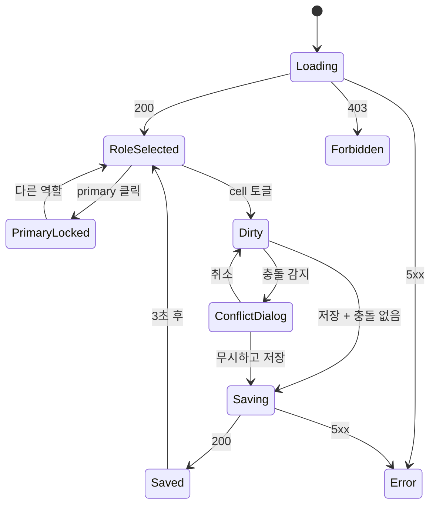

# SCR-081 권한 설정 — 기본화면 (마스터)

> 이 문서는 **화면 마스터 스펙**입니다. `01~07` 상태 문서는 이 문서를 상속합니다.
> 🚨 **핵심**: 8역할 × 22메뉴 × 5권한 매트릭스. **owner 이상**만 편집 가능. 최고관리자(primary)는 수정 불가.

---

## 0. 메타 & 원천 참조

| 항목 | 값 |
|---|---|
| 화면 ID | SCR-081 |
| 화면명 | 권한 설정 |
| 도메인 | D09-설정관리 |
| 경로 | `/settings/permissions` |
| 파일 | `src/app/(main)/settings/permissions/page.tsx` |
| 페이지 컴포넌트 | `PermissionsPage` |
| 역할 | `superAdmin`, `primary`, `owner` |
| 우선순위 | P1 |

### 원천
| 문서 | 경로 | 섹션 |
|---|---|---|
| 화면설계서 | `docs/화면설계서/설정관리.md` | §SCR-081 |
| 기능명세서 | `docs/기능명세서/설정관리.md` | §2 권한 설정 |
| 권한매트릭스 | `docs/다이어그램/10_권한매트릭스/R1_역할화면_매트릭스.md` | 전 역할 |
| 권한위계 | `docs/다이어그램/10_권한매트릭스/R8_권한위계.md` | 역할 위계 |
| 에러코드 | `docs/에러코드정의서.md` | §권한 E901xxx |

---

## 1. 화면 목적

8개 시스템 역할(+ 커스텀 역할) × 22개 메뉴 × 5권한(access/read/create/update/delete) 매트릭스를 시각적으로 편집. 충돌 규칙을 자동 검증. primary(최고관리자)는 수정 불가(읽기 전용).

---

## 2. 레이아웃

```
┌─────────────────────────────────────────────────────────────────┐
│ [Header] 권한 설정   [⚠ 저장되지 않음] [초기화] [저장]            │
├──────────┬──────────────────────────────────────────────────────┤
│ 역할 목록 │  [역할명] 편집                                        │
│(좌 260px) │  [모두 허용] [모두 거부]                              │
│ ┌──────┐ │  ┌─────┬────┬────┬────┬────┬────┐                   │
│ │최고관리│ │  │메뉴  │접근 │조회 │생성 │수정 │삭제 │                   │
│ │센터장 │ │  ├─────┼────┼────┼────┼────┼────┤                   │
│ │매니저 │ │  │회원  │ ✓  │ ✓  │ ✓  │ ✓  │ ✓  │                   │
│ │FC    │ │  │매출  │ ✓  │ ✓  │ —  │ —  │ —  │                   │
│ │트레이너│ │  │…     │                           │                   │
│ │스태프 │ │  └─────┴────┴────┴────┴────┴────┘                   │
│ │프론트 │ │                                                      │
│ │조회전용│ │  [충돌 경고 영역]                                    │
│ │ + 커스텀│ │                                                      │
│ │[+추가]│ │  배정된 직원: 홍길동, 김철수 (N명)                    │
│ └──────┘ │                                                      │
└──────────┴──────────────────────────────────────────────────────┘
```

### 2.2 영역 표
| 영역 | 치수 | 역할 |
|---|---|---|
| 좌 역할 패널 | `w-60 border-r` | 역할 목록 + 추가 |
| 매트릭스 | `flex-1 overflow-x-auto` | 테이블형 권한 편집 |
| 충돌 영역 | `mt-4 rounded-lg bg-amber-50` | 실시간 검증 메시지 |
| 배정 직원 | `mt-2 text-xs text-gray-500` | userCount + 이름 |

---

## 3. 디자인 토큰

| 토큰 | 값 | 용도 |
|---|---|---|
| bg.page | `bg-gray-50` | 배경 |
| panel.role.active | `bg-blue-50 text-blue-700 ring-1 ring-blue-100` | 선택된 역할 |
| panel.role.system | `bg-gray-50` 좌측 `border-l-2 border-gray-400` | 시스템 역할 |
| panel.role.custom | `bg-white` 좌측 `border-l-2 border-purple-400` | 커스텀 역할 |
| cell.on | `bg-blue-50 text-blue-700` + `<Check>` | 권한 ON |
| cell.off | `bg-white text-gray-300` + `<X>` | 권한 OFF |
| cell.dirty | `ring-2 ring-amber-500 bg-amber-50` | 변경됨 |
| cell.locked | `bg-gray-100 cursor-not-allowed` | primary 고정 |
| conflict | `bg-amber-50 text-amber-800 border-amber-200` | 충돌 경고 |
| btn.allow | `bg-emerald-50 text-emerald-700` | 모두 허용 |
| btn.deny | `bg-rose-50 text-rose-700` | 모두 거부 |

---

## 4. 반응형

| BP | 역할 패널 | 매트릭스 |
|---|---|---|
| <768 | 상단 탭(가로) | 1열 스크롤 |
| 768-1024 | 사이드 220px | 컬럼 축약 |
| ≥1024 | 사이드 260px | 전체 |

---

## 5. 🔐 역할별(RBAC) 매트릭스

> 이 화면 자체에 대한 접근 권한. 매트릭스 내부의 8역할과는 다른 차원.

| 요소 | superAdmin | primary | owner | manager | 그 외 |
|---|:---:|:---:|:---:|:---:|:---:|
| 페이지 접근 | ● | ● | ● | — | — |
| 시스템 역할 편집 | ● | ●(단 primary 자체 ×) | ● | — | — |
| 커스텀 역할 편집/삭제 | ● | ● | ● | — | — |
| 역할 생성 | ● | ● | ● | — | — |
| 역할 삭제 | ●(커스텀만) | ●(커스텀만) | ●(커스텀만) | — | — |
| 최고관리자(primary) 행 | ○(읽기) | ○(자기자신) | ○ | — | — |

규칙:
1. 최고관리자(`primary`)의 권한은 모두 `true`로 고정, 변경 불가
2. 시스템 역할 7개(primary/owner/manager/fc/trainer/staff/readonly)는 삭제 불가
3. 커스텀 역할 삭제 시 배정 직원 있으면 DLG-087-001 재배정 다이얼로그 필수
4. 역할 위계: owner는 manager 이하 역할만 생성/편집 가능 (본인보다 높은 역할 생성 금지)

---

## 6. 컴포넌트 트리

```
<AppLayout role={user.role}>
  <PageHeader title="권한 설정">
    <DirtyBadge visible={isDirty} />
    <Button variant="secondary" onClick={() => openDialog('init')}>초기화</Button>
    <Button variant="primary" onClick={handleSave} disabled={!isDirty}>변경 사항 저장</Button>
  </PageHeader>

  <div className="flex min-h-[calc(100vh-96px)]">
    <aside className="w-60 border-r bg-white">
      <RoleList roles={roles}
                selected={selectedRoleId}
                onSelect={setSelectedRoleId}
                onAddRole={() => openDialog('create')} />
    </aside>

    <main className="flex-1 p-6 space-y-4">
      <div className="flex items-center justify-between">
        <h2>{selectedRole.name} {selectedRole.isSystem && <SystemBadge />}</h2>
        <div className="flex gap-2">
          <Button variant="ghost" onClick={allowAll}>모두 허용</Button>
          <Button variant="ghost" onClick={denyAll}>모두 거부</Button>
          {selectedRole.isSystem === false && (
            <>
              <Button onClick={() => openDialog('copy')}>복사</Button>
              <Button variant="danger" onClick={() => openDialog('delete')}>삭제</Button>
            </>
          )}
        </div>
      </div>

      <PermissionMatrix
        groups={MENU_GROUPS}
        permissions={draft[selectedRoleCode]}
        onToggle={togglePermission}
        locked={selectedRole.code === 'primary'}
        dirtyCells={dirtyCells}
      />

      {conflicts.length > 0 && (
        <ConflictList items={conflicts} />
      )}

      <AssignedUsers role={selectedRole} users={assignedUsers} />
    </main>
  </div>

  <PermissionInitDialog  open={dialog === 'init'}   ... />   {/* DLG-081-001 */}
  <ConflictWarnDialog    open={dialog === 'conflict'} ... /> {/* DLG-081-002 */}
  <RoleCreateDialog      open={dialog === 'create'} ... />   {/* DLG-081-003 */}
  <RoleDeleteDialog      open={dialog === 'delete'} ... />   {/* DLG-081-004 */}
  <RoleCopyDialog        open={dialog === 'copy'}   ... />   {/* DLG-081-005 */}
</AppLayout>
```

---

## 7. 데이터 계약

```ts
type PermissionAction = 'access'|'read'|'create'|'update'|'delete';
interface RolePermission {
  branchId: number;
  roleCode: string;
  menuId: string;          // "{group}-{menu}" e.g. "members-list"
  access: boolean;
  read:   boolean;
  create: boolean;
  update: boolean;
  delete: boolean;
}
interface Role {
  id: number;
  code: string;             // primary | owner | manager | fc | trainer | staff | front | readonly | custom_*
  name: string;
  description?: string;
  isSystem: boolean;
  userCount: number;
  createdAt: string;
  updatedAt: string;
}
```

### API
| Endpoint | 메서드 | 설명 |
|---|---|---|
| `/roles?branchId=` | GET | 역할 목록 |
| `/role-permissions?branchId=&roleCode=` | GET | 매트릭스 |
| `/role-permissions/bulk` | PUT | 전체 저장 |
| `/roles` | POST | 역할 생성 |
| `/roles/:id` | PATCH | 역할 수정 |
| `/roles/:id` | DELETE | 역할 삭제 (배정 0일 때만) |
| `/roles/:id/assigned-users` | GET | 배정 직원 목록 |
| `/roles/:id/reassign` | POST | 일괄 재배정 |

저장 위치(현재): `localStorage.permissions_{roleCode}` → 향후 Supabase `role_permissions` 테이블 마이그레이션.

---

## 8. 비즈니스 룰

1. **22메뉴 그룹**: 회원(3) / 수업(1) / 매출(2) / 상품(1) / 직원(1) / 급여(1) / 시설(3) / 메시지(3) / 설정(4) / 기타(3)
2. **최고관리자**: 모든 cell `true` 고정, cursor-not-allowed, 변경 시도 무시
3. **충돌 검증** (실시간, 저장 시 필수):
   - `delete && !update` → "삭제 권한이 있지만 수정 권한이 없습니다"
   - `(create||update||delete) && !access` → "쓰기 권한이 있지만 접근 권한이 없습니다"
   - `(create||update||delete) && !read` → "조회 권한 없이 쓰기 권한이 설정되어 있습니다"
4. **저장 전 충돌 감지** → `DLG-081-002` 경고 다이얼로그
5. **"모두 허용" / "모두 거부"**: 현재 선택 역할의 전 cell 일괄 변경 (primary는 무시)
6. **역할 추가**: `DLG-081-003` 모달 → 이름/코드/설명/기준 역할 복사
7. **역할 복사**: `DLG-081-005` → 기존 역할 권한 구조 그대로 새 role_code로
8. **역할 삭제**: `DLG-081-004` 타이핑 확인 (역할명 입력). 배정 직원 있으면 `DLG-087-001`로 전환
9. **초기화**: `DLG-081-001` → `savedPermissions`로 복원, isDirty=false
10. **감사로그**: `AUDIT.PERMISSION_UPDATE(roleCode, changes[])` 저장 시 기록

---

## 9. 상태 목록

| 파일 | 상태 코드 | 한글 | 트리거 |
|---|---|---|---|
| `01-로딩.md` | `perm-loading` | 로딩 | 진입 / 역할 전환 |
| `02-정상-역할선택.md` | `perm-role-selected` | 일반 역할 선택 | owner/manager/fc 등 |
| `03-최고관리자-선택.md` | `perm-primary-locked` | primary 선택 (고정) | 최고관리자 클릭 |
| `04-편집-변경됨.md` | `perm-dirty` | 편집 중 (dirty) | cell 토글 |
| `05-저장중.md` | `perm-saving` | 저장 중 | 저장 클릭 |
| `06-저장완료.md` | `perm-saved` | 저장 완료(배지) | 200 응답 |
| `07-에러.md` | `perm-error` | 에러 | 5xx/네트워크/검증 실패 |

---

## 10. 에러 코드

| errorCode | 설명 |
|---|---|
| E401001 | 세션 만료 |
| E403001 | 권한 없음 |
| E901001 | 충돌 감지 (ignore 가능) |
| E901002 | primary 수정 시도 |
| E901003 | 커스텀 역할 삭제 - 배정 직원 존재 |
| E901004 | 역할 코드 중복 |
| E901005 | 역할 이름 중복 |
| E500001 | 서버 오류 |

---

## 11. 접근성

| 항목 | 요구사항 |
|---|---|
| 역할 목록 | `role="list"` / 각 항목 `role="listitem"` / Arrow 키 이동 |
| 매트릭스 | `<table>` + `<caption>` + `<th scope>` |
| cell 토글 | `role="checkbox"` + `aria-checked` + Space/Enter |
| primary cell | `aria-disabled="true"` |
| 충돌 경고 | `role="alert" aria-live="polite"` |
| DirtyBadge | `role="status"` |

---

## 12. 진입/이탈

진입:
- 사이드바 "설정 > 권한 설정"
- `/settings/permissions` 직접 입력
- 직원 등록 화면 "권한 설정" 링크

이탈:
| 액션 | 목적지 | 가드 |
|---|---|---|
| 사이드바 | 해당 메뉴 | dirty 시 DLG-080-001 유사 경고 |
| 역할 전환 | 해당 역할 | dirty 시 경고 |
| 저장 성공 | 같은 화면 | SavedBadge 3초 |

---

## 13. 다이어그램 통합



---

## 14. 🧩 바이브코딩 프롬프트 (마스터)

```
Next.js 15 App Router + TS + Tailwind + React Query + Supabase 기반 'use client'

━━ 화면: SCR-081 권한 설정 (8역할 × 22메뉴 × 5권한) ━━
파일: src/app/(main)/settings/permissions/page.tsx
보조:
- src/components/settings/permissions/{RoleList, PermissionMatrix, ConflictList, AssignedUsers}.tsx
- src/components/settings/permissions/dialogs/{InitDialog, ConflictDialog, CreateDialog, DeleteDialog, CopyDialog}.tsx
- src/lib/permission-rules.ts (MENU_GROUPS, ROLE_DEFAULTS, validateConflicts, applyAllowAll, applyDenyAll)
- src/hooks/usePermissions.ts

━━ 상수 ━━
const MENU_GROUPS = [
  { key: 'members',   label: '회원',      menus: [
    { id: 'members-list',    label: '회원 목록' },
    { id: 'members-detail',  label: '회원 상세' },
    { id: 'members-edit',    label: '회원 등록/수정' },
  ]},
  { key: 'classes',   label: '수업',      menus: [{ id: 'classes-calendar', label: '수업/캘린더' }]},
  { key: 'sales',     label: '매출',      menus: [
    { id: 'sales-list', label: '매출 현황' }, { id: 'sales-pos', label: 'POS 결제' }]},
  { key: 'products',  label: '상품',      menus: [{ id: 'products-mgmt', label: '상품 관리' }]},
  { key: 'staff',     label: '직원',      menus: [{ id: 'staff-mgmt',    label: '직원 관리' }]},
  { key: 'payroll',   label: '급여',      menus: [{ id: 'payroll-mgmt',  label: '급여 관리' }]},
  { key: 'facilities',label: '시설',      menus: [
    { id: 'facilities-lockers', label: '락커 관리' },
    { id: 'facilities-rooms',   label: '운동룸 관리' },
    { id: 'facilities-bands',   label: '밴드/카드 관리' },
  ]},
  { key: 'messages',  label: '메시지',    menus: [
    { id: 'messages-send',   label: '메시지 발송' },
    { id: 'messages-coupon', label: '쿠폰 관리' },
    { id: 'messages-mileage',label: '마일리지 관리' },
  ]},
  { key: 'settings',  label: '설정',      menus: [
    { id: 'settings-center',     label: '센터 설정' },
    { id: 'settings-kiosk',      label: '키오스크 설정' },
    { id: 'settings-iot',        label: 'IoT 설정' },
    { id: 'settings-permissions',label: '권한 설정' },
  ]},
] as const;

━━ PermissionMatrix ━━
<table className="w-full text-sm">
  <caption className="sr-only">{selectedRole.name} 권한 매트릭스</caption>
  <thead className="bg-gray-50">
    <tr>
      <th scope="col" className="sticky left-0 bg-gray-50 text-left px-3 py-2">메뉴</th>
      {['접근','조회','생성','수정','삭제'].map(k => <th key={k} className="px-3 py-2 text-center">{k}</th>)}
    </tr>
  </thead>
  <tbody>
    {MENU_GROUPS.flatMap(g => [
      <tr key={g.key}><td colSpan={6} className="bg-gray-100 px-3 py-1.5 text-xs font-semibold">{g.label}</td></tr>,
      ...g.menus.map(m => (
        <tr key={m.id} className="border-b border-gray-100">
          <td className="sticky left-0 bg-white px-3 py-2">{m.label}</td>
          {(['access','read','create','update','delete'] as const).map(action => {
            const on = draft[selectedRoleCode][m.id]?.[action] ?? false;
            const dirty = dirtyCells.has(`${m.id}:${action}`);
            const locked = selectedRole.code === 'primary';
            return (
              <td key={action} className="text-center">
                <button role="checkbox" aria-checked={on} aria-disabled={locked}
                        disabled={locked}
                        onClick={() => !locked && togglePermission(m.id, action)}
                        className={cn('size-8 rounded inline-flex items-center justify-center transition-colors',
                          on ? 'bg-blue-50 text-blue-700' : 'bg-white text-gray-300 hover:bg-gray-50',
                          dirty && 'ring-2 ring-amber-500',
                          locked && 'cursor-not-allowed bg-gray-100')}>
                  {on ? <Check className="size-4" /> : <X className="size-4" />}
                </button>
              </td>
            );
          })}
        </tr>
      ))
    ])}
  </tbody>
</table>

━━ 충돌 검증 ━━
function validateConflicts(perms: Record<string, Perm>): Conflict[] {
  const out: Conflict[] = [];
  for (const [menuId, p] of Object.entries(perms)) {
    if (p.delete && !p.update) out.push({ menuId, msg:'삭제 권한이 있지만 수정 권한이 없습니다.' });
    if ((p.create||p.update||p.delete) && !p.access) out.push({ menuId, msg:'쓰기 권한이 있지만 접근 권한이 없습니다.' });
    if ((p.create||p.update||p.delete) && !p.read) out.push({ menuId, msg:'조회 권한 없이 쓰기 권한이 설정되어 있습니다.' });
  }
  return out;
}

━━ 저장 흐름 ━━
async function handleSave() {
  const conflicts = validateConflicts(draft[selectedRoleCode]);
  if (conflicts.length > 0) { setDialog('conflict'); return; }
  await saveMutation.mutateAsync({ branchId, roleCode: selectedRoleCode, permissions: draft[selectedRoleCode] });
  setSaved(true); setTimeout(() => setSaved(false), 3000);
  auditLog('PERMISSION_UPDATE', { roleCode: selectedRoleCode, changes: Array.from(dirtyCells) });
}

━━ 디자인 토큰 ━━
panel.role.active:     bg-blue-50 text-blue-700 ring-1 ring-blue-100
panel.role.system:     border-l-2 border-gray-400
panel.role.custom:     border-l-2 border-purple-400
cell.on:               bg-blue-50 text-blue-700
cell.off:              bg-white text-gray-300
cell.dirty:            ring-2 ring-amber-500 bg-amber-50
cell.locked:           bg-gray-100 cursor-not-allowed
conflict.banner:       bg-amber-50 text-amber-800 border border-amber-200 rounded-lg p-3

━━ 접근성 ━━
- Arrow 키로 cell 이동
- Space/Enter로 토글
- 역할 전환 Arrow Up/Down
- primary cell aria-disabled

━━ QA ━━
- primary 역할 cell 클릭 불가
- 시스템 역할 삭제 메뉴 미노출
- 커스텀 역할 배정 직원 있을 때 DLG-087-001로 전환
- 충돌 시 DLG-081-002 경고
- 역할 전환 시 dirty 경고
```

---

## 15. QA 체크리스트

- [ ] owner 이상만 접근, manager 이하 403
- [ ] 최고관리자(primary) 모든 cell `true` 고정
- [ ] 일반 역할 cell 토글 정상 동작
- [ ] 변경된 cell amber ring + DirtyBadge
- [ ] "모두 허용"/"모두 거부" 일괄 변경
- [ ] 역할 전환 시 dirty 경고
- [ ] 충돌 3규칙 실시간 표시
- [ ] 저장 시 충돌 있으면 DLG-081-002
- [ ] 초기화 → DLG-081-001 → savedPermissions 복원
- [ ] 역할 생성 DLG-081-003 (기준 복사 옵션)
- [ ] 역할 복사 DLG-081-005
- [ ] 커스텀 역할 삭제 (배정 0) → DLG-081-004
- [ ] 커스텀 역할 삭제 (배정 >0) → DLG-087-001 재배정
- [ ] 시스템 역할 삭제 메뉴 미노출
- [ ] 감사로그 저장
- [ ] 키보드 Arrow/Space 동작
