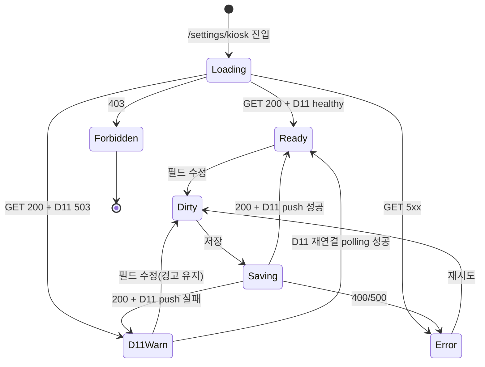

# SCR-082 키오스크 설정 — 기본화면 (마스터)

> 이 문서는 **화면 마스터 스펙**입니다. `01~06` 상태 문서는 이 문서를 상속(override/delta)합니다.
> 🚨 **D11 통합운영 연계**: 키오스크 기기 상태·TTS·얼굴인식 설정은 D11 `/ops/kiosk`의 모니터링 데이터와 연동된다. 저장 시 D11에 push가 필요하며, D11 서비스가 OFF면 `04-D11연결경고` 상태로 전이.

---

## 0. 메타 & 원천 참조

| 항목 | 값 |
|------|----|
| 화면 ID | SCR-082 |
| 화면명 | 키오스크 설정 |
| 도메인 | D09-설정관리 |
| 경로 | `/settings/kiosk` |
| Next.js Route Group | `(main)` |
| 파일 경로 | `src/app/(main)/settings/kiosk/page.tsx` |
| 페이지 컴포넌트 | `KioskSettingsPage` |
| 역할 | `superAdmin`, `primary`, `owner` (필수) / `manager` 이하 차단 |
| 우선순위 | P1 (운영 필수) |
| 플랫폼 | 데스크톱(우선) / 태블릿 |
| 멀티테넌트 | ✅ `branchId` 컨텍스트 강제 |
| 저장소 | `localStorage`(`settings_{branchId}_kiosk_settings`) + D11 push |

### 원천 문서 링크
| 문서 | 경로 | 섹션 |
|---|---|---|
| 화면설계서 | `docs/화면설계서/설정관리.md` | §SCR-082 키오스크 설정 |
| 기능명세서 | `docs/기능명세서/설정관리.md` | §3. 키오스크 설정 |
| 공통 UI 패턴 | `docs/화면설계서/공통.md` | §2.2 권한, §3 공통 UI |
| 에러코드정의서 | `docs/에러코드정의서.md` | §공통(E401·E403·E500), §설정(E910xxx) |
| 권한 매트릭스 | `docs/다이어그램/10_권한매트릭스/R1_역할화면_매트릭스.md` | `/settings/kiosk` owner 이상 |
| 다이어그램 F1 진입 | `docs/다이어그램/D09_설정관리/SCR-082_키오스크설정/F1_진입.md` | 권한 → 설정 로드 |
| 다이어그램 F2 메인 | `docs/다이어그램/D09_설정관리/SCR-082_키오스크설정/F2_메인인터랙션.md` | 탭 전환 / 편집 / 미리보기 |
| 다이어그램 F3 버튼액션 | `docs/다이어그램/D09_설정관리/SCR-082_키오스크설정/F3_버튼액션.md` | 저장 / TTS 재생 / 배너 |
| 다이어그램 F5 모달 | `docs/다이어그램/D09_설정관리/SCR-082_키오스크설정/F5_모달트리거.md` | DLG-080-001 미저장 |
| 다이어그램 F6 상태별 | `docs/다이어그램/D09_설정관리/SCR-082_키오스크설정/F6_상태별화면.md` | 로딩/정상/변경됨/D11연결경고/에러/권한없음 |
| 다이어그램 F7 권한 | `docs/다이어그램/D09_설정관리/SCR-082_키오스크설정/F7_권한RBAC.md` | owner/manager 분기 |
| 다이어그램 F8 에러 | `docs/다이어그램/D09_설정관리/SCR-082_키오스크설정/F8_에러예외복구.md` | 저장 실패, D11 연결 끊김 |
| 다이어그램 F9 토스트 | `docs/다이어그램/D09_설정관리/SCR-082_키오스크설정/F9_토스트피드백.md` | 저장 성공/실패 토스트 |

---

## 1. 화면 목적 (Why)

하나의 **지점**(`branchId`) 키오스크(무인 체크인 단말)의 기본 설정·화면 디자인·TTS 안내·출입 규칙을 한 화면에서 통합 관리하는 **단말 제어 콘솔**.
- 4개 탭(기본설정/화면설정/TTS설정/출입규칙)으로 역할 분리.
- 우측에 **실시간 미리보기(KioskPreview)** 제공 — 환영 문구/테마색/공지/배너 즉시 반영.
- 저장 시 D11 통합운영 서비스로 push(MQTT/HTTP)되어 현장 키오스크 기기에 실시간 반영. D11 OFF면 경고 배너.
- 얼굴 인식(face) 체크인 활성화 시 추가 섹션(인식 모드/민감도/병행 인증/자동 등록)이 동적 확장.

---

## 2. 화면 레이아웃 (Wireframe)

### 2.1 풀뷰 (데스크톱 1440px, 2열 구조)

```
┌─────────────────────────────────────────────────────────────────────────┐
│ ┌──Sidebar──┐ ┌── Main Content ─────────────────────────────────────┐   │
│ │  설정      │ │ PageHeader: 키오스크 설정  [⚠ 미저장] / [✅ 저장]  │   │
│ │  > 키오스크 │ │                   [D11 연결: 🟢] / [D11 OFF: 🟡]    │   │
│ │            │ │ ─────────────────────────────────────────────────    │   │
│ │            │ │ [기본설정][화면설정][TTS설정][출입규칙]             │   │
│ │            │ │ ┌─── 좌측(7/12): 폼 ───┐ ┌── 우측(5/12): 미리보기 ─┐ │   │
│ │            │ │ │ [활성 토글]            │ │  📱 키오스크 프레임        │ │   │
│ │            │ │ │ [Type A / Type B]     │ │  ┌──────────────┐       │ │   │
│ │            │ │ │ [입장방식 체크 5종]    │ │  │ {테마색 헤더} │       │ │   │
│ │            │ │ │ [화면타임아웃/자동로그]│ │  │ {환영문구}    │       │ │   │
│ │            │ │ │ [관리자 PIN]          │ │  │ [체크인 CTA] │       │ │   │
│ │            │ │ │ (face 활성 시 확장)   │ │  │ {공지/배너}   │       │ │   │
│ │            │ │ └───────────────────────┘ │  └──────────────┘       │ │   │
│ │            │ │                           │  타입 A: 입퇴장 전용       │ │   │
│ │            │ │                           └─────────────────────────┘ │   │
│ │            │ │ ─────────────────────────────────────────────────    │   │
│ │            │ │ [Sticky Footer]        [취소] [저장하기(D11 push)]   │   │
│ └────────────┘ └──────────────────────────────────────────────────────┘ │
└─────────────────────────────────────────────────────────────────────────┘
```

### 2.2 영역/치수 표
| 영역 | 위치 | 치수 | 역할 |
|------|------|------|------|
| PageHeader | 상단 | `h-16 px-6 py-4` | 제목 + 상태 배지 2종(미저장/D11연결) |
| TabBar | Header 아래 | `h-12 border-b border-gray-200` | 4탭 pill |
| 좌측 폼 | 2열 중 좌 | `lg:col-span-7 space-y-6` | 설정 필드 |
| 우측 미리보기 | 2열 중 우 | `lg:col-span-5 sticky top-4` | KioskPreview |
| 활성 토글 영역 | 기본설정 최상단 | `h-16 rounded-xl border` | 키오스크 체크인 ON/OFF |
| 섹션 카드 | 각 탭 내부 | `rounded-xl bg-white ring-1 ring-gray-100 p-6` | FormSection |
| StickyFooter | 하단 고정 | `sticky bottom-0 h-16 bg-white border-t` | 저장/취소 |
| D11 경고 배너 | Header 아래 | `h-12 bg-amber-50 text-amber-800` | D11 OFF 시 |

---

## 3. 디자인 토큰

### 3.1 색상
| 역할 | 클래스 | 용도 |
|---|---|---|
| bg.page | `bg-gray-50` | 페이지 배경 |
| bg.card | `bg-white rounded-xl ring-1 ring-gray-100 shadow-sm` | 섹션 카드 |
| tab.active | `bg-blue-50 text-blue-700 ring-1 ring-blue-100` | 선택 탭 |
| tab.inactive | `text-gray-600 hover:bg-gray-100` | 기본 탭 |
| activate.on | `border-emerald-400/40 bg-emerald-50/40` | 키오스크 활성화 토글 ON |
| activate.off | `border-rose-400/30 bg-rose-50/30` | 비활성화 (경고 톤) |
| badge.dirty | `bg-amber-50 text-amber-800 ring-1 ring-amber-200` | ⚠ 미저장 |
| badge.saved | `bg-emerald-50 text-emerald-700 ring-1 ring-emerald-200` | ✅ 저장완료 |
| badge.d11.on | `bg-emerald-50 text-emerald-700 ring-1 ring-emerald-200` + 🟢 | D11 연결됨 |
| badge.d11.off | `bg-amber-50 text-amber-800 ring-1 ring-amber-200` + 🟡 | D11 연결 끊김 |
| banner.d11.warn | `bg-amber-50 border-l-4 border-amber-400 text-amber-900` | D11 OFF 배너 |
| kiosk.type.card | `border-2 rounded-xl p-4 cursor-pointer` | Type A/B 카드 |
| kiosk.type.selected | `border-blue-500 bg-blue-50 ring-2 ring-blue-200` | 선택된 타입 |
| preview.frame | `rounded-[32px] border-8 border-gray-800 bg-black shadow-2xl` | 폰 프레임 |
| btn.primary | `bg-blue-600 hover:bg-blue-700 active:bg-blue-800 disabled:bg-blue-400` | 저장 |
| btn.secondary | `bg-white text-gray-700 border border-gray-300 hover:bg-gray-50` | 취소 |
| toggle.on | `bg-blue-600` | 토글 ON |
| toggle.off | `bg-gray-200` | 토글 OFF |
| tts.play | `bg-blue-50 text-blue-700 hover:bg-blue-100` | TTS 재생 버튼 |
| tts.playing | `bg-emerald-100 text-emerald-700 animate-pulse` | 재생 중 |

### 3.2 타이포그래피
| 토큰 | 스타일 | 용도 |
|---|---|---|
| page.title | `text-2xl font-bold tracking-tight text-gray-900` | "키오스크 설정" |
| page.subtitle | `text-sm text-gray-500` | 지점 경로 |
| section.title | `text-base font-semibold text-gray-900` | 섹션 헤더 |
| field.label | `text-sm font-medium text-gray-700` | 필드 라벨 |
| field.help | `text-xs text-gray-500` | 보조 설명 |
| tab.label | `text-sm font-medium` | 탭 텍스트 |
| preview.welcome | `text-lg font-semibold text-white` | 미리보기 환영문구 |
| preview.cta | `text-sm font-medium` | 체크인 CTA |
| d11.status.label | `text-xs font-medium tabular-nums` | D11 상태 |

### 3.3 간격/반경/그림자
| 토큰 | 값 |
|---|---|
| card.radius | `rounded-xl` |
| card.padding | `p-6` |
| preview.radius | `rounded-[32px]` |
| section.gap | `space-y-6` |
| field.gap | `space-y-4` |

### 3.4 모션
| 토큰 | 값 |
|---|---|
| preview.transition | `transition-all duration-200` |
| badge.fadeIn | `animate-[fadeIn_150ms_ease-out]` |
| tts.playing.pulse | `animate-pulse` |
| d11.reconnect.pulse | `animate-pulse` (재연결 시도) |
| prefers-reduced-motion | transition 100ms 이하 |

---

## 4. 반응형 규칙

| BP | 폭 | 레이아웃 | TabBar | 미리보기 | Sticky Footer |
|---|---|---|---|---|---|
| Mobile <640 | 100% | 1열 세로 (미리보기 접힘) | 가로 스크롤 | 모달(Portal) | h-14 + safe-area |
| Tablet 640~1024 | 100% | 1열 세로 | 고정 4탭 | 하단 고정 카드 | h-16 |
| Desktop ≥1024 | sidebar+main | 2열(7/5) | 고정 4탭 | sticky top-4 | h-16 |
| XL ≥1440 | max container | 2열(8/4) | 좌측 정렬 | sticky top-4 | — |

---

## 5. 🔐 역할별(RBAC) 매트릭스

> `●` = 표시+수정, `○` = 표시만, `—` = 미표시. 접근 자체가 owner 이상만.

| 요소 | superAdmin | primary | owner | manager | fc | trainer | staff | front |
|---|:---:|:---:|:---:|:---:|:---:|:---:|:---:|:---:|
| **페이지 접근** | ● | ● | ● | — | — | — | — | — |
| **BranchSwitcher** | ●(전 지점) | ●(소속 브랜드) | —(본인 지점) | — | — | — | — | — |
| **기본설정 탭** | ● | ● | ● | — | — | — | — | — |
| ─ 키오스크 활성 토글 | ● | ● | ● | — | — | — | — | — |
| ─ 키오스크 타입 | ● | ● | ● | — | — | — | — | — |
| ─ 입장 방식(5종) | ● | ● | ● | — | — | — | — | — |
| ─ 관리자 PIN | ●(재설정) | ●(재설정) | ●(재설정) | — | — | — | — | — |
| **화면설정 탭** | ● | ● | ● | — | — | — | — | — |
| **TTS 설정 탭** | ● | ● | ● | — | — | — | — | — |
| **출입규칙 탭** | ● | ● | ● | — | — | — | — | — |
| **TTS 재생 버튼** | ● | ● | ● | — | — | — | — | — |
| **저장 (D11 push)** | ● | ● | ● | — | — | — | — | — |
| **D11 상태 배지** | ● | ● | ● | — | — | — | — | — |

권한 규칙:
1. manager 이하가 URL `/settings/kiosk` 진입 → 서버 403 → `06-권한없음`
2. 사이드바 메뉴도 owner 이상에게만 노출
3. `superAdmin`은 관리자 PIN을 `****` 마스킹 조회 + 재설정 가능 (`AUDIT.KIOSK_PIN_RESET`)
4. 감사로그: `AUDIT.KIOSK_UPDATE`, `AUDIT.KIOSK_ACTIVATE_TOGGLE`

---

## 6. 컴포넌트 트리

```
<AppLayout role={user.role}>
  <Sidebar menu={settingsMenu} />
  <MainContent>
    <PageHeader title="키오스크 설정" subtitle={`지점: ${branchName}`}>
      {canSwitchBranch(role) && <BranchSwitcher value={branchId} onChange={switchBranch} />}
      <D11StatusBadge status={d11Status} />
      {isDirty && !saveSuccess && <DirtyBadge />}
      {saveSuccess && <SavedBadge />}
    </PageHeader>

    {d11Status === 'disconnected' && <D11WarningBanner onRetry={pingD11} />}

    <TabBar value={activeTab} onChange={tryChangeTab} items={TABS_KIOSK} />

    <div className="grid grid-cols-1 lg:grid-cols-12 gap-6 p-6">
      <form className="lg:col-span-7 space-y-6">
        {activeTab === 'basic'   && <KioskBasicTab   form={form} />}
        {activeTab === 'screen'  && <KioskScreenTab  form={form} />}
        {activeTab === 'tts'     && <KioskTtsTab     form={form} onPlay={playTTS} />}
        {activeTab === 'access'  && <KioskAccessTab  form={form} />}
      </form>
      <aside className="lg:col-span-5 lg:sticky lg:top-4 self-start"
             aria-label="키오스크 미리보기">
        <KioskPreview settings={form.watch()} kioskType={form.watch('kioskType')} />
      </aside>
    </div>

    <StickyFooter>
      <Button variant="secondary" onClick={resetForm} disabled={!isDirty}>취소</Button>
      <Button variant="primary" onClick={handleSave} loading={isSaving} disabled={!isDirty || isSaving}>
        {isSaving ? '저장 중...' : '저장하기 (D11 push)'}
      </Button>
    </StickyFooter>

    <UnsavedDialog open={showUnsavedDialog}
                   onCancel={...} onSaveThenMove={...} onDiscard={...} />
  </MainContent>
</AppLayout>
```

### 6.1 핵심 컴포넌트
| 컴포넌트 | 파일 | 핵심 Props |
|---|---|---|
| `KioskBasicTab` | `src/components/settings/kiosk/BasicTab.tsx` | `{form}` |
| `KioskScreenTab` | `src/components/settings/kiosk/ScreenTab.tsx` | `{form}` |
| `KioskTtsTab` | `src/components/settings/kiosk/TtsTab.tsx` | `{form, onPlay}` |
| `KioskAccessTab` | `src/components/settings/kiosk/AccessTab.tsx` | `{form}` |
| `KioskPreview` | `src/components/settings/kiosk/KioskPreview.tsx` | `{settings, kioskType}` |
| `KioskTypeSelector` | `src/components/settings/kiosk/TypeSelector.tsx` | `{value, onChange}` |
| `CheckInMethodCheckbox` | `src/components/settings/kiosk/CheckInMethod.tsx` | `{value[], onChange}` |
| `FaceRecognitionFields` | `src/components/settings/kiosk/FaceRecognition.tsx` | `{form}` |
| `BannerManager` | `src/components/settings/kiosk/BannerManager.tsx` | `{banners, onAdd, onRemove}` |
| `TtsRow` | `src/components/settings/kiosk/TtsRow.tsx` | `{id, event, message, onPlay, playing}` |
| `D11StatusBadge` | `src/components/settings/kiosk/D11StatusBadge.tsx` | `{status}` |
| `D11WarningBanner` | `src/components/settings/kiosk/D11WarningBanner.tsx` | `{onRetry}` |
| `AdminPinInput` | `src/components/ui/AdminPinInput.tsx` | `{value, onChange, masked}` |

---

## 7. 데이터 계약

### 7.1 폼 스키마 (Zod)
```ts
// src/schemas/kiosk.ts
export const kioskSchema = z.object({
  branchId: z.number(),
  isActive: z.boolean().default(true),
  kioskType: z.enum(['typeA','typeB']).default('typeB'),
  checkInMethods: z.array(z.enum(['qr','rfid','face','phone','barcode']))
                   .min(1, '최소 1개의 입장 방식을 선택하세요')
                   .default(['qr','rfid','face']),
  screenTimeout: z.number().int().min(10).max(600).default(30),
  autoLogout: z.number().int().min(1).max(60).default(5),
  adminPin: z.string().regex(/^\d{4,6}$/, 'PIN은 4~6자리 숫자').default('1234'),
  face: z.object({
    mode: z.enum(['single','multi']).default('single'),
    sensitivity: z.enum(['high','medium','low']).default('medium'),
    fallback: z.enum(['none','phone','qr']).default('phone'),
    autoRegister: z.enum(['manual','autoFirstVisit']).default('manual'),
  }).optional(),
  clothesRental: z.boolean().default(false),
  lockerAssign: z.boolean().default(false),
  attendanceRanking: z.boolean().default(false),
  promotionPopup: z.boolean().default(false),
  bgImage: z.string().url().optional().or(z.literal('')),
  logoImage: z.string().url().optional().or(z.literal('')),
  themeColor: z.string().regex(/^#[0-9A-F]{6}$/i).default('#3B82F6'),
  welcomeMessage: z.string().min(1).max(100).default('오늘도 건강한 하루 되세요!'),
  showNotice: z.boolean().default(true),
  noticeContent: z.string().max(200).default('센터 내 수건은 1인 1장씩 사용 부탁드립니다.'),
  showWeather: z.boolean().default(true),
  showAdBanner: z.boolean().default(true),
  banners: z.array(z.object({ id: z.string(), url: z.string().url(), name: z.string().max(50) })).max(5).default([]),
  ttsMessages: z.array(z.object({ id: z.string(), event: z.string(), message: z.string().max(200), description: z.string().max(200) })).length(6),
  accessStartTime: z.string().regex(/^\d{2}:\d{2}$/).default('06:00'),
  accessEndTime:   z.string().regex(/^\d{2}:\d{2}$/).default('23:00'),
  allowExpired: z.enum(['allow','deny']).default('deny'),
  expirationWarningDays: z.number().int().min(1).max(30).default(7),
  preventDuplicateCheckIn: z.boolean().default(true),
  duplicatePreventionMinutes: z.number().int().min(1).max(60).default(10),
  unpaidAccess: z.enum(['allow','warn','deny']).default('warn'),
});
export type KioskSettings = z.infer<typeof kioskSchema>;
```

### 7.2 API / 저장소
| 동작 | 엔드포인트/저장소 | 권한 |
|---|---|---|
| 설정 로드 | `localStorage[settings_{branchId}_kiosk_settings]` + 폴백 `GET /settings/:branchId/kiosk` | owner 이상 |
| 설정 저장 | 1) localStorage write 2) `POST /ops/d11/kiosk/push` (D11 MQTT) | owner 이상 |
| D11 헬스체크 | `GET /ops/d11/health` (polling 30s) | owner 이상 |
| TTS 재생 | `speechSynthesis.speak(utterance)` | 로컬 |
| 로고/배너 업로드 | `POST /assets/upload` (multipart) | owner 이상 |

### 7.3 상태 관리
- **Store**: `useAuthStore`
- **Fetching**: React Query `useQuery(['kiosk', branchId])` + localStorage fallback
- **Form**: `react-hook-form` + `zodResolver`
- **Local**: `activeTab`, `saveSuccess`(3초), `d11Status`, `ttsPlayingId`, `showUnsavedDialog`
- **Mirror**: `form.watch()` → KioskPreview 실시간
- **D11 연결 체크**: 진입 시 + 30초 polling + 저장 직전

---

## 8. 비즈니스 룰

1. **진입 권한**: `owner/primary/super` 이외 → `06-권한없음`.
2. **키오스크 활성 토글**: `isActive=false` 저장 시 현장 키오스크 대기화면 잠금(빨간 톤 경고 배지).
3. **입장 방식 최소 1개**: `checkInMethods.length >= 1`.
4. **얼굴 인식 의존 규칙**: `'face'` 포함 시 FaceRecognition 섹션 렌더·검증. 제거 시 자동 축소.
5. **관리자 PIN**: 4~6자리 숫자. 서버 측 해싱. 변경 시 `AUDIT.KIOSK_PIN_RESET`.
6. **TTS 변수 치환**: `{이름}→홍길동`, `{N}→3` (미리듣기 고정 더미).
7. **TTS 재생 동시성**: 1개만 재생. 클릭 시 `speechSynthesis.cancel()` 후 재생.
8. **배너 최대 5개**.
9. **테마색 Accessibility**: 대비 4.5:1 자동 체크, 미달 시 경고 텍스트.
10. **출입시간**: `accessStartTime < accessEndTime` (24시간 운영은 `00:00~23:59`).
11. **중복 체크인 방지**: min=1, max=60 분.
12. **D11 연결 게이트**: `disconnected` 시 경고 배너 + 저장 시 `DLG-D11-CONFIRM` → 무시 저장 시 localStorage만 쓰고 D11 재시도 큐 적재.
13. **저장 동작**: diff PATCH + D11 push 병렬. 부분 실패 시 별도 토스트.
14. **미저장 가드**: 탭 전환·BranchSwitcher·뒤로가기 시 `DLG-080-001`.
15. **미리보기 격리**: `srcdoc`/postMessage. welcomeMessage/noticeContent는 DOMPurify.
16. **감사로그**: `AUDIT.KIOSK_UPDATE` + (활성 토글 시) `AUDIT.KIOSK_ACTIVATE_TOGGLE`.
17. **i18n**: UI ko-KR. TTS `ko-KR` 고정(다국어 매핑은 SCR-088과 별도 이슈).

---

## 9. 상태 목록

| 파일 | 상태 코드 | 한글 | 트리거 |
|---|---|---|---|
| `01-로딩.md` | `kiosk-loading` | 로딩 | 진입 직후, 로드 pending |
| `02-정상.md` | `kiosk-ready` | 정상 | 로드 완료, isDirty=false, D11=connected |
| `03-변경됨.md` | `kiosk-dirty` | 변경됨 | 필드 수정 |
| `04-D11연결경고.md` | `kiosk-d11-disconnected` | D11 연결 끊김 | D11 헬스체크 실패 |
| `05-에러.md` | `kiosk-error` | 저장/로드 실패 | 5xx, 검증 실패 |
| `06-권한없음.md` | `kiosk-forbidden` | 403 | manager 이하 진입 |

---

## 10. 에러 코드 매핑

| errorCode | HTTP | 시나리오 | 표시 | 대응 |
|---|---|---|---|---|
| E401001 | 401 | 세션 만료 | 전역 리디렉션 → `/login` | 자동 |
| E403001 | 403 | 권한 없음 | `06-권한없음` | 홈 이동 |
| E910001 | 400 | 입장 방식 0개 | CheckInMethod 에러 | 선택 요구 |
| E910002 | 400 | PIN 형식 오류 | PIN 인라인 에러 | 4~6자리 |
| E910003 | 400 | 얼굴 인식 필드 누락 | Face 섹션 에러 | 기본값 채움 |
| E910004 | 400 | 출입시간 순서 오류 | Access 에러 | start<end |
| E910005 | 413 | 로고/배경 용량 초과 | BannerManager 에러 | 파일 교체 |
| E910006 | 415 | 이미지 타입 불가 | BannerManager 에러 | PNG/JPG/WebP |
| E910007 | 409 | 동시 수정 충돌 | 상단 배너 + 재로드 | refetch |
| E910010 | 503 | D11 서비스 OFF | `04-D11연결경고` | 무시 저장 or 재시도 |
| E500001 | 500 | 서버 오류 | 배너 + 재시도 | 재시도 |
| NETWORK | — | 오프라인 | `05-에러` or 오프라인 모드 | 재연결 대기 |

---

## 11. 접근성 (WCAG 2.1 AA)

| 항목 | 요구사항 |
|---|---|
| 탭 패턴 | `role=tablist`/`tab`/`aria-selected`/Arrow 키 |
| 토글 | `role=switch`/`aria-checked` |
| 체크박스(입장방식) | `role=group aria-labelledby`, 0개 시 `aria-invalid` |
| TTS 재생 | `aria-label="{event} 메시지 재생"`, 재생 중 `aria-pressed` |
| 미리보기 | `aria-label="키오스크 미리보기"` + sr-only 설명 |
| 관리자 PIN | `type=password` + show/hide 토글 |
| 테마색 | HEX 병기, 대비 경고 시 `aria-describedby` |
| D11 배지 | `role=status aria-live=polite` |
| D11 경고 배너 | `role=alert` (최초 1회) |
| 미저장 다이얼로그 | `role=alertdialog` + Tab 트랩 + Esc |
| 모션 감소 | pulse 제거, transition 100ms 이하 |

---

## 12. 진입 / 이탈

### 진입
- 사이드바 "설정 > 키오스크 설정"
- 직접 URL `/settings/kiosk`
- D11 모니터링 `/ops/kiosk` → "설정 편집"
- SCR-080 센터설정 → "키오스크 설정으로" 배너

### 이탈
| 액션 | 목적지 | 가드 |
|---|---|---|
| 사이드바 다른 메뉴 | 해당 페이지 | dirty 시 `DLG-080-001` |
| 다른 탭 클릭 | 해당 탭 | dirty 시 `DLG-080-001` |
| BranchSwitcher | 다른 지점 | dirty 시 `DLG-080-001` |
| D11 모니터링 링크 | `/ops/kiosk` | dirty 시 `DLG-080-001` |
| 저장 성공 | 현재 화면 + 3초 배지 | — |
| 취소 | 원본 값 복원 | dirty=false |

---

## 13. 다이어그램 통합 뷰



---

## 14. 🧩 바이브코딩 프롬프트 (마스터)

```
Next.js 15 App Router + TypeScript + Tailwind + Supabase + React Query + react-hook-form + zod + lucide-react 기반
'use client' 컴포넌트를 작성하라.

━━ 화면: SCR-082 키오스크 설정 (마스터) ━━
파일: src/app/(main)/settings/kiosk/page.tsx
보조:
- src/components/settings/kiosk/{BasicTab, ScreenTab, TtsTab, AccessTab,
                                   KioskPreview, TypeSelector, CheckInMethod,
                                   FaceRecognition, BannerManager, TtsRow,
                                   D11StatusBadge, D11WarningBanner}.tsx
- src/components/ui/{TabBar, ToggleSwitch, ColorPicker, AdminPinInput, LogoUploader}.tsx
- src/components/settings/{StatusBadge(DirtyBadge/SavedBadge), UnsavedDialog}.tsx
- src/schemas/kiosk.ts (kioskSchema + KioskSettings 타입)
- src/hooks/useKioskSettings.ts (localStorage + D11 push)
- src/lib/role-access.ts (canAccessSettings)
- src/lib/d11-client.ts (pingD11, pushKioskSettings)

━━ 권한 게이트 ━━
- useAuthStore().role ∈ ['superAdmin','primary','owner'] 아니면 06-권한없음
- super/primary만 BranchSwitcher 노출
- 서버는 jwt role/branchId로 스코프 강제

━━ D11 연결 상태 ━━
const d11Query = useQuery(['d11-health'], () => pingD11(), {
  refetchInterval: 30_000, staleTime: 15_000,
});
const d11Status = d11Query.isLoading ? 'checking'
                : d11Query.data?.ok  ? 'connected'
                : 'disconnected';

━━ TABS ━━
const TABS_KIOSK = [
  { key: 'basic',  label: '기본 설정', Icon: Cog },
  { key: 'screen', label: '화면 설정', Icon: Monitor },
  { key: 'tts',    label: 'TTS 설정',  Icon: Volume2 },
  { key: 'access', label: '출입 규칙', Icon: Shield },
] as const;

━━ 레이아웃 ━━
<main className="min-h-screen bg-gray-50">
  <AppLayout role={user.role}>
    <PageHeader title="키오스크 설정" subtitle={`지점: ${branchName}`}>
      {canSwitchBranch(role) && <BranchSwitcher value={branchId} onChange={switchBranch} />}
      <D11StatusBadge status={d11Status} />
      {isDirty && !saveSuccess && <DirtyBadge />}
      {saveSuccess && <SavedBadge />}
    </PageHeader>

    {d11Status === 'disconnected' && <D11WarningBanner onRetry={d11Query.refetch} />}

    <nav role="tablist" aria-label="키오스크 설정 탭"
         className="flex gap-1 border-b border-gray-200 px-6 lg:px-8">
      {TABS_KIOSK.map(t => (
        <button key={t.key} role="tab" id={`tab-${t.key}`}
                aria-selected={activeTab === t.key}
                aria-controls={`panel-${t.key}`}
                onClick={() => tryChangeTab(t.key)}
                className={cn('h-12 px-4 text-sm font-medium rounded-t-lg transition-colors duration-150',
                  activeTab === t.key
                    ? 'bg-blue-50 text-blue-700 ring-1 ring-blue-100'
                    : 'text-gray-600 hover:bg-gray-100')}>
          <t.Icon className="inline size-4 mr-1" />{t.label}
        </button>
      ))}
    </nav>

    <div className="grid grid-cols-1 lg:grid-cols-12 gap-6 p-6 lg:p-8"
         role="tabpanel" id={`panel-${activeTab}`} aria-labelledby={`tab-${activeTab}`}>
      <form className="lg:col-span-7 space-y-6">
        {activeTab === 'basic'   && <KioskBasicTab   form={form} />}
        {activeTab === 'screen'  && <KioskScreenTab  form={form} />}
        {activeTab === 'tts'     && <KioskTtsTab     form={form} onPlay={playTTS} />}
        {activeTab === 'access'  && <KioskAccessTab  form={form} />}
      </form>
      <aside className="lg:col-span-5 lg:sticky lg:top-4 self-start"
             aria-label="키오스크 미리보기">
        <KioskPreview settings={form.watch()} kioskType={form.watch('kioskType')} />
      </aside>
    </div>

    <div className="sticky bottom-0 bg-white border-t border-gray-200">
      <div className="max-w-[1400px] mx-auto p-4 flex justify-end gap-2">
        <button type="button" onClick={resetForm} disabled={!isDirty || isSaving}
                className="h-10 px-4 rounded-lg border border-gray-300 bg-white text-gray-700 hover:bg-gray-50 disabled:opacity-50">취소</button>
        <button type="button" onClick={handleSave}
                disabled={!isDirty || isSaving}
                className={cn('h-10 px-5 rounded-lg text-white font-medium transition-colors',
                  'bg-blue-600 hover:bg-blue-700 active:bg-blue-800',
                  'disabled:bg-blue-400 disabled:cursor-not-allowed',
                  isSaving && 'animate-pulse')}>
          {isSaving ? '저장 중...' : '저장하기 (D11 push)'}
        </button>
      </div>
    </div>

    <UnsavedDialog open={showUnsavedDialog}
                   onCancel={cancelNavigation}
                   onSaveThenMove={saveAndMove}
                   onDiscard={discardAndMove} />
  </AppLayout>
</main>

━━ 폼 & 저장 ━━
const { data, isLoading } = useQuery(['kiosk', branchId], () => loadKioskSettings(branchId));
const saveMutation = useMutation(async (vals: KioskSettings) => {
  const localOk = await saveToLocalStorage(branchId, vals);
  const d11Ok   = d11Status === 'connected' ? await pushKioskSettings(branchId, vals) : false;
  return { localOk, d11Ok };
});
const form = useForm<KioskSettings>({
  resolver: zodResolver(kioskSchema),
  defaultValues: data, values: data,
});
const isDirty = form.formState.isDirty;

async function handleSave() {
  const vals = form.getValues();
  if (d11Status === 'disconnected') {
    const proceed = await openD11ConfirmDialog();
    if (!proceed) return;
  }
  const { localOk, d11Ok } = await saveMutation.mutateAsync(vals);
  form.reset(vals);
  setSaveSuccess(true);
  setTimeout(() => setSaveSuccess(false), 3000);
  if (!d11Ok && d11Status === 'connected') enqueueD11Retry(vals);
  auditLog('KIOSK_UPDATE', diff(data, vals));
}

━━ TTS 재생 ━━
const [ttsPlayingId, setTtsPlayingId] = useState<string|null>(null);
function playTTS(id: string, msg: string) {
  window.speechSynthesis.cancel();
  const text = msg.replace('{이름}','홍길동').replace('{N}','3');
  const uttr = new SpeechSynthesisUtterance(text);
  uttr.lang = 'ko-KR';
  uttr.onstart = () => setTtsPlayingId(id);
  uttr.onend   = () => setTtsPlayingId(null);
  window.speechSynthesis.speak(uttr);
}

━━ 미리보기 (실시간 반영) ━━
<KioskPreview settings={form.watch()} kioskType={form.watch('kioskType')} />
// KioskPreview 내부는 DOMPurify로 welcomeMessage/noticeContent sanitize.

━━ 디자인 토큰 (정확히 적용) ━━
bg.page: bg-gray-50
card: bg-white rounded-xl ring-1 ring-gray-100 shadow-sm p-6
tab.active: bg-blue-50 text-blue-700 ring-1 ring-blue-100
activate.on:  border border-emerald-400/40 bg-emerald-50/40
activate.off: border border-rose-400/30 bg-rose-50/30
badge.d11.on:  inline-flex items-center gap-1 h-7 px-2.5 rounded-full text-xs font-medium bg-emerald-50 text-emerald-700 ring-1 ring-emerald-200
badge.d11.off: inline-flex items-center gap-1 h-7 px-2.5 rounded-full text-xs font-medium bg-amber-50  text-amber-800 ring-1 ring-amber-200
btn.primary: h-10 px-5 rounded-lg bg-blue-600 hover:bg-blue-700 active:bg-blue-800 text-white font-medium disabled:bg-blue-400 disabled:cursor-not-allowed

━━ 접근성 ━━
- role=tablist / role=tab / aria-selected / Arrow 키
- 토글: role=switch
- 미리보기: aria-label + 스크린리더용 sr-only 텍스트
- D11 배지: role=status aria-live=polite
- D11 경고: role=alert

━━ 반응형 ━━
모바일: 1열 세로, 미리보기 접힘
태블릿: 1열 세로, 미리보기 하단 카드
데스크톱: 2열 (7/5), 미리보기 sticky
XL: 2열 (8/4)

━━ QA 체크 ━━
- owner 이상만 접근
- D11 OFF 시 경고 배너 + 저장 시 DLG-D11-CONFIRM
- 입장 방식 최소 1개
- face 체크 시 FaceRecognition 섹션 확장
- TTS 재생 중 다른 TTS 클릭 → cancel 후 재생
- 미리보기: 환영문구/테마색/공지/배너 즉시 반영
- 저장 성공 시 3초 배지 + D11 push 성공/실패 구분 토스트
```

---

## 15. QA 체크리스트 (수용 기준)

- [ ] owner 이상만 `/settings/kiosk` 접근 (manager 이하 → 06-권한없음)
- [ ] 4탭 전환 시 dirty 가드 (`DLG-080-001`)
- [ ] 활성 토글 ON/OFF 시 emerald/rose 톤 전환
- [ ] Type A / B 카드 선택 시 선택 상태 시각화 + 미리보기 라벨 갱신
- [ ] 입장 방식 최소 1개 검증
- [ ] face 체크 시 FaceRecognition 섹션 확장/축소
- [ ] 관리자 PIN 4~6자리 검증 + show/hide
- [ ] 테마색 변경 시 미리보기 즉시 반영 + 대비 경고
- [ ] 환영문구/공지/배너 변경 시 미리보기 즉시 반영
- [ ] TTS 재생/중지 단일 채널
- [ ] 출입시간 start < end 검증
- [ ] 중복방지 1~60 분 검증
- [ ] D11 OFF 배너 + 저장 시 `DLG-D11-CONFIRM`
- [ ] D11 상태 배지 30초 polling
- [ ] 저장 성공 시 3초 배지 + 감사로그
- [ ] 부분 실패(local OK, D11 fail) 시 재시도 큐 + 구분 토스트
- [ ] BranchSwitcher/뒤로가기/beforeunload dirty 가드
- [ ] 키보드로 모든 탭/체크박스/토글/슬라이더/저장 조작 가능
- [ ] prefers-reduced-motion 준수
