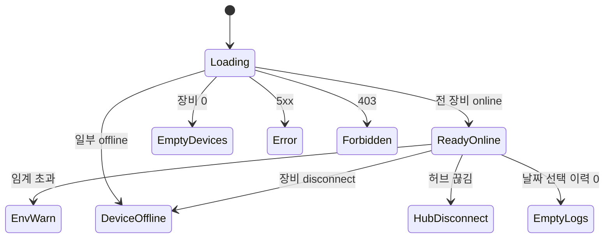

# SCR-083 IoT/출입 관리 — 기본화면 (마스터)

> 🚨 **owner 이상만** 접근. 게이트/CCTV/환경 센서 IoT 장비 상태 + 출입 이력 통합 관리. 실시간(WebSocket) 상태 모니터링.

## 0. 메타 & 원천

| 항목 | 값 |
|---|---|
| 화면 ID | SCR-083 |
| 경로 | `/settings/iot` |
| 파일 | `src/app/(main)/settings/iot/page.tsx` |
| 역할 | superAdmin, primary, owner |
| 우선순위 | P1 |

### 원천
- `docs/화면설계서/설정관리.md` §SCR-083 + IoT 상세 필드
- `docs/기능명세서/설정관리.md` §4 IoT
- `docs/에러코드정의서.md` §IoT E910xxx
- `docs/다이어그램/D09_설정관리/SCR-083_IoT출입관리/F1~F9`

## 1. 화면 목적
출입 게이트/CCTV/환경 센서(온도/습도/CO2) IoT 장비의 **실시간 상태** + **출입 정책** + **오늘의 출입 이력**을 단일 화면에 통합. 임계값 초과 시 환경 경고.

## 2. 레이아웃

```
┌──────────────────────────────────────────────────────────┐
│ [Header] IoT/출입 관리    [+ 장비 추가]                   │
├──────────────────────────────────────────────────────────┤
│ [🔴 IoT 허브 연결 끊김 배너] (해당 시)                     │
├─────────────────┬────────────────────────────────────────┤
│ §A 장비 목록     │ §B 출입 이력                           │
│ (좌 col-span-2) │ (우 col-span-3)                        │
│ ┌─────────────┐ │ 날짜: [2026-04-22] [출석유형▼] [검색] │
│ │메인 게이트   │ │ ┌──────────────────────────────────┐  │
│ │ 🟢 온라인    │ │ │시각│회원│장비│유형│결과│             │  │
│ │ [원격열기]   │ │ └──────────────────────────────────┘  │
│ └─────────────┘ │                                        │
│ ┌─────────────┐ │                                        │
│ │서브 게이트   │ │                                        │
│ │ 🔴 오프라인  │ │                                        │
│ │ [진단]       │ │                                        │
│ └─────────────┘ │                                        │
│                 │                                        │
│ §C 출입 정책     │                                        │
│ 영업시간 외 차단 │                                        │
│ 만료회원 차단    │                                        │
│ ...             │                                        │
│                 │                                        │
│ §D 환경 센서     │                                        │
│ 🌡 24°C 💧 45%  │                                        │
│ CO2 620ppm ✅   │                                        │
│                 │                                        │
│ §E CCTV         │                                        │
│ 8대 (6 live)    │                                        │
└─────────────────┴────────────────────────────────────────┘
```

## 3. 디자인 토큰

| 토큰 | 값 |
|---|---|
| device.card | `bg-white rounded-xl ring-1 ring-gray-200 p-4` |
| status.online | `bg-emerald-100 text-emerald-700` + green dot |
| status.offline | `bg-red-100 text-red-700` + red dot |
| status.error | `bg-amber-100 text-amber-700` + amber dot |
| env.normal | `text-gray-700` |
| env.warn | `text-amber-700 bg-amber-50` |
| env.critical | `text-red-700 bg-red-50` |
| log.success | `bg-emerald-50 text-emerald-800` |
| log.failed | `bg-red-50 text-red-800` |

## 4. 반응형
| BP | 장비 | 이력 |
|---|---|---|
| <1024 | 상단 | 하단 |
| ≥1024 | col-span-2 (240px) | col-span-3 flex-1 |

## 5. 🔐 RBAC

| 요소 | super/primary/owner | manager | 그 외 |
|---|:---:|:---:|:---:|
| 페이지 접근 | ● | — | — |
| 장비 추가/삭제 | ● | — | — |
| 원격 열기/잠금 | ● | — | — |
| 환경 임계값 설정 | ● | — | — |
| 출입 이력 조회 | ● | — | — |

## 6. 컴포넌트 트리

```
<AppLayout>
  <PageHeader title="IoT/출입 관리">
    <Button onClick={openAddDevice}>+ 장비 추가</Button>
  </PageHeader>
  {hubStatus === 'disconnected' && <HubDisconnectBanner onRetry={retryHub} />}
  <div className="grid lg:grid-cols-5 gap-6">
    <section className="lg:col-span-2 space-y-4">
      <DeviceList devices={gates} title="게이트" />
      <PolicySection policies={policies} onChange={updatePolicy} />
      <EnvironmentPanel env={env} thresholds={thresholds} />
      <CctvSummary cameras={cameras} />
    </section>
    <section className="lg:col-span-3">
      <AccessLogTable logs={logs} date={date} filter={filter} onDateChange={setDate} />
    </section>
  </div>
</AppLayout>
```

## 7. 데이터 계약

```ts
interface IoTDevice {
  id: number; branchId: number;
  name: string; type: 'gate_main'|'gate_sub'|'cctv'|'sensor_temp'|'sensor_humid'|'sensor_co2';
  ip: string; port: number;
  status: 'online'|'offline'|'error';
  lastHeartbeat: string; // ISO
  location?: string;
}
interface Policy {
  branchId: number;
  blockAfterHours: boolean; blockExpiredMembers: boolean;
  alertUnregistered: boolean; restrictCompanion: boolean;
}
interface EnvReading {
  temperature: number;   // °C
  humidity: number;      // %
  co2: number;           // ppm
  measuredAt: string;
}
interface EnvThresholds {
  tempMax: number;       // 기본 28
  humidityMax: number;   // 기본 70
  co2Max: number;        // 기본 1000
}
interface AccessLog {
  id: number; occurredAt: string;
  memberId?: number; memberName?: string;
  deviceId: number; deviceName: string;
  method: 'RFID'|'QR'|'PHONE'|'FACE'|'MANUAL';
  result: 'success'|'failed';
  reason?: 'expired'|'unregistered'|'blocked'|'system_error';
}
```

### API
| Endpoint | 메서드 |
|---|---|
| `/iot/devices?branchId=` | GET |
| `/iot/devices` | POST |
| `/iot/devices/:id` | PATCH/DELETE |
| `/iot/devices/:id/test` | POST (열기 테스트) |
| `/iot/policies/:branchId` | GET/PATCH |
| `/iot/env/:branchId` | GET (polling 10초) |
| `/iot/env/thresholds/:branchId` | GET/PATCH |
| `/access-logs?branchId=&date=` | GET |
| `/iot/hub/status?branchId=` | WebSocket |

## 8. 비즈니스 룰

1. owner 이상만 접근
2. 장비 상태는 WebSocket(우선) + 30초 polling fallback
3. 환경 센서는 10초 polling
4. 임계값 초과 → `04-환경경고` 배너 (severity에 따라 warn/critical)
5. IoT 허브 전체 연결 끊김 → `05-IoT연결끊김` 모든 장비 배지 회색
6. 장비 0개 → `07-장비없음` 유도 화면
7. 이력 0개 → `08-이력없음` (날짜 선택은 유지)
8. 원격 열기 → `AUDIT.GATE_OPEN(userId, deviceId)` 기록
9. 장비 삭제 시 확인 다이얼로그 (별도 DLG 없음, 인라인 confirm)
10. CCTV 프리뷰는 별도 화면 또는 새 탭

## 9. 상태 목록

| 파일 | 상태 코드 | 설명 |
|---|---|---|
| `01-로딩.md` | `iot-loading` | 스켈레톤 |
| `02-정상-장비온라인.md` | `iot-ready-online` | 모든 장비 online |
| `03-장비오프라인.md` | `iot-device-offline` | 1개 이상 offline |
| `04-환경경고.md` | `iot-env-warn` | 온도/습도/CO2 임계 초과 |
| `05-IoT연결끊김.md` | `iot-hub-disconnect` | 허브 자체 연결 끊김 |
| `06-에러.md` | `iot-error` | API 5xx |
| `07-장비없음.md` | `iot-empty-devices` | 등록 장비 0 |
| `08-이력없음.md` | `iot-empty-logs` | 선택 날짜 이력 0 |

## 10. 에러 코드

| errorCode | 설명 |
|---|---|
| E403001 | 권한 없음 |
| E910001 | IoT 허브 연결 실패 |
| E910002 | 장비 응답 없음 |
| E910003 | 원격 열기 실패 |
| E910004 | 임계값 형식 오류 |
| E500001 | 서버 오류 |

## 11. 접근성
- 장비 카드 `role="article"` + `aria-labelledby`
- 상태 배지 `role="status"` + 색 + 텍스트 병기
- 이력 테이블 `<table>` + `<caption>` + `<th scope>`
- 환경 값 `aria-live="polite"` (새 값 공지)

## 12. 진입/이탈
- 진입: 사이드바 "설정 > IoT 출입 관리"
- 이탈: BranchSwitcher / 다른 메뉴 (dirty 없음)

## 13. 다이어그램



## 14. 🧩 바이브코딩 프롬프트 (마스터)

```
Next.js 15 + TS + Tailwind + React Query + Supabase + WebSocket
'use client'. 파일: src/app/(main)/settings/iot/page.tsx

━━ 실시간 상태 ━━
useEffect(() => {
  const ws = new WebSocket(`ws://iot/hub/status?branchId=${branchId}`);
  ws.onmessage = (e) => {
    const msg = JSON.parse(e.data);
    if (msg.type === 'hub') setHubStatus(msg.status);
    if (msg.type === 'device') queryClient.setQueryData(['devices', branchId], (old: IoTDevice[]) =>
      old.map(d => d.id === msg.deviceId ? { ...d, status: msg.status, lastHeartbeat: msg.at } : d));
  };
  ws.onclose = () => setHubStatus('disconnected');
  return () => ws.close();
}, [branchId]);

const envQ = useQuery({
  queryKey: ['env', branchId],
  queryFn: () => fetchEnv(branchId),
  refetchInterval: 10_000,
});

const logsQ = useQuery({
  queryKey: ['accessLogs', branchId, date, filter],
  queryFn: () => fetchAccessLogs(branchId, date, filter),
});

━━ DeviceCard ━━
<article role="article" aria-labelledby={`dev-${d.id}`}
         className="bg-white rounded-xl ring-1 ring-gray-200 p-4">
  <div className="flex items-center justify-between">
    <div>
      <p id={`dev-${d.id}`} className="font-medium text-gray-900">{d.name}</p>
      <p className="text-xs text-gray-400 mt-0.5">{d.location} · {d.ip}</p>
    </div>
    <StatusBadge status={d.status} />
  </div>
  <div className="mt-3 flex gap-2">
    {d.type.startsWith('gate') && (
      <button onClick={() => openGate(d.id)} disabled={d.status !== 'online'}
              className="h-8 px-3 rounded text-xs border hover:bg-gray-50 disabled:opacity-50">
        원격 열기
      </button>
    )}
    <button onClick={() => openSettings(d.id)} className="h-8 px-3 rounded text-xs text-gray-600 hover:bg-gray-100">설정</button>
  </div>
  <div className="text-xs text-gray-400 mt-2">마지막 통신: {relative(d.lastHeartbeat)}</div>
</article>

━━ EnvironmentPanel ━━
<section className="bg-white rounded-xl p-4 space-y-3">
  <EnvItem label="온도" value={env.temperature} unit="°C"
           warn={env.temperature > thresholds.tempMax} icon={<Thermometer />} />
  <EnvItem label="습도" value={env.humidity} unit="%"
           warn={env.humidity > thresholds.humidityMax} icon={<Droplets />} />
  <EnvItem label="CO₂" value={env.co2} unit="ppm"
           warn={env.co2 > thresholds.co2Max} icon={<Wind />} />
</section>

━━ AccessLogTable ━━
<table className="w-full text-sm">
  <caption className="sr-only">오늘의 출입 이력</caption>
  <thead className="bg-gray-50">
    <tr>
      {['시각','회원','장비','방식','결과'].map(h => <th key={h} scope="col" className="px-3 py-2 text-left">{h}</th>)}
    </tr>
  </thead>
  <tbody>
    {logs.map(l => (
      <tr key={l.id} className="border-b border-gray-100">
        <td className="px-3 py-2 font-mono text-gray-600">{fmt(l.occurredAt,'HH:mm:ss')}</td>
        <td>{l.memberName ?? <span className="text-gray-400">미등록</span>}</td>
        <td>{l.deviceName}</td>
        <td><MethodBadge method={l.method} /></td>
        <td>
          {l.result === 'success' ? <span className="text-emerald-600">성공</span> : <span className="text-red-600">실패 ({l.reason})</span>}
        </td>
      </tr>
    ))}
  </tbody>
</table>

━━ 실시간 로그 추가 ━━
Supabase realtime subscription on access_logs:
supabase.channel(`access-logs-${branchId}`)
  .on('postgres_changes', { event:'INSERT', schema:'public', table:'access_logs', filter:`branch_id=eq.${branchId}` },
      (payload) => queryClient.setQueryData(['accessLogs', branchId, today], (old: AccessLog[]) => [payload.new, ...old]))
  .subscribe();
```

## 15. QA 체크리스트
- [ ] owner 이상만 접근
- [ ] 장비 실시간 상태 (WebSocket)
- [ ] 환경 센서 10초 polling
- [ ] 임계값 초과 시 경고 배너
- [ ] 허브 끊김 배너 + 모든 장비 회색
- [ ] 원격 열기 감사로그
- [ ] 장비 0개 EmptyState
- [ ] 이력 0개 EmptyState
- [ ] 실시간 이력 추가(Supabase realtime)
