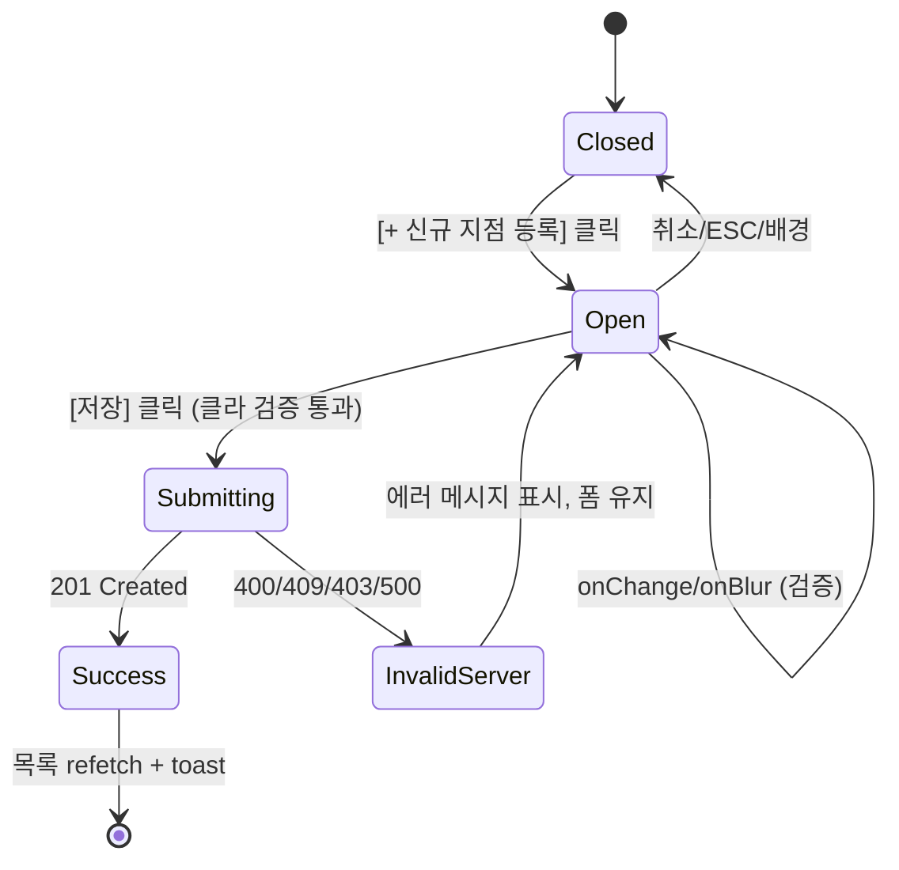

# DLG-092-001 신규 지점 등록 — 기본화면 (마스터)

> 이 문서는 **다이얼로그 마스터 스펙**입니다. `01~03` 상태 문서는 이 문서를 상속(override/delta)합니다.
> 🚨 **본사 전용 액션**: `superAdmin`/`primary`만 오픈 가능. `owner`는 조건부(다중 브랜드 소유 시). 그 외 역할은 버튼 자체가 렌더되지 않음.
> 부모 화면은 **SCR-092 지점 관리**(`/branches`). 저장 성공 시 지점 목록 테이블을 refetch 하고 브랜드 컨텍스트에 신규 지점을 연결한다.

---

## 0. 메타 & 원천 참조

| 항목 | 값 |
|------|----|
| 다이얼로그 ID | DLG-092-001 |
| 다이얼로그명 | 신규 지점 등록 |
| 도메인 | D10-본사관리 |
| 부모 화면 | SCR-092 지점 관리 (`/branches`) |
| 트리거 | PageHeader `[+ 신규 지점 등록]` 클릭 |
| 확인 레벨 | L1 (생성형) — 타이핑 확인 없음 |
| 서버 호출 | `POST /branches` (Supabase `branches` 테이블 insert) |
| 닫기 옵션 | 🟡 ESC/배경/X = 취소 허용 (단, `03-저장성공` 직전 저장 중엔 차단) |
| 역할 | `superAdmin`, `primary` / `owner`(다중 브랜드 소유 시) |
| 파일 경로 | `src/components/admin/BranchCreateDialog.tsx` (DLG 전용) |
| 멀티테넌트 | ✅ 저장 시 현재 로그인 `brandId` 컨텍스트 자동 연결 |
| 우선순위 | P0 (본사 운영 핵심) |

### 원천 문서 링크
| 문서 | 경로 | 섹션 |
|---|---|---|
| 화면설계서 | `docs/화면설계서/본사관리.md` | §SCR-092 § 5. 신규 지점 등록 모달 |
| 기능명세서 | `docs/기능명세서/본사관리.md` | §3. 지점 관리 §D 필드 / §G-1 모달 / §K 토스트 |
| 공통 화면설계서 | `docs/화면설계서/공통.md` | §2.2 권한(슈퍼만 ●) |
| 에러코드정의서 | `docs/에러코드정의서.md` | §4.1 공통 E400001~ / §4.10 지점 E400900, E403900, E409900 |
| 상태전이도 | `docs/상태전이도.md` | §지점 상태(active/inactive/closed) |
| 다이어그램 M1 | `docs/다이어그램/D10_본사관리/DLG/DLG-092-001_신규지점등록/M1_생명주기.md` | 생명주기 |
| 다이어그램 M2 | `docs/다이어그램/D10_본사관리/DLG/DLG-092-001_신규지점등록/M2_필드검증.md` | 9개 필드 검증 |
| 다이어그램 M3 | `docs/다이어그램/D10_본사관리/DLG/DLG-092-001_신규지점등록/M3_결과분기.md` | 201/400/409/403/500 분기 |
| 권한 매트릭스 R1 | `docs/다이어그램/10_권한매트릭스/R1_역할화면_매트릭스.md` | `/branches` 슈퍼·오너 ● |
| 공용 DLG 참조 | `docs/화면설계서/D01-공통/DLG-004-저장확인/00-기본화면.md` | 저장 패턴 |

---

## 1. 다이얼로그 목적 (Why)

본사 운영자가 **신규 지점을 CRM에 등록**하여 멀티테넌트 브랜드 하위에 지점을 추가하기 위한 입력 UI.
- 9개 필드(지점명/코드/연락처/주소/상세주소/관리자/오픈·마감 시간/수용 인원/메모)를 한 화면에서 수집한다.
- 지점 코드는 `[자동생성]` 버튼 또는 수동 입력 모두 지원하되 중복 검증을 서버가 최종 수행한다.
- 저장 성공 시 본사 운영 스태프가 해당 지점으로 즉시 전환해 세팅을 이어갈 수 있도록 목록 상단으로 갱신한다.

---

## 2. 화면 레이아웃 (Wireframe)

### 2.1 기본 레이아웃

```
  backdrop: bg-black/50
  ┌──────────────────────────────────────────────────────┐
  │ ┌──────────────────────────────────────────────────┐ │
  │ │ 🏢 신규 지점 등록                            [X] │ │ ← Header (primary tone)
  │ │ 본사 브랜드에 추가할 지점 정보를 입력하세요        │ │
  │ ├──────────────────────────────────────────────────┤ │
  │ │ ┌─ 2열 그리드 ────────────────────────────────┐  │ │
  │ │ │ [지점명 *       ]  [지점 코드 *  ][자동생성]│  │ │
  │ │ │ [연락처 *       ]  [주소 *                 ]│  │ │
  │ │ │ [상세주소       ]  [지점 관리자 * ▼        ]│  │ │
  │ │ │ [오픈시간 06:00]  [마감시간 23:30         ]│  │ │
  │ │ │ [수용 인원      ]                          │  │ │
  │ │ │ [메모 (textarea, col-span-2)              ]│  │ │
  │ │ └─────────────────────────────────────────────┘  │ │
  │ ├──────────────────────────────────────────────────┤ │
  │ │                           [ 취소 ]  [ 저장 ]   │ │ ← Footer
  │ └──────────────────────────────────────────────────┘ │
  └──────────────────────────────────────────────────────┘
```

### 2.2 치수/영역

| 영역 | 치수/클래스 |
|---|---|
| Backdrop | `fixed inset-0 bg-black/50 z-40` |
| Modal | `w-full max-w-2xl` (데스크톱) / `max-w-xs` (모바일) |
| Header | 56px `px-6 pt-5 pb-3` |
| Body | `grid grid-cols-1 md:grid-cols-2 gap-4 px-6 pb-4 max-h-[70vh] overflow-y-auto` |
| Footer | 64px `px-6 py-4 border-t border-gray-100 flex justify-end gap-2` |
| 필드 Row | 72px (label 20px + input 40px + error 12px) |

---

## 3. 디자인 토큰

### 3.1 색상
| 토큰 | 클래스 | 용도 |
|---|---|---|
| backdrop | `fixed inset-0 bg-black/50 z-40` | 배경 |
| card | `bg-white rounded-2xl shadow-xl ring-1 ring-gray-100` | 카드 |
| icon.primary.wrap | `bg-blue-50 rounded-full size-10` | 🏢 아이콘 래퍼 |
| icon.primary | `text-blue-600` | Building2 |
| input.base | `h-10 w-full rounded-lg border border-gray-300 px-3 text-sm focus:ring-2 focus:ring-blue-500 focus:border-blue-500` | 기본 |
| input.error | `border-rose-400 focus:ring-rose-500 focus:border-rose-500` | 에러 |
| input.readonly | `bg-gray-50 text-gray-500 cursor-not-allowed` | readonly |
| label.required | `after:content-['*'] after:ml-0.5 after:text-rose-500` | 필수 표식 |
| btn.autogen | `h-10 px-3 rounded-lg border border-gray-300 bg-white hover:bg-gray-50 text-xs text-gray-700` | 자동생성 |
| btn.cancel | `h-10 px-4 rounded-lg border border-gray-300 bg-white hover:bg-gray-50 text-sm font-medium text-gray-700` | Secondary |
| btn.save | `h-10 px-4 rounded-lg bg-blue-600 hover:bg-blue-700 disabled:bg-blue-300 text-white text-sm font-medium` | Primary |
| error.text | `text-xs text-rose-600 mt-1` | 인라인 에러 |
| help.text | `text-xs text-gray-500 mt-1` | 도움말 |

### 3.2 타이포
| 토큰 | 값 |
|---|---|
| title | `text-lg font-semibold text-gray-900` |
| subtitle | `text-xs text-gray-500` |
| label | `text-xs font-medium text-gray-700 mb-1` |
| input.text | `text-sm text-gray-900` |
| textarea | `text-sm text-gray-900 resize-none` |

### 3.3 간격/반경/모션
- radius: `rounded-2xl` (모달), `rounded-lg` (인풋/버튼)
- padding: `p-6` 기본
- enter: `animate-[fadeInUp_140ms_ease-out]`
- motion-reduce: `motion-reduce:animate-none`

---

## 4. 반응형 규칙

| BP | 모달 폭 | 그리드 | 비고 |
|---|---|---|---|
| Mobile <640 | `max-w-xs w-[calc(100%-32px)]` | 1열 | 바텀시트 대안, 필드 세로 스택 |
| Tablet | `max-w-lg` | 2열 | 메모는 col-span-2 |
| Desktop ≥1024 | `max-w-2xl` | 2열 | 양옆 여백 |

---

## 5. 🔐 역할별(RBAC) 매트릭스

> `●` = 완전 권한, `○` = 제한(조건부), `—` = 미노출(버튼 자체 숨김)

| 요소 | superAdmin | primary | owner | manager | fc | trainer | staff | front |
|---|:---:|:---:|:---:|:---:|:---:|:---:|:---:|:---:|
| **페이지 버튼 렌더** | ● | ● | ○ (다중 브랜드 소유) | — | — | — | — | — |
| **다이얼로그 오픈** | ● | ● | ○ | — | — | — | — | — |
| 지점명 입력 | ● | ● | ● | — | — | — | — | — |
| 지점 코드 입력 | ● | ● | ● | — | — | — | — | — |
| [자동생성] 버튼 | ● | ● | ● | — | — | — | — | — |
| 연락처/주소/상세주소 | ● | ● | ● | — | — | — | — | — |
| 지점 관리자 선택(Select) | ● (전 직원) | ● (본 브랜드 직원) | ● (본인 브랜드 직원) | — | — | — | — | — |
| 오픈/마감 시간 | ● | ● | ● | — | — | — | — | — |
| 수용 인원 | ● | ● | ● | — | — | — | — | — |
| 메모 | ● | ● | ● | — | — | — | — | — |
| **[저장]** | ● | ● | ● | — | — | — | — | — |
| [취소]/ESC/배경 | ● | ● | ● | — | — | — | — | — |

### 5.1 브랜드 스코프
- `superAdmin`: 모든 브랜드에 지점 생성 가능(브랜드 Select 추가 노출 — 옵션)
- `primary`: 로그인 계정의 `brandId` 하위에만 생성 (브랜드 Select 비노출, 서버가 강제)
- `owner`: 멀티 브랜드 소유 시만 노출, 단일 브랜드 owner는 `manager` 수준으로 취급

### 5.2 서버 가드
- Row Level Security 정책: `branches.insert` 는 `role IN ('superAdmin','primary','owner')` 만 허용
- `brandId` 매칭 검증: jwt `brandId` !== payload `brandId` 시 403

---

## 6. 컴포넌트 트리

```tsx
<BranchCreateDialog isOpen={isAddBranchOpen} onClose={() => setIsAddBranchOpen(false)}
                    onSuccess={(newBranch) => { refetchBranches(); toast.success(`지점 "${newBranch.name}"이(가) 등록되었습니다.`); }}>
  <DialogHeader icon={<Building2 />} title="신규 지점 등록"
                subtitle="본사 브랜드에 추가할 지점 정보를 입력하세요" />
  <form onSubmit={handleSubmit(onSubmit)}>
    <FieldGrid cols={2}>
      <TextField label="지점명" required {...register('name')} error={errors.name?.message} maxLength={30} />
      <BranchCodeField value={form.code} onChange={setCode} onAutoGenerate={handleAutoGenerateCode} error={errors.code?.message} />
      <TextField label="연락처" required {...register('phone')} error={errors.phone?.message} placeholder="02-1234-5678" />
      <TextField label="주소" required {...register('address')} error={errors.address?.message} />
      <TextField label="상세주소" {...register('addressDetail')} />
      <StaffSelect label="지점 관리자" required value={form.managerId} onChange={setManagerId}
                   brandId={user.brandId} error={errors.managerId?.message} />
      <TimeField label="오픈 시간" {...register('openTime')} defaultValue="06:00" />
      <TimeField label="마감 시간" {...register('closeTime')} defaultValue="23:30" />
      <TextField label="수용 인원" {...register('maxCapacity')} inputMode="numeric" placeholder="예: 200" />
      <TextareaField label="메모" {...register('memo')} rows={3} className="col-span-2" maxLength={500} />
    </FieldGrid>
    <DialogFooter>
      <CancelButton onClick={onClose} disabled={isSaving}>취소</CancelButton>
      <SubmitButton loading={isSaving} disabled={!isFormValid || isSaving}>저장</SubmitButton>
    </DialogFooter>
  </form>
</BranchCreateDialog>
```

### 6.1 컴포넌트 명세
| 컴포넌트 | 파일 | Props |
|---|---|---|
| `BranchCreateDialog` | `src/components/admin/BranchCreateDialog.tsx` | `{isOpen, onClose, onSuccess}` |
| `BranchCodeField` | `src/components/admin/BranchCodeField.tsx` | `{value, onChange, onAutoGenerate, error}` — [자동생성] 내장 |
| `StaffSelect` | `src/components/admin/StaffSelect.tsx` | `{value, onChange, brandId, error, required}` — 브랜드 내 직원 Combobox |
| `TextField/TimeField/TextareaField` | `src/components/common/form/*.tsx` | react-hook-form 호환 |
| `DialogHeader/Footer` | `src/components/common/dialog/*.tsx` | 공용 |

---

## 7. 데이터 계약

### 7.1 폼 타입
```ts
// src/types/branch.ts
export interface BranchForm {
  name: string;            // 지점명, 2~30자
  code: string;            // 지점 코드, /^[A-Z]{2,5}$/, 중복 불가
  phone: string;           // /^(0\d{1,2})-(\d{3,4})-(\d{4})$/
  address: string;         // 필수
  addressDetail: string;   // 선택
  managerId: string;       // staff.id (UUID), 본 브랜드 내 active 직원
  openTime: string;        // "HH:MM", 기본 "06:00"
  closeTime: string;       // "HH:MM", 기본 "23:30"
  maxCapacity: string;     // 숫자 문자열
  memo: string;            // 500자 이내
}

export interface FormErrors {
  name?: string; code?: string; phone?: string; address?: string; managerId?: string;
}

// 서버 저장 payload
export interface BranchInsertPayload {
  brandId: string;         // jwt에서 자동 주입, 서버 강제
  name: string;
  code: string;
  phone: string;
  address: string;
  addressDetail?: string;
  managerId: string;
  openTime: string;
  closeTime: string;
  maxCapacity?: number;
  memo?: string;
  status: 'active';        // 등록 시 기본값
  regDate: string;         // ISO date, 서버가 now()
}
```

### 7.2 검증 함수 (클라이언트)
```ts
export const isValidPhone = (v: string) => /^(0\d{1,2})-(\d{3,4})-(\d{4})$/.test(v);
export const isValidCode  = (v: string) => /^[A-Z]{2,5}$/.test(v);
export const isValidName  = (v: string) => {
  const t = v.trim();
  return t.length >= 2 && t.length <= 30;
};
```

### 7.3 API
| 동작 | 메서드 | 경로 / Supabase | 성공 | 실패 |
|---|---|---|---|---|
| 신규 지점 생성 | POST | `supabase.from('branches').insert({...}).select().single()` | 201 `{id, ...payload}` | 400/403/409/500 |
| 직원 목록(관리자 후보) | GET | `supabase.from('staff').select('id,name,role').eq('brandId', brandId).eq('isActive', true)` | 200 `Staff[]` | 401/403 |
| 코드 중복 체크(선택) | GET | `supabase.from('branches').select('id', {count:'exact', head:true}).eq('code', code)` | `count>=1` → 중복 | - |

### 7.4 지점 코드 자동 생성 규칙
```ts
// 기본 구현(코드 기준): SG + N을 3자리 0-pad
handleAutoGenerateCode = () => {
  setCode(`SG${String(branches.length + 1).padStart(3, '0')}`);
};
// 대안(다이어그램): BR-YYYYMM-NNN (월별 시퀀스)
// 프로젝트 현행은 SG{NNN} 유지, 신규 기능일 경우 BR- 패턴으로 확장
```

---

## 8. 비즈니스 룰

1. **필수 필드 5개**: 지점명, 지점 코드, 연락처, 주소, 지점 관리자. 이 중 하나라도 비어있으면 `[저장]` 비활성.
2. **실시간 클라이언트 검증**: `onBlur` 시 각 필드별 검증 함수 실행 → 인라인 에러 표시. 에러가 있으면 저장 버튼 disabled.
3. **서버 코드 중복 검증**: 클라이언트에서 사전 체크해도 동시성 이슈로 실패할 수 있으므로 서버 409 응답을 최종 진실로 취급.
4. **중복 저장 방지**: `isSaving` state — 클릭 즉시 버튼 비활성 + 스피너.
5. **자동 생성 코드**: `[자동생성]` 클릭 시 `SG${지점수+1의 3자리}` 적용. 사용자 수동 편집 가능.
6. **오픈/마감 시간**: HTML `input[type=time]`. 기본값 06:00 / 23:30. 오픈 ≥ 마감이면 UI 경고(선택).
7. **관리자 Select**: 본 브랜드의 `active=true` 직원만 옵션에 노출. 퇴사 직원은 필터.
8. **저장 성공**: `onSuccess({newBranch})` → 목록 refetch → `toast.success("지점 \"${name}\"이(가) 등록되었습니다.")` → 다이얼로그 닫힘.
9. **저장 실패**: `02-검증에러` 상태로 진입. 서버 에러는 `toast.error("지점 등록 실패: ${error.message}")` + 다이얼로그 유지.
10. **감사로그**: 서버가 `AUDIT.BRANCH_CREATE` 자동 기록 (userId, targetType='branch', targetId, brandId, payload).
11. **배경 스크롤 잠금**: 오픈 동안 `body.style.overflow='hidden'`.
12. **탐색 잠금**: 미저장 변경사항 있는 상태에서 ESC/배경/X 시 브라우저 `beforeunload` 대신 다이얼로그 내부 확인(Phase 2, 현재는 즉시 닫기 허용 + 변경사항 파기).

---

## 9. 상태 목록

| 파일 | 상태 코드 | 한글 | 트리거 |
|---|---|---|---|
| `01-오픈.md` | `branch-create-open` | 오픈(초기) | [+ 신규 지점 등록] 클릭, 빈 폼 |
| `02-검증에러.md` | `branch-create-invalid` | 검증 에러 | 클라/서버 검증 실패 (400/409) |
| `03-저장성공.md` | `branch-create-success` | 저장 성공 | 201 응답 수신 |

상태 전이: `01-오픈` → (저장) → 검증실패시 `02-검증에러` / 성공시 `03-저장성공` → 닫힘.

---

## 10. 에러 코드 매핑

| errorCode | HTTP | 시나리오 | 표시 | 다음 상태 |
|---|---|---|---|---|
| E400001 | 400 | 필수값 누락 | 해당 필드 인라인 에러 "필수 입력" | `02-검증에러` |
| E400002 | 400 | 입력 형식 오류 | 해당 필드 인라인 에러 "형식 오류" | `02-검증에러` |
| E400900 | 400 | 지점 정보 누락(서버) | "지점 정보를 입력해주세요" 토스트 + 인라인 | `02-검증에러` |
| E401002 | 401 | 세션 만료 | 전역 DLG-000 세션만료 → /login | 이 다이얼로그 정리 |
| E403001 | 403 | 권한 없음 | `toast.error("권한이 없습니다.")` + 닫힘 | 닫힘 |
| E403900 | 403 | 지점 수 초과(플랜 한도) | 배너 "생성 가능한 지점 수를 초과했습니다" | `02-검증에러` |
| E409900 | 409 | 지점 코드 중복 | `code` 필드 인라인 "이미 사용 중인 지점 코드입니다" | `02-검증에러` |
| E500001 | 500 | 서버 오류 | `toast.error("지점 등록 실패: ${message}")` + 다이얼로그 유지 | `02-검증에러` (재시도) |
| NETWORK | — | 네트워크 단절 | `toast.error("네트워크 오류. 다시 시도해 주세요.")` | `02-검증에러` |

---

## 11. 접근성 (WCAG 2.1 AA)

| 항목 | 요구사항 |
|---|---|
| role | `role="dialog" aria-modal="true"` |
| 라벨 | `aria-labelledby="branch-create-title"`, `aria-describedby="branch-create-subtitle"` |
| 포커스 | 오픈 시 "지점명" 입력 필드 autoFocus |
| Tab 순서 | 지점명 → 코드 → [자동생성] → 연락처 → 주소 → 상세주소 → 관리자 → 오픈 → 마감 → 수용 → 메모 → 취소 → 저장 → X |
| 에러 공지 | 각 `errorMessage` `role="alert" aria-live="polite"` |
| 필드-에러 연결 | `aria-invalid={!!error} aria-describedby="{field}-error"` |
| 키보드 | `Enter`(submit 필드에서) = 저장, `Esc` = 취소 |
| 모션 감소 | `motion-reduce:animate-none` |
| 색 대비 | 에러 `text-rose-600`은 AA 충족 |

---

## 12. 진입 / 이탈 연결

### 진입
- `SCR-092 지점 관리` PageHeader `[+ 신규 지점 등록]` 버튼
- 키보드 단축키 `N` (옵션, Phase 2)
- 퍼널: 슈퍼 대시보드 "지점 추가" 빠른 액션 (옵션)

### 이탈
| 액션 | 목적지 |
|---|---|
| "취소" / ESC / 배경 / X | 닫힘, 변경사항 파기, 포커스 트리거 버튼으로 복귀 |
| "저장" 성공 | 다이얼로그 닫힘 + SCR-092 목록 상단 갱신 + 토스트 |
| 401 세션 만료 | DLG-000 세션만료 우선 오픈 → /login |

---

## 13. 다이어그램 통합 뷰



참조:
- `docs/다이어그램/D10_본사관리/DLG/DLG-092-001_신규지점등록/M1_생명주기.md`
- `docs/다이어그램/D10_본사관리/DLG/DLG-092-001_신규지점등록/M2_필드검증.md`
- `docs/다이어그램/D10_본사관리/DLG/DLG-092-001_신규지점등록/M3_결과분기.md`

---

## 14. 🧩 바이브코딩 프롬프트 (마스터)

```
Next.js 15 App Router + TypeScript + Tailwind + React Hook Form + Zod + Supabase 기반
'use client' 다이얼로그 컴포넌트를 작성하라.

━━ 다이얼로그: DLG-092-001 신규 지점 등록 (본사 전용) ━━
파일: src/components/admin/BranchCreateDialog.tsx
부모: src/app/(admin)/branches/page.tsx

━━ 권한 가드 ━━
부모 화면에서 사전 필터:
  const canCreateBranch = ['superAdmin','primary'].includes(role)
                        || (role === 'owner' && user.ownedBrandCount > 1);
버튼을 canCreateBranch 로 조건부 렌더.
서버 가드: RLS `branches.insert` 정책 `role IN ('superAdmin','primary','owner')`.

━━ 스키마 ━━
import { z } from 'zod';
const schema = z.object({
  name:           z.string().trim().min(2, '지점명은 2글자 이상 입력해주세요').max(30, '30자 이내'),
  code:           z.string().regex(/^[A-Z]{2,5}$/, '영문 대문자 2~5자'),
  phone:          z.string().regex(/^(0\d{1,2})-(\d{3,4})-(\d{4})$/, '올바른 전화번호 형식 (예: 02-1234-5678)'),
  address:        z.string().min(1, '주소를 입력해주세요'),
  addressDetail:  z.string().optional(),
  managerId:      z.string().min(1, '지점 관리자를 선택해주세요'),
  openTime:       z.string().default('06:00'),
  closeTime:      z.string().default('23:30'),
  maxCapacity:    z.string().optional(),
  memo:           z.string().max(500, '500자 이내').optional(),
});
type FormValues = z.infer<typeof schema>;

━━ 컴포넌트 ━━
'use client';
import { createPortal } from 'react-dom';
import { useEffect, useRef, useState } from 'react';
import { useForm } from 'react-hook-form';
import { zodResolver } from '@hookform/resolvers/zod';
import { Building2, X, Loader2 } from 'lucide-react';
import { supabase } from '@/lib/supabase';
import { toast } from 'sonner';
import { useAuthStore } from '@/stores/auth';
import { useBranchCount, useStaffList } from '@/hooks/admin';

interface Props { isOpen: boolean; onClose: () => void; onSuccess: (b: Branch) => void; }

export function BranchCreateDialog({ isOpen, onClose, onSuccess }: Props) {
  const { user } = useAuthStore();
  const firstFieldRef = useRef<HTMLInputElement>(null);
  const [isSaving, setIsSaving] = useState(false);
  const { data: staff } = useStaffList({ brandId: user.brandId, isActive: true });
  const { data: branchCount = 0 } = useBranchCount();

  const { register, handleSubmit, watch, setValue, setError, formState: { errors, isValid } } =
    useForm<FormValues>({
      resolver: zodResolver(schema),
      mode: 'onBlur',
      defaultValues: { name:'', code:'', phone:'', address:'', addressDetail:'',
                       managerId:'', openTime:'06:00', closeTime:'23:30', maxCapacity:'', memo:'' },
    });

  useEffect(() => {
    if (!isOpen) return;
    firstFieldRef.current?.focus();
    document.body.style.overflow = 'hidden';
    const onKey = (e: KeyboardEvent) => { if (e.key === 'Escape' && !isSaving) onClose(); };
    window.addEventListener('keydown', onKey);
    return () => { document.body.style.overflow = ''; window.removeEventListener('keydown', onKey); };
  }, [isOpen, isSaving, onClose]);

  const handleAutoGenerate = () => {
    setValue('code', `SG${String(branchCount + 1).padStart(3, '0')}`, { shouldValidate: true });
  };

  const onSubmit = async (values: FormValues) => {
    if (isSaving) return;
    setIsSaving(true);
    const { data, error } = await supabase.from('branches').insert({
      brandId: user.brandId, name: values.name.trim(), code: values.code,
      phone: values.phone, address: values.address, addressDetail: values.addressDetail,
      managerId: values.managerId, openTime: values.openTime, closeTime: values.closeTime,
      maxCapacity: values.maxCapacity ? Number(values.maxCapacity) : null,
      memo: values.memo, status: 'active', regDate: new Date().toISOString(),
    }).select().single();
    setIsSaving(false);

    if (error) {
      if (error.code === '23505') { // UNIQUE 위반
        setError('code', { message: '이미 사용 중인 지점 코드입니다.' });
      } else if (error.code === 'PGRST301' || error.code === '42501') {
        toast.error('권한이 없습니다.'); onClose();
      } else {
        toast.error(`지점 등록 실패: ${error.message}`);
      }
      return;
    }
    toast.success(`지점 "${data.name}"이(가) 등록되었습니다.`);
    onSuccess(data);
    onClose();
  };

  if (!isOpen || typeof document === 'undefined') return null;
  return createPortal(
    <div role="dialog" aria-modal="true" aria-labelledby="bc-title" aria-describedby="bc-subtitle"
         onClick={(e) => { if (e.target === e.currentTarget && !isSaving) onClose(); }}
         className="fixed inset-0 z-40 flex items-center justify-center bg-black/50 px-4">
      <div className="w-full max-w-2xl bg-white rounded-2xl shadow-xl ring-1 ring-gray-100
                      motion-reduce:animate-none animate-[fadeInUp_140ms_ease-out]">
        <header className="flex items-start gap-3 px-6 pt-5 pb-3">
          <span className="flex size-10 items-center justify-center rounded-full bg-blue-50">
            <Building2 className="size-5 text-blue-600" />
          </span>
          <div className="flex-1">
            <h2 id="bc-title" className="text-lg font-semibold text-gray-900">신규 지점 등록</h2>
            <p id="bc-subtitle" className="text-xs text-gray-500 mt-0.5">본사 브랜드에 추가할 지점 정보를 입력하세요</p>
          </div>
          <button aria-label="닫기" onClick={onClose} disabled={isSaving}
            className="size-8 grid place-items-center rounded-md hover:bg-gray-100 text-gray-500 disabled:opacity-50">
            <X className="size-4" />
          </button>
        </header>

        <form onSubmit={handleSubmit(onSubmit)}>
          <div className="grid grid-cols-1 md:grid-cols-2 gap-4 px-6 pb-4 max-h-[70vh] overflow-y-auto">
            <Field label="지점명" required error={errors.name?.message}>
              <input ref={firstFieldRef} {...register('name')} maxLength={30}
                className={`h-10 w-full rounded-lg border px-3 text-sm focus:ring-2 focus:ring-blue-500
                           ${errors.name ? 'border-rose-400' : 'border-gray-300'}`} />
            </Field>
            <Field label="지점 코드" required error={errors.code?.message}>
              <div className="flex gap-2">
                <input {...register('code')} placeholder="영문 대문자 2~5자 (예: SG001)"
                  className={`h-10 flex-1 rounded-lg border px-3 text-sm uppercase focus:ring-2 focus:ring-blue-500
                             ${errors.code ? 'border-rose-400' : 'border-gray-300'}`} />
                <button type="button" onClick={handleAutoGenerate}
                  className="h-10 px-3 rounded-lg border border-gray-300 bg-white hover:bg-gray-50 text-xs text-gray-700">
                  자동생성
                </button>
              </div>
            </Field>
            <Field label="연락처" required error={errors.phone?.message}>
              <input {...register('phone')} placeholder="02-1234-5678"
                className={`h-10 w-full rounded-lg border px-3 text-sm focus:ring-2 focus:ring-blue-500
                           ${errors.phone ? 'border-rose-400' : 'border-gray-300'}`} />
            </Field>
            <Field label="주소" required error={errors.address?.message}>
              <input {...register('address')}
                className={`h-10 w-full rounded-lg border px-3 text-sm focus:ring-2 focus:ring-blue-500
                           ${errors.address ? 'border-rose-400' : 'border-gray-300'}`} />
            </Field>
            <Field label="상세주소">
              <input {...register('addressDetail')}
                className="h-10 w-full rounded-lg border border-gray-300 px-3 text-sm focus:ring-2 focus:ring-blue-500" />
            </Field>
            <Field label="지점 관리자" required error={errors.managerId?.message}>
              <select {...register('managerId')}
                className={`h-10 w-full rounded-lg border px-3 text-sm focus:ring-2 focus:ring-blue-500
                           ${errors.managerId ? 'border-rose-400' : 'border-gray-300'}`}>
                <option value="">선택하세요</option>
                {staff?.map(s => <option key={s.id} value={s.id}>{s.name} ({s.role})</option>)}
              </select>
            </Field>
            <Field label="오픈 시간">
              <input type="time" {...register('openTime')}
                className="h-10 w-full rounded-lg border border-gray-300 px-3 text-sm focus:ring-2 focus:ring-blue-500" />
            </Field>
            <Field label="마감 시간">
              <input type="time" {...register('closeTime')}
                className="h-10 w-full rounded-lg border border-gray-300 px-3 text-sm focus:ring-2 focus:ring-blue-500" />
            </Field>
            <Field label="수용 인원">
              <input {...register('maxCapacity')} inputMode="numeric" placeholder="예: 200"
                className="h-10 w-full rounded-lg border border-gray-300 px-3 text-sm focus:ring-2 focus:ring-blue-500" />
            </Field>
            <Field label="메모" className="md:col-span-2">
              <textarea {...register('memo')} rows={3} maxLength={500}
                className="w-full rounded-lg border border-gray-300 px-3 py-2 text-sm resize-none focus:ring-2 focus:ring-blue-500" />
            </Field>
          </div>
          <footer className="flex items-center justify-end gap-2 px-6 py-4 border-t border-gray-100">
            <button type="button" onClick={onClose} disabled={isSaving}
              className="h-10 px-4 rounded-lg border border-gray-300 bg-white hover:bg-gray-50 text-sm font-medium text-gray-700 disabled:opacity-50">
              취소
            </button>
            <button type="submit" disabled={!isValid || isSaving}
              className="h-10 px-4 rounded-lg bg-blue-600 hover:bg-blue-700 disabled:bg-blue-300 text-white text-sm font-medium inline-flex items-center gap-2">
              {isSaving && <Loader2 className="size-4 animate-spin" aria-hidden />}
              {isSaving ? '저장 중...' : '저장'}
            </button>
          </footer>
        </form>
      </div>
    </div>, document.body);
}

function Field({ label, required, error, className, children }:
  { label: string; required?: boolean; error?: string; className?: string; children: React.ReactNode }) {
  return (
    <label className={`block ${className ?? ''}`}>
      <span className="block text-xs font-medium text-gray-700 mb-1">
        {label}{required && <span className="text-rose-500 ml-0.5">*</span>}
      </span>
      {children}
      {error && <span role="alert" className="block text-xs text-rose-600 mt-1">{error}</span>}
    </label>
  );
}

━━ 디자인 토큰 (정확히 적용) ━━
backdrop:   fixed inset-0 z-40 bg-black/50
card:       bg-white rounded-2xl shadow-xl ring-1 ring-gray-100
header:     px-6 pt-5 pb-3
body:       grid grid-cols-1 md:grid-cols-2 gap-4 px-6 pb-4 max-h-[70vh] overflow-y-auto
footer:     flex justify-end gap-2 px-6 py-4 border-t border-gray-100
input.base: h-10 w-full rounded-lg border border-gray-300 px-3 text-sm focus:ring-2 focus:ring-blue-500
input.err:  border-rose-400 focus:ring-rose-500
btn.save:   h-10 px-4 rounded-lg bg-blue-600 hover:bg-blue-700 disabled:bg-blue-300 text-white text-sm font-medium
btn.cancel: h-10 px-4 rounded-lg border border-gray-300 bg-white hover:bg-gray-50 text-sm font-medium text-gray-700

━━ QA 체크 ━━
- 필수 5개 미입력 시 저장 비활성
- [자동생성] 클릭 → SG + 3자리 숫자 자동 채움
- 지점 코드 중복 409 → 인라인 에러
- 저장 중 버튼 loading + 취소 비활성
- ESC/배경 = 취소 (저장 중 차단)
- 성공 시 목록 refetch + 토스트 + 닫힘
- 접근성: role=dialog, aria-invalid, aria-describedby
- 감사로그 BRANCH_CREATE 서버 기록
```

---

## 15. QA 체크리스트

- [ ] `superAdmin`/`primary` 접근 시 버튼 렌더 + 오픈
- [ ] `owner`는 다중 브랜드 소유 시만 버튼 노출 (단일 브랜드는 미노출)
- [ ] 그 외 역할은 버튼 자체가 렌더되지 않음 (서버 RLS 가드)
- [ ] 오픈 시 "지점명" 입력에 autoFocus
- [ ] 필수 5개 중 하나라도 비면 저장 비활성
- [ ] 지점명 2~30자 벗어나면 인라인 에러
- [ ] 지점 코드 `/^[A-Z]{2,5}$/` 위배 시 인라인 에러
- [ ] 연락처 `0XX-XXXX-XXXX` 형식 검증
- [ ] [자동생성] 클릭 → `SG{지점수+1}` 3자리 0-pad
- [ ] 관리자 Select는 본 브랜드 active 직원만 노출
- [ ] 지점 코드 중복(409) → 인라인 에러 + 다이얼로그 유지
- [ ] 권한 없음(403) → 토스트 + 닫힘
- [ ] 플랜 한도 초과(E403900) → 배너 표시
- [ ] 저장 중 [저장] 스피너 + [취소] 비활성, ESC 차단
- [ ] 성공 시 `toast.success("지점 \"${name}\"이(가) 등록되었습니다.")` + 목록 refetch + 닫힘
- [ ] 감사로그 `AUDIT.BRANCH_CREATE` 서버 기록
- [ ] 멀티테넌트: 저장 payload `brandId`는 jwt에서 자동 주입(클라이언트 임의 설정 금지)
- [ ] 접근성: `role=dialog`, `aria-modal`, 에러 `role=alert`, Tab 순환
- [ ] 모바일 360px 2열 → 1열 자동 반응형
- [ ] 세션 만료 시 DLG-000 우선 오픈
