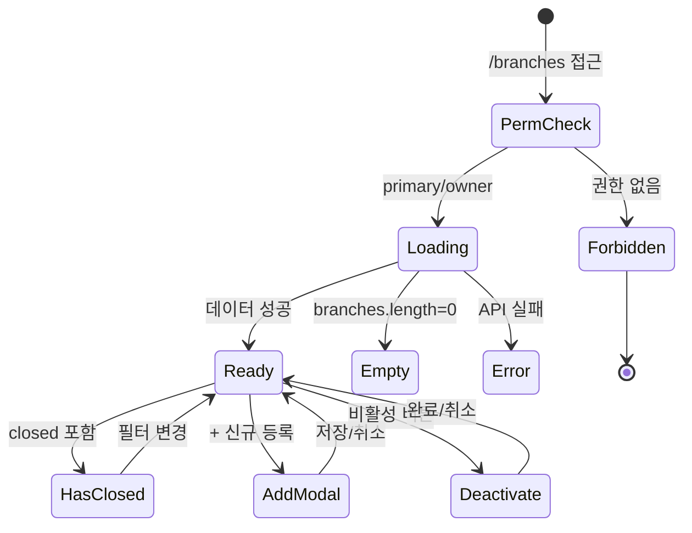

# SCR-092 지점 관리 — 기본화면 (마스터)

> 이 문서는 **화면 마스터 스펙**입니다. `01~06` 상태 문서는 이 문서를 상속(override/delta)합니다.
> 🚨 **본사 전용 화면**: `primary/superAdmin/owner`만 접근. manager 이하는 `06-권한없음`으로 차단.
> 전 지점 목록·등록·상태변경·통합현황·지점간이동까지 본사 운영의 중심 화면.

---

## 0. 메타 & 원천 참조

| 항목 | 값 |
|------|----|
| 화면 ID | SCR-092 |
| 화면명 | 지점 관리 (멀티지점) |
| 도메인 | D10-본사관리 |
| 경로 | `/branches` |
| Next.js Route Group | `(admin)` |
| 파일 경로 | `src/app/(admin)/branches/page.tsx` |
| 페이지 컴포넌트 | `BranchManagement` |
| 역할 | `primary/superAdmin`, `owner` (manager 이하 차단) |
| 우선순위 | P0 |
| 플랫폼 | 데스크톱(우선) / 태블릿 |
| 멀티테넌트 | ✅ `tenantId` 스코프, primary는 전체/owner는 자기 브랜드 |

### 원천 문서 링크
| 문서 | 경로 | 섹션 |
|---|---|---|
| 화면설계서 | `docs/화면설계서/본사관리.md` | §SCR-092 지점 관리 |
| 기능명세서 | `docs/기능명세서/본사관리.md` | §3. 지점 관리 (`/branches`) |
| 에러코드정의서 | `docs/에러코드정의서.md` | §4.10 지점/설정 (E400900~E422900) |
| 상태전이도 | `docs/상태전이도.md` | §지점 상태(ACTIVE/SUSPENDED/CLOSED) |
| 권한 매트릭스 | `docs/다이어그램/10_권한매트릭스/R1_역할화면_매트릭스.md` | `/branches` primary/owner ● |
| 다이어그램 F1 | `docs/다이어그램/D10_본사관리/SCR-092_지점관리/F1_진입.md` | 진입 가드 |
| 다이어그램 F2 | `.../F2_메인.md` | 메인 렌더 플로우 |
| 다이어그램 F3 | `.../F3_버튼액션.md` | 등록/전환/상태변경 |
| 다이어그램 F4 | `.../F4_필터.md` | 검색/상태 필터 |
| 다이어그램 F5 | `.../F5_모달트리거.md` | DLG-092-001/002/003/004 |
| 다이어그램 F6 | `.../F6_상태별.md` | 로딩/정상/빈/폐점포함/에러/권한 |
| 다이어그램 F7 | `.../F7_권한.md` | primary/owner 전용 |
| 다이어그램 F8 | `.../F8_에러.md` | API 실패, 중복코드 |
| 다이어그램 F9 | `.../F9_토스트.md` | 등록/전환/상태변경 토스트 |

---

## 1. 화면 목적 (Why)

**전체 지점의 목록을 조회하고, 신규 지점 등록/상태 변경(임시휴업·폐점)/지점 간 회원 이동을 관리**하는 본사 운영 중심 화면.
- 지점 운영 상황을 한눈에: 총 지점 수·총 회원·이번달 매출·활성 지점 4개 KPI
- 상태별 관리 흐름: `운영중 → 임시휴업/폐점`의 2단계 확인 플로우로 데이터 안전 보장
- 멀티테넌트: `primary/super`는 전 지점, `owner`는 자기 브랜드 소속 지점만 노출

---

## 2. 화면 레이아웃 (Wireframe)

### 2.1 공통 골격 (데스크톱 1440px 기준)

```
┌─────────────────────────────────────────────────────────────────────────┐
│ AppLayout  Sidebar(본사관리) Main Content                                │
│ ┌─Sidebar─┐ ┌─Main──────────────────────────────────────────────────────┐│
│ │ 본사관리 │ │ ┌─Header─────────────────────────────────────────────────┐││
│ │ ├지점관리│ │ │ 지점 관리 (멀티지점)                                     │││
│ │ ├지점리포│ │ │ [지점 이동 신청] [+ 신규 지점 등록]                      │││
│ │ ├KPI     │ │ └─────────────────────────────────────────────────────────┘││
│ │ ├감사로그│ │ ┌─TabNav─────────────────────────────────────────────────┐││
│ │ └온보딩  │ │ │ [지점 목록]  [통합 현황]  [지점 간 이동]                 │││
│ │          │ │ └─────────────────────────────────────────────────────────┘││
│ │          │ │ ┌─폐점 포함 배너(조건부, amber)──────────────────────────┐││
│ │          │ │ │ ⚠ 폐점 지점이 포함되어 있습니다. 조회 전용 모드입니다.   │││
│ │          │ │ └─────────────────────────────────────────────────────────┘││
│ │          │ │ ┌─§A KPI 카드(4열)────────────────────────────────────────┐││
│ │          │ │ │ [총 지점 N] [총 회원 N] [이번달 매출 X] [활성 지점 N]    │││
│ │          │ │ └─────────────────────────────────────────────────────────┘││
│ │          │ │ ┌─SearchFilter────────────────────────────────────────────┐││
│ │          │ │ │ [🔍 지점명/주소 검색]  [상태 ▼: 전체/운영중/휴업/폐점]   │││
│ │          │ │ │                            [엑셀 다운로드]              │││
│ │          │ │ └─────────────────────────────────────────────────────────┘││
│ │          │ │ ┌─DataTable (지점 목록)──────────────────────────────────┐││
│ │          │ │ │ No│지점명│코드│주소│연락처│회원│직원│상태│등록일│메뉴   │││
│ │          │ │ │ 1 │강남점│SG001│서울..│02-..│520│14  │🟢운영│24-01│[...] │││
│ │          │ │ │ 2 │홍대점│SG002│서울..│02-..│412│11  │🟢운영│24-03│[...] │││
│ │          │ │ │ 3 │분당점│SG003│성남..│031..│315│7   │🟡휴업│24-08│[...] │││
│ │          │ │ │ 4 │을지로│SG004│서울..│02-..│0  │0   │🔴폐점│25-01│[보기]│││
│ │          │ │ └─────────────────────────────────────────────────────────┘││
│ │          │ │ [< 1 2 3 ... >]                                           ││
│ └──────────┘ └───────────────────────────────────────────────────────────┘│
└─────────────────────────────────────────────────────────────────────────┘
```

### 2.2 메뉴 컬럼 액션 (row actions)

| 버튼 | 권한 | 동작 |
|---|---|---|
| 관리 | primary/owner | `moveToPage('/')` + switchBranch |
| 수정 | primary/owner | 지점 편집 모달 (향후) |
| 비활성 | primary/owner | DLG-092-002 2단계 확인 |
| 상태변경 | primary/owner | Select → 임시휴업/폐점 → DLG-092-003 |

### 2.3 영역 그리드

| 영역 | 그리드 / 사이즈 |
|---|---|
| §A KPI 카드 | `grid grid-cols-2 md:grid-cols-4 gap-4` |
| SearchFilter | `flex flex-wrap gap-3 items-center` |
| DataTable | `w-full`, row height 56px, sticky header |
| 폐점 배너 | `w-full p-3 rounded-md bg-amber-50 border border-amber-200` |

---

## 3. 디자인 토큰

### 3.1 색상
| 토큰 | 클래스 | 용도 |
|---|---|---|
| bg.page | `bg-gray-50` | 페이지 배경 |
| bg.card | `bg-white rounded-xl shadow-sm ring-1 ring-gray-100 p-5` | KPI/테이블 컨테이너 |
| badge.active | `bg-emerald-100 text-emerald-800 border-emerald-200` | 🟢 운영중 |
| badge.suspended | `bg-amber-100 text-amber-800 border-amber-200` | 🟡 휴업 |
| badge.closed | `bg-red-100 text-red-800 border-red-200` | 🔴 폐점 |
| banner.warn | `bg-amber-50 text-amber-800 border-amber-200` | 폐점 포함 안내 |
| btn.primary | `bg-blue-600 hover:bg-blue-700 text-white` | + 신규 등록 |
| btn.secondary | `bg-white border border-gray-300 hover:bg-gray-50 text-gray-900` | 지점 이동 신청/엑셀 |
| btn.danger | `bg-red-600 hover:bg-red-700 text-white` | 비활성/폐점 확인 |

### 3.2 타이포그래피
| 토큰 | 스타일 |
|---|---|
| page.title | `text-2xl font-bold tracking-tight text-gray-900` |
| tab.active | `text-blue-600 font-semibold border-b-2 border-blue-600` |
| tab.inactive | `text-gray-500 hover:text-gray-700` |
| kpi.value | `text-3xl font-bold tabular-nums text-gray-900` |
| kpi.label | `text-xs uppercase tracking-wide font-medium text-gray-500` |
| table.th | `text-xs font-medium text-gray-500 uppercase tracking-wide` |
| table.td | `text-sm text-gray-900 tabular-nums` |

### 3.3 간격/반경
- 카드 radius: `rounded-xl`
- 섹션 gap: `space-y-6`
- 페이지 패딩: `p-6 lg:p-8`

### 3.4 모션
- 행 hover: `hover:bg-gray-50 transition-colors duration-150`
- 모달 진입: `animate-[fadeIn_180ms_ease-out]`
- 상태 변경 행: `animate-[pulse_400ms_ease-in-out]`

---

## 4. 반응형 규칙

| BP | 폭 | §A KPI | 테이블 | Sidebar |
|---|---|---|---|---|
| Mobile <640 | 100% | 2열 | 카드 리스트 전환(지점별 카드) | 드로어 |
| Tablet 640~1024 | 100% | 4열 축약 | 가로 스크롤 테이블 | 축약 |
| Desktop ≥1024 | sidebar+main | 4열 | 풀 테이블 | 펼침 240px |

---

## 5. 🔐 역할별(RBAC) 매트릭스

> `●` = 표시+CRUD, `○` = 표시만(읽기), `—` = 접근 불가 / 리다이렉트

| 요소 | primary/super | owner | manager | fc | trainer | staff | front | readonly |
|---|:---:|:---:|:---:|:---:|:---:|:---:|:---:|:---:|
| **페이지 접근** | ● | ● (자기 브랜드) | **—** | **—** | **—** | **—** | **—** | **—** |
| 총 지점 KPI | ● | ● | — | — | — | — | — | — |
| + 신규 지점 등록 | ● | ○ (maxBranches 제한) | — | — | — | — | — | — |
| 지점 이동 신청 | ● | ● | — | — | — | — | — | — |
| 지점 검색/필터 | ● | ● | — | — | — | — | — | — |
| 지점명 클릭(전환) | ● | ● (자기 브랜드) | — | — | — | — | — | — |
| 관리 버튼 | ● | ● | — | — | — | — | — | — |
| 수정 버튼 | ● | ● | — | — | — | — | — | — |
| 비활성 | ● | ● (본인 지점만) | — | — | — | — | — | — |
| 상태변경(폐점) | ● | **—** (본사 승인 필요) | — | — | — | — | — | — |
| 폐점 배너 | ● | ● | — | — | — | — | — | — |
| 엑셀 다운로드 | ● | ● (본인 브랜드만) | — | — | — | — | — | — |
| 통합 현황 탭 | ● | ● | — | — | — | — | — | — |
| 지점 간 이동 탭 | ● | ● | — | — | — | — | — | — |

### 5.1 역할별 접근 실패 UX
- `manager/fc/trainer/staff/front/readonly` → `/forbidden` 서버 리다이렉트 + `06-권한없음` 상태 (클라 fallback)
- `owner`가 다른 브랜드 branchId 조작 시 → 403 E403003 → `/forbidden`

### 5.2 서버 가드
```ts
// middleware.ts
if (pathname.startsWith('/branches')) {
  if (!['primary','superAdmin','owner'].includes(user.role)) {
    return NextResponse.redirect('/forbidden');
  }
}
```

---

## 6. 컴포넌트 트리

```
<AppLayout role={user.role}>
  <PageHeader title="지점 관리 (멀티지점)">
    <Button variant="secondary" onClick={openMoveMember}>지점 이동 신청</Button>
    <Button variant="primary" onClick={openAddBranch}><Plus/> 신규 지점 등록</Button>
  </PageHeader>

  <TabNav
    tabs={[{key:'list',label:'지점 목록'},{key:'integrated',label:'통합 현황'},{key:'move',label:'지점 간 이동'}]}
    active={activeTab} onChange={setActiveTab} />

  {hasClosedBranch && <ClosedBranchBanner />}

  <StatCardGrid cols={4}>
    <StatCard label="총 지점" value={branches.length} unit="개" icon={<Building2/>} />
    <StatCard label="총 회원" value={totalMembers} unit="명" variant="mint" icon={<Users/>} />
    <StatCard label="이번달 매출" value={formatAmount(totalRevenue)} unit="원" variant="peach" icon={<DollarSign/>} />
    <StatCard label="활성 지점" value={activeBranches} unit="개" icon={<CheckCircle2/>} />
  </StatCardGrid>

  <SearchFilter
    keyword={keyword} onKeywordChange={setKeyword}
    filters={[{key:'status',options:STATUS_OPTIONS}]}
    onExport={() => exportToExcel(branches, exportColumns, {filename:'지점목록'})} />

  {activeTab === 'list' &&
    <DataTable columns={branchColumns} data={filteredBranches}
      onRowClick={(row) => row.status !== 'closed' && switchBranch(row.id, row.name)}
      pagination={{pageSize:20}} />}

  {activeTab === 'integrated' &&
    <IntegratedView branches={branches} period={period} onPeriodChange={setPeriod} />}

  {activeTab === 'move' &&
    <MemberTransferHistory data={transferHistory} />}

  {/* Modals */}
  {isAddBranchOpen && <AddBranchModal onClose={...} onSubmit={...} />}    {/* DLG-092-001 */}
  {isDeactivateOpen && <DeactivateDialog row={target} step={step} />}     {/* DLG-092-002 */}
  {statusChangeOpen && <StatusChangeDialog row={target} next={newStatus}/>}
  {isMoveMemberOpen && <MoveMemberDialog />}
</AppLayout>
```

### 6.1 핵심 컴포넌트
| 컴포넌트 | 파일 | 핵심 Props |
|---|---|---|
| `DataTable` | `src/components/common/DataTable.tsx` | `{columns,data,onRowClick,pagination}` |
| `StatCardGrid` | `src/components/common/StatCardGrid.tsx` | `{cols, children}` |
| `TabNav` | `src/components/common/TabNav.tsx` | `{tabs, active, onChange}` |
| `SearchFilter` | `src/components/common/SearchFilter.tsx` | `{keyword, filters, onExport}` |
| `StatusBadge` | `src/components/common/StatusBadge.tsx` | `{variant, label, dot}` |
| `AddBranchModal` | `src/components/admin/AddBranchModal.tsx` | `{onSubmit, onClose}` |
| `DeactivateDialog` | `src/components/admin/DeactivateDialog.tsx` | 2단계 확인 |
| `StatusChangeDialog` | `src/components/admin/StatusChangeDialog.tsx` | 상태 전이 확인 |
| `IntegratedView` | `src/components/admin/IntegratedView.tsx` | 통합 비교 뷰 |

---

## 7. 데이터 계약

### 7.1 타입
```ts
interface Branch {
  id: number;
  name: string;
  code: string;          // 'SG001' 형식, UNIQUE
  phone: string;         // '02-1234-5678' 형식
  address: string;
  addressDetail?: string;
  managerId?: number;
  openTime: string;      // 'HH:mm'
  closeTime: string;
  maxCapacity?: number;
  status: 'active' | 'inactive' | 'closed';
  regDate: string;       // 'YYYY-MM-DD'
  members?: number;      // 집계
  staffs?: number;       // 집계
  monthlyRevenue?: number;
  memo?: string;
  tenantId: number;
  createdAt: string;
  updatedAt: string;
}

interface BranchForm {
  name: string; code: string; phone: string; address: string; addressDetail: string;
  managerId: string; openTime: string; closeTime: string; maxCapacity: string; memo: string;
}

interface MemberTransfer {
  id: number; memberId: number; memberName: string;
  fromBranchId: number; fromBranch: string;
  toBranchId: number; toBranch: string;
  transferDate: string; processor: string;
  status: 'PENDING' | 'APPROVED' | 'COMPLETED' | 'REJECTED';
}
```

### 7.2 API 엔드포인트

| 엔드포인트 | 메서드 | 파라미터 | 반환 |
|---|---|---|---|
| `GET /branches` | GET | `{tenantId, status?, keyword?}` | `Branch[]` |
| `GET /branches/:id/stats` | GET | - | `{members, staffs, monthlyRevenue, todayAttendance}` |
| `POST /branches` | POST | `BranchForm` | `Branch` |
| `PUT /branches/:id` | PUT | `Partial<Branch>` | `Branch` |
| `PATCH /branches/:id/status` | PATCH | `{status, reason?}` | `Branch` |
| `POST /branches/:id/deactivate` | POST | `{step1,step2,reason}` | 201 |
| `POST /member-transfers` | POST | `{memberId, toBranchId, reason}` | `MemberTransfer` |
| `GET /member-transfers` | GET | `{tenantId}` | `MemberTransfer[]` |

### 7.3 상태 관리
- **Store**: `useAuthStore`, `useBranchStore`(현재 지점), `useBranchesQuery`
- **Fetching**: React Query `['branches',tenantId,filter]`, staleTime: 60s
- **Cache**: optimistic update on status change
- **Refresh**: 상태 변경 시 `invalidateQueries(['branches'])`

### 7.4 멀티테넌트/권한
- primary/super: `tenantId` 기반 전체 조회
- owner: `tenantId` + `brandId` 필터 서버 강제
- 권한 없는 역할이 URL 직접 접근 → 서버 403 + middleware 리다이렉트

---

## 8. 비즈니스 룰

### 8.1 등록/검증
1. **지점 코드 형식**: `^[A-Z]{2,5}$` (영문 대문자 2~5자), UNIQUE
2. **자동 생성**: `handleAutoGenerateCode()` → `SG${(branches.length+1).toString().padStart(3,'0')}`
3. **지점명**: 2~30자, trim
4. **연락처**: `/^(0\d{1,2})-(\d{3,4})-(\d{4})$/`
5. **주소**: 필수, 상세주소는 선택
6. **관리자**: staff 테이블에서 role='manager' 이상 중 선택
7. **오픈/마감 시간**: 기본 `06:00~23:30`, 마감 > 오픈 검증

### 8.2 상태 전이 (상태전이도.md §지점)
```
active ─┬─► inactive (임시휴업)─► active (재개)
        └─► closed (폐점, 2단계 확인) ──► [종료]
inactive ──► closed
```

8. **임시휴업(inactive)**: 단순 확인 → 회원/매출 데이터 "조회 전용"으로 전환
9. **폐점(closed)**: 2단계 확인 + 영향 범위 표시(활성 회원·재직 직원 수) + 이관 정책
10. **비활성 2단계 확인 (DLG-092-002)**:
    - Step1: 영향 범위 확인(회원 N명, 직원 N명)
    - Step2: 최종 확인 ("지점명" 입력 검증)
11. **폐점 차단 규칙**: 활성 회원 > 0 또는 재직 직원 > 0이면 차단 → `E422900`

### 8.3 멀티테넌트
12. `primary/super`는 `tenantId` 기반 전체 조회
13. `owner`는 자기 브랜드 하위 지점만 보이도록 서버 필터
14. URL `?branch=` 조작 시 서버 401/403 → 리다이렉트

### 8.4 폐점 지점 배너
15. 조회 결과에 `status='closed'`가 1건 이상 포함되면 상단 amber 배너 표시
16. 폐점 지점은 행 opacity-60 + 관리/수정/비활성 비활성화, "보기"만 가능

### 8.5 지점 전환
17. 지점명 클릭 → `switchBranch(id, name)` → useBranchStore 업데이트 → toast "${name} 지점으로 전환되었습니다" → `/` 이동
18. 폐점 지점 전환 불가 (row cursor-not-allowed)

### 8.6 엑셀 다운로드
19. `exportToExcel(branches, exportColumns, {filename:'지점목록'})` → success toast
20. 개인정보 필드(연락처) 포함, audit_log에 `EXPORT` 기록

---

## 9. 상태 목록

| 파일 | 상태 코드 | 한글 | 트리거 |
|---|---|---|---|
| `01-로딩.md` | `branches-loading` | 로딩(스켈레톤) | 진입 직후 |
| `02-정상.md` | `branches-ready` | 정상 | 데이터 수신 완료 |
| `03-빈목록.md` | `branches-empty` | 빈 목록 | `branches.length === 0` (신규 테넌트) |
| `04-폐점포함.md` | `branches-has-closed` | 폐점 포함 | 1건 이상 `status='closed'` |
| `05-에러.md` | `branches-error` | 에러 | API 실패 |
| `06-권한없음.md` | `branches-forbidden` | 권한 없음 | non-primary/owner 접근 |

상태 전이: `docs/다이어그램/D10_본사관리/SCR-092_지점관리/F6_상태별.md`

---

## 10. 에러 코드 매핑

| errorCode | HTTP | 시나리오 | 표시 | 대응 |
|---|---|---|---|---|
| E401002 | 401 | JWT 만료 | 전역 인터셉터 → `/login` | 자동 |
| E403001 | 403 | 권한 없음(role) | toast "접근 권한이 없습니다" + `/forbidden` | 리다이렉트 |
| E403003 | 403 | 지점 접근 제한 | toast + 해당 행 비활성화 | 서버 스코프 |
| E400900 | 400 | 지점 정보 누락 | 폼 인라인 에러 | 필드 포커스 |
| E403900 | 403 | 지점 수 초과 | toast "생성 가능한 지점 수를 초과했습니다" | 구독 업그레이드 안내 |
| E404900 | 404 | 지점 없음 | toast "지점을 찾을 수 없습니다" | refetch |
| E409900 | 409 | 지점코드 중복 | 인라인 에러 "이미 사용 중인 지점 코드입니다" | 코드 재입력 |
| E422900 | 422 | 폐점 불가 | 모달 내부 에러 "이관/환불 미처리 회원이 있어 폐점할 수 없습니다" | 회원 정리 |
| E500001 | 500 | 서버 오류 | `05-에러` + 재시도 | 자동 backoff |
| NETWORK | — | 오프라인 | 오프라인 배너 | 캐시 fallback |

---

## 11. 접근성 (WCAG 2.1 AA)
- `<main role="main" aria-labelledby="page-title">`
- 테이블: `<table>` + `<caption class="sr-only">지점 목록 {N}개</caption>`
- 상태 배지: `dot=true` + `aria-label="운영중"` 등
- 모든 row action 버튼: `aria-label` 구체적(예: "강남점 비활성화")
- 폐점 배너: `role="status"` + `aria-live="polite"`
- Esc: 모달 닫기. Enter: row 선택 시 전환
- 포커스 링: `focus-visible:ring-2 ring-blue-500 ring-offset-2`
- 키보드 네비게이션: Tab → PageHeader → 탭 → KPI → 필터 → 테이블 row → 페이지네이션

---

## 12. 진입 / 이탈

### 진입
- 사이드바 "본사관리 > 지점 관리" 클릭 (primary/owner만 메뉴 노출)
- 슈퍼 대시보드(SCR-091) 지점 카드 "상세" 클릭 → `?id=N`
- URL 직접 입력 `/branches` (권한 가드)

### 이탈
| 액션 | 목적지 |
|---|---|
| 지점명 클릭 | `switchBranch(id)` → `/` (SCR-090) |
| 관리 버튼 | `switchBranch(id)` → `/` |
| 수정 버튼 | 편집 모달 (same route) |
| 비활성 버튼 | DLG-092-002 오픈 |
| 상태변경 Select | DLG-092-003 오픈 |
| 신규 등록 | DLG-092-001 오픈 |
| 지점 이동 신청 | DLG-092-004 오픈 |

---

## 13. 다이어그램 통합 뷰



---

## 14. 🧩 바이브코딩 프롬프트 (마스터)

```
Next.js 15 App Router + TypeScript + Tailwind + React Query + Supabase 기반
'use client' 컴포넌트를 작성하라.

━━ 화면: SCR-092 지점 관리 (본사 전용, primary/owner) ━━
파일: src/app/(admin)/branches/page.tsx
보조:
- src/components/admin/AddBranchModal.tsx (DLG-092-001)
- src/components/admin/DeactivateDialog.tsx (DLG-092-002)
- src/components/admin/StatusChangeDialog.tsx
- src/components/admin/MoveMemberDialog.tsx
- src/components/admin/IntegratedView.tsx
- src/hooks/useBranches.ts (React Query)
- src/lib/branch-validation.ts (isValidName/Code/Phone)

━━ 접근 가드 (서버) ━━
// middleware.ts
if (pathname.startsWith('/branches')) {
  if (!['primary','superAdmin','owner'].includes(user.role)) {
    return NextResponse.redirect('/forbidden');
  }
}

━━ 레이아웃 ━━
<main className="min-h-screen bg-gray-50">
  <AppLayout role={user.role}>
    <div className="p-6 lg:p-8 space-y-6">
      <PageHeader title="지점 관리 (멀티지점)">
        <Button variant="secondary" onClick={() => setMoveOpen(true)}>지점 이동 신청</Button>
        {canAddBranch(role) && (
          <Button variant="primary" onClick={() => setAddOpen(true)}>
            <Plus className="h-4 w-4 mr-1" /> 신규 지점 등록
          </Button>
        )}
      </PageHeader>

      <TabNav tabs={TABS} active={tab} onChange={setTab} />

      {hasClosed && (
        <div role="status" aria-live="polite"
          className="rounded-md bg-amber-50 border border-amber-200 p-3 text-sm text-amber-800">
          ⚠ 폐점 지점이 포함되어 있습니다. 조회 전용 모드입니다.
        </div>
      )}

      <StatCardGrid cols={4}>
        <StatCard label="총 지점" value={branches.length} unit="개" icon={<Building2/>} />
        <StatCard label="총 회원" value={formatNumber(totalMembers)} unit="명" variant="mint" icon={<Users/>} />
        <StatCard label="이번달 매출" value={formatAmount(totalRevenue)} unit="원" variant="peach" icon={<DollarSign/>} />
        <StatCard label="활성 지점" value={activeBranches} unit="개" icon={<CheckCircle2/>} />
      </StatCardGrid>

      <SearchFilter
        keyword={keyword}
        onKeywordChange={setKeyword}
        placeholder="지점명 또는 주소 검색"
        filters={[{key:'status', label:'상태', options:STATUS_OPTIONS}]}
        onChangeFilter={setFilters}
        extra={<ExportButton onExport={handleExport} />}
      />

      {tab === 'list' && (
        <DataTable
          columns={branchColumns}
          data={filtered}
          loading={isLoading}
          emptyState={<EmptyBranches onAdd={() => setAddOpen(true)} />}
          onRowClick={(row) => row.status !== 'closed' && switchBranch(row.id, row.name)}
          pagination={{ pageSize: 20 }}
        />
      )}

      {tab === 'integrated' && <IntegratedView branches={branches} period={period} />}

      {tab === 'move' && <MemberTransferHistory data={transferHistory} />}
    </div>

    {addOpen && <AddBranchModal onClose={() => setAddOpen(false)} onSubmit={handleAdd} />}
    {deactivateRow && <DeactivateDialog row={deactivateRow} onClose={() => setDeactivateRow(null)} />}
    {statusChange && <StatusChangeDialog {...statusChange} onClose={() => setStatusChange(null)} />}
    {moveOpen && <MoveMemberDialog onClose={() => setMoveOpen(false)} />}
  </AppLayout>
</main>

━━ 컬럼 정의 ━━
const branchColumns: Column<Branch>[] = [
  { key: 'id', label: 'No', width: 60, align: 'center' },
  { key: 'name', label: '지점명', sortable: true,
    render: (v, row) => (
      <button onClick={() => switchBranch(row.id, row.name)}
        className="text-blue-600 hover:underline font-medium disabled:text-gray-400 disabled:cursor-not-allowed"
        disabled={row.status === 'closed'}>
        {v}
      </button>
    )
  },
  { key: 'code', label: '지점 코드', width: 120 },
  { key: 'address', label: '주소' },
  { key: 'phone', label: '연락처', width: 140 },
  { key: 'members', label: '회원 수', width: 100, align: 'right',
    render: (v) => formatNumber(v ?? 0) },
  { key: 'staffs', label: '직원 수', width: 100, align: 'right',
    render: (v) => formatNumber(v ?? 0) },
  { key: 'status', label: '상태', width: 120, align: 'center',
    render: (v) =>
      v === 'active' || v === '운영중'
        ? <StatusBadge variant="success" dot>운영중</StatusBadge>
        : v === 'inactive' || v === '임시휴업'
          ? <StatusBadge variant="warning" dot>임시휴업</StatusBadge>
          : <StatusBadge variant="default" dot>폐점</StatusBadge>
  },
  { key: 'regDate', label: '등록일', width: 120 },
  { key: 'actions', label: '메뉴', width: 220, align: 'center',
    render: (_, row) => (
      <div className="flex gap-1 justify-center">
        <Button size="sm" variant="ghost" onClick={() => switchBranch(row.id, row.name)}
          disabled={row.status === 'closed'}>관리</Button>
        <Button size="sm" variant="ghost" onClick={() => openEdit(row)}>수정</Button>
        <Button size="sm" variant="ghost" onClick={() => openDeactivate(row)}
          disabled={row.status === 'closed'}>비활성</Button>
        <Select size="sm" placeholder="상태변경" onChange={(v) => openStatusChange(row, v)}
          disabled={row.status === 'closed'}
          options={[{value:'inactive',label:'임시휴업'},{value:'closed',label:'폐점'}]} />
      </div>
    )
  },
];

━━ 데이터 훅 ━━
function useBranches() {
  const { user } = useAuthStore();
  return useQuery({
    queryKey: ['branches', user.tenantId, filter],
    queryFn: () => api.get('/branches', { params: { tenantId: user.tenantId, ...filter }}),
    staleTime: 60_000,
    refetchOnWindowFocus: true,
  });
}

━━ 디자인 토큰 ━━
(마스터 §3 참조: badge.active emerald-100, badge.suspended amber-100, badge.closed red-100)

━━ 접근성 ━━
- main role="main"
- 테이블 <caption className="sr-only">
- 상태 배지 aria-label="운영중"
- 폐점 배너 role="status" aria-live="polite"
- 액션 버튼 명확한 aria-label

━━ 반응형 ━━
- <640: KPI 2열, 테이블 → 카드 리스트 변환
- 640~1024: KPI 4열 축약, 테이블 가로 스크롤
- ≥1024: 풀 테이블

━━ 에러 처리 ━━
- E409900 중복코드 → 폼 인라인 에러
- E403900 지점수 초과 → toast "생성 가능한 지점 수를 초과했습니다"
- E422900 폐점 불가 → DLG 내부 에러
- 전역 5xx → 05-에러 상태
```

---

## 15. QA 체크리스트 (수용 기준)
- [ ] primary/owner만 페이지 접근, 그 외 `/forbidden`
- [ ] 지점 목록 로드 (loading 스켈레톤 → 데이터 표시)
- [ ] 상태 배지 3종 정확 표시 (🟢/🟡/🔴)
- [ ] 폐점 지점 포함 시 amber 배너 표시
- [ ] 지점명 클릭 → switchBranch + toast + `/` 이동
- [ ] 폐점 지점은 클릭/관리/수정 비활성
- [ ] 신규 지점 등록 → 코드 자동생성 (SG + 3자리)
- [ ] 코드 중복 시 E409900 인라인 에러
- [ ] 연락처 형식 검증 (정규식)
- [ ] 비활성 2단계 확인 (영향 범위 → 지점명 입력)
- [ ] 폐점 시 회원 이관 미처리 차단 (E422900)
- [ ] 검색 필터 (지점명/주소 부분일치)
- [ ] 상태 필터 (운영중/휴업/폐점)
- [ ] 엑셀 다운로드 + audit_log 기록
- [ ] 통합 현황 탭 지점별 매출/회원 비교
- [ ] 지점 간 이동 이력 테이블 표시
- [ ] 접근성: 키보드 Tab 흐름, SR 공지
- [ ] owner URL 직접 조작으로 다른 브랜드 접근 차단
