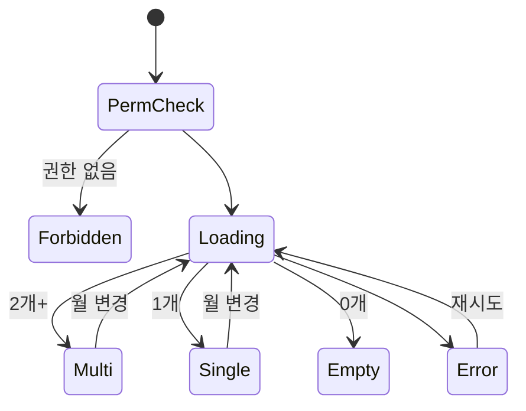

# SCR-093 지점 성과 리포트 — 기본화면 (마스터)

> 이 문서는 **화면 마스터 스펙**입니다. `01~05` 상태 문서는 이 문서를 상속(override/delta)합니다.
> 🚨 **primary/superAdmin 전용**: 전 지점 성과 비교 리포트. owner는 자기 브랜드 하위 지점만, manager 이하는 차단.

---

## 0. 메타 & 원천 참조

| 항목 | 값 |
|------|----|
| 화면 ID | SCR-093 |
| 화면명 | 지점 성과 리포트 |
| 도메인 | D10-본사관리 |
| 경로 | `/branch-report` |
| Next.js Route Group | `(admin)` |
| 파일 경로 | `src/app/(admin)/branch-report/page.tsx` |
| 페이지 컴포넌트 | `BranchReport` |
| 역할 | `primary/super` 전체 / `owner` 자기 브랜드 |
| 우선순위 | P0 |
| 플랫폼 | 데스크톱 우선 |
| 멀티테넌트 | ✅ tenantId 스코프 |

### 원천 문서 링크
| 문서 | 경로 |
|---|---|
| 화면설계서 | `docs/화면설계서/본사관리.md` §SCR-093 |
| 기능명세서 | `docs/기능명세서/본사관리.md` §4. 지점 리포트 |
| KPI 정의서 | `docs/KPI_정의서.md` §지점 KPI 18~29 |
| 에러코드정의서 | `docs/에러코드정의서.md` §공통 + 지점 |
| 권한매트릭스 | `docs/다이어그램/10_권한매트릭스/R1_역할화면_매트릭스.md` (primary ●, 그 외 —) |
| 다이어그램 F1~F9 | `docs/다이어그램/D10_본사관리/SCR-093_지점성과리포트/` |

---

## 1. 화면 목적 (Why)

**월별 지점 간 성과를 한 화면에서 비교하고 랭킹을 매겨 본사 운영 의사결정을 지원**한다.
- 매출 기준 1~3위 메달 표시 (🥇🥈🥉), 4위+ 숫자
- 총회원·신규·활성·만료·매출·객단가·출석률 8개 지표 비교
- 지점별 매출/회원 가로 바 차트로 시각화
- 월 선택, 정렬, 엑셀 다운로드 지원

---

## 2. 화면 레이아웃 (Wireframe)

```
┌─────────────────────────────────────────────────────────────────────────┐
│ AppLayout (본사관리 사이드바)                                            │
│ ┌─Sidebar─┐ ┌─Main──────────────────────────────────────────────────────┐│
│ │본사관리  │ │ PageHeader: 지점 성과 리포트                             ││
│ │├지점관리 │ │ [월 선택 ▼: 2026년 4월]              [엑셀 다운로드]    ││
│ │●지점리포 │ ├──────────────────────────────────────────────────────────┤│
│ │├KPI      │ │ [총 매출 4.82억] [총 회원 1,247] [신규 108] [활성 81%]   ││
│ │└...      │ ├──────────────────────────────────────────────────────────┤│
│ │          │ │ ┌─매출 비교──────────┐ ┌─회원 비교──────────┐            ││
│ │          │ │ │ 강남점  ████ 3,800만│ │ 강남점 ████ 520명  │            ││
│ │          │ │ │ 홍대점  ███  2,920만│ │ 홍대점 ███  412명  │            ││
│ │          │ │ │ 분당점  ██   1,700만│ │ 분당점 ██   315명  │            ││
│ │          │ │ └────────────────────┘ └────────────────────┘            ││
│ │          │ ├──────────────────────────────────────────────────────────┤│
│ │          │ │ DataTable: 지점별 성과                                   ││
│ │          │ │ 지점명 │총회원│신규│활성│만료│매출 │객단가│출석률│        ││
│ │          │ │ 🥇강남점│ 520 │43  │412 │36  │3.8억│73만  │62%  │        ││
│ │          │ │ 🥈홍대점│ 412 │35  │334 │28  │2.9억│71만  │58%  │        ││
│ │          │ │ 🥉분당점│ 315 │30  │242 │19  │1.7억│54만  │55%  │        ││
│ └──────────┘ └──────────────────────────────────────────────────────────┘│
└─────────────────────────────────────────────────────────────────────────┘
```

### 영역 그리드
| 영역 | 그리드 |
|---|---|
| KPI 카드 | `grid grid-cols-2 md:grid-cols-4 gap-4` |
| 차트 2개 | `grid grid-cols-1 lg:grid-cols-2 gap-6` |
| DataTable | `w-full` |

---

## 3. 디자인 토큰

### 3.1 색상
| 토큰 | 클래스 | 용도 |
|---|---|---|
| bg.page | `bg-gray-50` | 페이지 배경 |
| bg.card | `bg-white rounded-xl shadow-sm ring-1 ring-gray-100 p-5` | 컨테이너 |
| chart.revenue | `bg-blue-500` | 매출 바 |
| chart.member | `bg-emerald-500` | 회원 바 |
| medal.1 | `text-yellow-500` | 🥇 |
| medal.2 | `text-gray-400` | 🥈 |
| medal.3 | `text-amber-700` | 🥉 |
| row.highlight | `bg-blue-50/50` | 1위 행 하이라이트 |

### 3.2 타이포그래피
| 토큰 | 스타일 |
|---|---|
| page.title | `text-2xl font-bold tracking-tight text-gray-900` |
| chart.title | `text-sm font-semibold text-gray-900 mb-3` |
| bar.value | `text-xs tabular-nums text-gray-600` |
| table.value | `text-sm tabular-nums text-gray-900` |

### 3.3 간격/반경
- 카드 radius: `rounded-xl`
- 섹션 gap: `space-y-6`

### 3.4 모션
- 바 차트 너비 애니메이션: `transition-all duration-500 ease-out`
- 월 선택 변경 시 데이터 페이드: `animate-[fadeIn_200ms]`

---

## 4. 반응형 규칙

| BP | §A KPI | 차트 | 테이블 |
|---|---|---|---|
| Mobile <640 | 2열 | 1열 세로 | 가로 스크롤 |
| Tablet | 4열 | 2열 | 풀 |
| Desktop ≥1024 | 4열 | 2열 | 풀 |

---

## 5. 🔐 역할별(RBAC) 매트릭스

| 요소 | primary/super | owner | manager | fc | trainer | staff | front | readonly |
|---|:---:|:---:|:---:|:---:|:---:|:---:|:---:|:---:|
| **페이지 접근** | ● | ● (자기 브랜드) | — | — | — | — | — | — |
| 월 선택 | ● | ● | — | — | — | — | — | — |
| KPI 카드 | ● | ● | — | — | — | — | — | — |
| 지점별 바 차트 | ● | ● | — | — | — | — | — | — |
| 테이블 정렬 | ● | ● | — | — | — | — | — | — |
| 메달 아이콘 | ● | ● | — | — | — | — | — | — |
| 엑셀 다운로드 | ● | ● (자기 브랜드만) | — | — | — | — | — | — |

### 5.1 서버 가드
```ts
if (pathname === '/branch-report') {
  if (!['primary','superAdmin','owner'].includes(user.role)) {
    return NextResponse.redirect('/forbidden');
  }
}
```

---

## 6. 컴포넌트 트리

```
<AppLayout role={user.role}>
  <PageHeader title="지점 성과 리포트">
    <MonthSelector value={selectedMonth} onChange={setSelectedMonth}/>
    <ExportButton onExport={handleExport}/>
  </PageHeader>

  <StatCardGrid cols={4}>
    <StatCard label="총 매출" value={formatAmount(totalSales)} unit="원" variant="peach" icon={<DollarSign/>}/>
    <StatCard label="총 회원" value={formatNumber(totalMembers)} unit="명" variant="mint" icon={<Users/>}/>
    <StatCard label="신규 가입" value={formatNumber(newMembers)} unit="명" icon={<UserPlus/>}/>
    <StatCard label="활성 비율" value={`${activeRate}%`} icon={<Target/>}/>
  </StatCardGrid>

  <section className="grid grid-cols-1 lg:grid-cols-2 gap-6">
    <SimpleBarChart title="매출 비교" color="primary" data={salesRanking}/>
    <SimpleBarChart title="회원 비교" color="accent" data={memberRanking}/>
  </section>

  <DataTable columns={reportColumns} data={sortedStats}
    sortState={{sortKey, sortAsc}} onSort={handleSort}/>
</AppLayout>
```

### 6.1 핵심 컴포넌트
| 컴포넌트 | 파일 | Props |
|---|---|---|
| `MonthSelector` | `src/components/common/MonthSelector.tsx` | 최근 12개월 |
| `SimpleBarChart` | `src/components/common/SimpleBarChart.tsx` | `{title, color, data}` |
| `MedalIcon` | `src/components/common/MedalIcon.tsx` | `{rank:1\|2\|3}` |
| `DataTable` | `src/components/common/DataTable.tsx` | sortable columns |

---

## 7. 데이터 계약

### 7.1 타입
```ts
interface BranchStat {
  id: number;
  name: string;
  totalMembers: number;
  newMembers: number;
  activeMembers: number;
  expiredMembers: number;
  totalSales: number;
  avgSales: number;          // totalSales / totalMembers
  attendanceRate: string;    // 'N%' 또는 '-'
  salesRank: number;
}
```

### 7.2 API
| 엔드포인트 | 메서드 | 파라미터 | 반환 |
|---|---|---|---|
| `GET /branch-report` | GET | `{tenantId, month}` | `BranchStat[]` |
| `GET /branch-report/summary` | GET | `{month}` | `{totalSales, totalMembers, newMembers, activeRate}` |

### 7.3 상태 관리
- **Store**: `useAuthStore`, `useBranchReport`
- **Fetching**: React Query `['branch-report', month, tenantId]`
- **Cache**: staleTime 5분

---

## 8. 비즈니스 룰

1. **월 선택**: 기본값 현재월, 최근 12개월 목록 (`YYYY년 M월`)
2. **매출 랭킹**: `totalSales DESC`, 1~3위 메달, 4위+ 숫자 표시
3. **출석률 계산**: `(출석수 / (활성회원 × 월 일수)) × 100`, 활성회원 0 → `"-"`
4. **객단가**: `totalSales / totalMembers`, totalMembers 0 → `0`
5. **정렬**: 컬럼 헤더 클릭 → toggle asc/desc
6. **차트**: 매출 최대값 기준 바 너비 비율
7. **엑셀 export**: 전 컬럼 + audit_log EXPORT
8. **권한**: owner는 자기 브랜드 내 지점만 조회, primary는 전 지점
9. **지점명 클릭**: SCR-092 지점 관리로 이동(상세 포커스)
10. **빈 지점 처리**: 회원 0명 지점은 객단가/출석률 `-`

---

## 9. 상태 목록

| 파일 | 상태 코드 | 한글 | 트리거 |
|---|---|---|---|
| `01-로딩.md` | `report-loading` | 로딩 | 진입/월 변경 |
| `02-정상-복수지점.md` | `report-multi` | 정상(2개+) | 지점 2개 이상 |
| `03-단일지점.md` | `report-single` | 단일 지점 | 지점 1개 (차트 축소) |
| `04-지점없음.md` | `report-empty` | 지점 없음 | 지점 0개 |
| `05-에러.md` | `report-error` | 에러 | API 실패 |

---

## 10. 에러 코드 매핑

| errorCode | HTTP | 시나리오 | 대응 |
|---|---|---|---|
| E401002 | 401 | JWT 만료 | `/login` |
| E403001 | 403 | 권한 없음 | `/forbidden` |
| E404900 | 404 | 지점 없음 | `04-지점없음` |
| E500001 | 500 | 서버 오류 | `05-에러` + 재시도 |
| E503001 | 503 | 점검 | 배너 |
| NETWORK | — | 오프라인 | 배너 |

---

## 11. 접근성 (WCAG 2.1 AA)
- `<main role="main">` + section `aria-label`
- 테이블: `<caption class="sr-only">` + sortable 헤더 `aria-sort`
- 바 차트: `role="img" aria-label` 또는 sr-only 테이블 병기
- 메달 아이콘: `aria-label="1위 강남점"` 등
- 월 선택 드롭다운: `<select>` 또는 combobox 패턴

---

## 12. 진입 / 이탈

### 진입
- 사이드바 "본사관리 > 지점 리포트"
- SCR-090 대시보드 → 지점 리포트 바로가기

### 이탈
- 지점명 클릭 → `/branches?focus={id}` (SCR-092)
- 월 선택 → 같은 라우트 쿼리 `?month=YYYY-MM`
- 엑셀 다운로드 → 파일 저장 (페이지 유지)

---

## 13. 다이어그램 통합 뷰



---

## 14. 🧩 바이브코딩 프롬프트 (마스터)

```
Next.js 15 + TS + Tailwind + React Query + Supabase
'use client' 컴포넌트를 작성하라.

━━ 화면: SCR-093 지점 성과 리포트 (primary/owner 전용) ━━
파일: src/app/(admin)/branch-report/page.tsx

━━ 가드 ━━
middleware.ts에서 primary/superAdmin/owner만 허용, 그 외 /forbidden

━━ 레이아웃 ━━
<AppLayout role={user.role}>
  <div className="p-6 lg:p-8 space-y-6">
    <PageHeader title="지점 성과 리포트">
      <MonthSelector
        value={month}
        options={last12Months()}
        onChange={(m) => { setMonth(m); router.replace(`?month=${m}`); }}
      />
      <Button variant="secondary" onClick={handleExport}>
        <Download className="h-4 w-4 mr-1"/> 엑셀 다운로드
      </Button>
    </PageHeader>

    <StatCardGrid cols={4}>
      <StatCard label="총 매출" value={formatAmount(summary.totalSales)} unit="원" variant="peach" icon={<DollarSign/>}/>
      <StatCard label="총 회원" value={formatNumber(summary.totalMembers)} unit="명" variant="mint" icon={<Users/>}/>
      <StatCard label="신규 가입" value={formatNumber(summary.newMembers)} unit="명" icon={<UserPlus/>}/>
      <StatCard label="활성 비율" value={`${summary.activeRate}%`} icon={<Target/>}/>
    </StatCardGrid>

    <section className="grid grid-cols-1 lg:grid-cols-2 gap-6">
      <ChartCard title="매출 비교">
        <SimpleBarChart
          data={[...stats].sort((a,b) => b.totalSales - a.totalSales)
            .map(s => ({ label: s.name, value: s.totalSales, format: formatAmount }))}
          color="bg-blue-500"
        />
      </ChartCard>
      <ChartCard title="회원 비교">
        <SimpleBarChart
          data={[...stats].sort((a,b) => b.totalMembers - a.totalMembers)
            .map(s => ({ label: s.name, value: s.totalMembers, format: (v) => `${formatNumber(v)}명` }))}
          color="bg-emerald-500"
        />
      </ChartCard>
    </section>

    <DataTable
      columns={reportColumns}
      data={sortedStats}
      sortState={{ sortKey, sortAsc }}
      onSort={handleSort}
      onRowClick={(row) => router.push(`/branches?focus=${row.id}`)}
    />
  </div>
</AppLayout>

━━ 컬럼 정의 ━━
const reportColumns: Column<BranchStat>[] = [
  { key:'name', label:'지점명', sortable:true,
    render: (v, row) => (
      <span className="flex items-center gap-2">
        {row.salesRank === 1 && <Medal className="h-4 w-4 text-yellow-500" aria-label="1위"/>}
        {row.salesRank === 2 && <Medal className="h-4 w-4 text-gray-400" aria-label="2위"/>}
        {row.salesRank === 3 && <Medal className="h-4 w-4 text-amber-700" aria-label="3위"/>}
        {row.salesRank >= 4 && <span className="text-xs text-gray-500">{row.salesRank}</span>}
        <span className="font-medium">{v}</span>
      </span>
    )
  },
  { key:'totalMembers', label:'총회원', align:'right', sortable:true, render:v=>`${formatNumber(v)}명` },
  { key:'newMembers', label:'신규가입', align:'right', sortable:true, render:formatNumber },
  { key:'activeMembers', label:'활성회원', align:'right', sortable:true, render:formatNumber },
  { key:'expiredMembers', label:'만료회원', align:'right', sortable:true, render:formatNumber },
  { key:'totalSales', label:'매출', align:'right', sortable:true, render:formatAmount },
  { key:'avgSales', label:'객단가', align:'right', sortable:true, render:formatAmount },
  { key:'attendanceRate', label:'출석률', align:'right', sortable:true },
];

━━ 데이터 훅 ━━
function useBranchReport(month: string) {
  return useQuery({
    queryKey: ['branch-report', month, user.tenantId],
    queryFn: () => api.get('/branch-report', { params: { month }}),
    staleTime: 5 * 60_000,
  });
}

━━ 정렬 ━━
const handleSort = (key: keyof BranchStat) => {
  if (sortKey === key) setSortAsc(!sortAsc);
  else { setSortKey(key); setSortAsc(false); }
};

const sortedStats = useMemo(() => [...stats].sort((a, b) => {
  const va = a[sortKey] ?? 0;
  const vb = b[sortKey] ?? 0;
  if (typeof va === 'number' && typeof vb === 'number')
    return sortAsc ? va - vb : vb - va;
  return sortAsc ? String(va).localeCompare(String(vb)) : String(vb).localeCompare(String(va));
}), [stats, sortKey, sortAsc]);

━━ 엑셀 export ━━
const handleExport = () => {
  exportToExcel(sortedStats, exportColumns, { filename:`지점리포트_${month}` });
  api.post('/audit-log', { action:'EXPORT', targetType:'branch_report' });
  toast.success(`${sortedStats.length}건 다운로드 완료`);
};

━━ 접근성 ━━
- 메달 aria-label "1위 강남점"
- 바 차트 aria-label "매출 비교 차트, {N}개 지점"
- 테이블 aria-sort 속성
- 월 선택 <label htmlFor>

━━ 반응형 ━━
- <640: 카드 2열, 차트 1열, 테이블 가로 스크롤
- ≥1024: KPI 4열, 차트 2열, 풀 테이블
```

---

## 15. QA 체크리스트
- [ ] primary/owner만 접근, 그 외 `/forbidden`
- [ ] 월 선택 변경 시 데이터 refetch + URL query 갱신
- [ ] 1위 🥇, 2위 🥈, 3위 🥉 메달 표시
- [ ] 4위+ 숫자 표시
- [ ] 컬럼 헤더 정렬 (asc/desc)
- [ ] 바 차트 최대값 기준 비율
- [ ] 객단가 0명 지점 `0` 표시
- [ ] 출석률 `-` 처리 (활성 0)
- [ ] 엑셀 다운로드 + audit_log
- [ ] 지점 1개면 `03-단일지점`
- [ ] 지점 0개면 `04-지점없음`
- [ ] owner는 자기 브랜드만
- [ ] 접근성 aria-sort, aria-label
