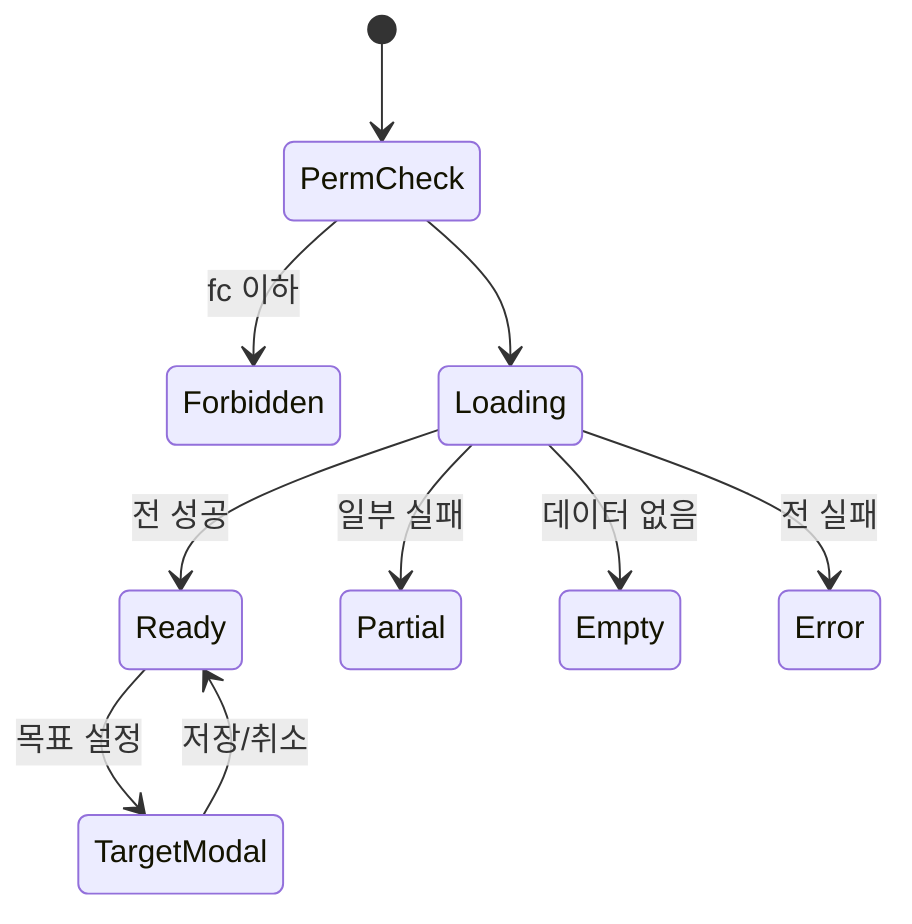

# SCR-094 KPI 대시보드 — 기본화면 (마스터)

> 이 문서는 **화면 마스터 스펙**입니다. `01~06` 상태 문서는 이 문서를 상속(override/delta)합니다.
> 🚨 **primary/owner/manager 접근 가능 (24개 KPI 본사/지점 동시 표시)**
> 매출 목표 설정(DLG-094-001), 코호트 분석, 퍼널 분석까지 종합 KPI 화면.

---

## 0. 메타 & 원천 참조

| 항목 | 값 |
|------|----|
| 화면 ID | SCR-094 |
| 화면명 | KPI 대시보드 (24지표) |
| 도메인 | D10-본사관리 |
| 경로 | `/kpi` |
| 파일 경로 | `src/app/(admin)/kpi/page.tsx` |
| 페이지 컴포넌트 | `KpiDashboard` |
| 역할 | `primary/super`, `owner`, `manager` |
| 우선순위 | P0 |
| 멀티테넌트 | ✅ branchId 스코프 (manager는 본인 지점만) |

### 원천 문서 링크
| 문서 | 경로 |
|---|---|
| 화면설계서 | `docs/화면설계서/본사관리.md` §SCR-094 |
| 기능명세서 | `docs/기능명세서/본사관리.md` §5. KPI 대시보드 |
| KPI 정의서 | `docs/KPI_정의서.md` §지점 KPI 18~29, 직원 KPI 1~17 |
| 에러코드 | `docs/에러코드정의서.md` §공통 |
| 다이어그램 F1~F9 | `docs/다이어그램/D10_본사관리/SCR-094_KPI대시보드/` |
| DLG-094-001 | `docs/화면설계서/D10-본사관리/DLG-094-001-매출목표설정/` |

---

## 1. 화면 목적 (Why)

**회사 성장 및 Team Health 24개 핵심 지표를 한 화면에서 확인**하여 경영 의사결정의 근거를 제공한다.
- 회원 현황 6개, 매출 4개 + 달성률 게이지, 상담/전환 4개, PT 4개, GX 4개
- 코호트 분석 (최근 6개월 유지율), 퍼널 분석 (리드→재등록 5단계)
- 지점별 집계 (manager=본인 지점, primary/owner=전체)
- 매출 목표 저장 (localStorage `kpi_monthly_target_{branchId}_{yearMonth}`)

---

## 2. 화면 레이아웃 (Wireframe)

```
┌─────────────────────────────────────────────────────────────────────────┐
│ PageHeader: KPI 대시보드         [목표 설정] [새로고침 🔄]              │
├─────────────────────────────────────────────────────────────────────────┤
│ §A 회원 현황 (6열)                                                      │
│ [전체회원][활성회원][활성비율][이번달신규][만료예정][만료회원]           │
├─────────────────────────────────────────────────────────────────────────┤
│ §B 매출 (4열 + 달성률 게이지)                                           │
│ [이번달매출][전월매출][MoM][신규MoM]                                    │
│ ┌─ 매출 달성률 게이지 ──────────────────────────────┐                   │
│ │ ₩5,200만 / ₩6,000만 (87% 달성)                    │                   │
│ │ ████████▌░░░  [목표 수정]                         │                   │
│ └────────────────────────────────────────────────────┘                  │
├─────────────────────────────────────────────────────────────────────────┤
│ §C 상담/전환 (4열)                                                      │
│ [이번달상담][완료상담][완료율][일평균출석]                              │
├─────────────────────────────────────────────────────────────────────────┤
│ §D PT 수업 (4열)                                                        │
│ [PT세션][PT완료][PT완료율][PT노쇼율]                                    │
├─────────────────────────────────────────────────────────────────────────┤
│ §E GX 수업 (4열)                                                        │
│ [이번달수업][예약수][출석수][수업출석률]                                │
├─────────────────────────────────────────────────────────────────────────┤
│ §F 코호트 분석 (최근 6개월 유지율 히트맵 테이블)                        │
│ 등록월  │등록수│1개월│2개월│3개월│4개월│5개월│6개월│                    │
│ 2025-11 │  42 │92%  │85%  │78%  │70%  │65%  │60%  │                    │
│ 2025-12 │  38 │94%  │88%  │82%  │75%  │68%  │-   │                    │
│ ...                                                                      │
├─────────────────────────────────────────────────────────────────────────┤
│ §G 퍼널 분석 (5단계)                                                    │
│ 리드유입 █████████ 248 (100%)                                           │
│ 상담완료 ███████   186 (75%)                                            │
│ 회원등록 ████      108 (58%)                                            │
│ 3개월유지 ███       78 (72%)                                            │
│ 재등록    ██        45 (58%)                                            │
├─────────────────────────────────────────────────────────────────────────┤
│ 추가 예정 KPI (9개 미구현) — 목록만 표시                                │
└─────────────────────────────────────────────────────────────────────────┘
```

### 영역 그리드
| 영역 | 그리드 |
|---|---|
| §A 6열 | `grid grid-cols-2 md:grid-cols-3 lg:grid-cols-6 gap-3` |
| §B~E 4열 | `grid grid-cols-2 md:grid-cols-4 gap-3` |
| 게이지 | `w-full h-3 rounded-full bg-gray-200` |
| §F 코호트 | `w-full overflow-x-auto` |
| §G 퍼널 | `space-y-3` |

---

## 3. 디자인 토큰

### 3.1 색상
| 토큰 | 클래스 | 용도 |
|---|---|---|
| bg.page | `bg-gray-50` | 배경 |
| card | `bg-white rounded-xl shadow-sm ring-1 ring-gray-100 p-4` | 카드 |
| gauge.100+ | `bg-emerald-500` | 100%+ 달성 |
| gauge.70-99 | `bg-blue-500` | 70~99% |
| gauge.50-69 | `bg-yellow-400` | 50~69% |
| gauge.0-49 | `bg-red-500` | 0~49% |
| cohort.90+ | `bg-green-200 text-green-900` | 유지율 90%+ |
| cohort.70-89 | `bg-green-100 text-green-800` | |
| cohort.50-69 | `bg-yellow-100 text-yellow-800` | |
| cohort.30-49 | `bg-orange-100 text-orange-800` | |
| cohort.0-29 | `bg-red-100 text-red-800` | |
| funnel.bar | `bg-gradient-to-r from-primary to-accent` | 퍼널 바 |
| variant.mint | `bg-emerald-50 ring-emerald-100` | 긍정 카드 |
| variant.peach | `bg-orange-50 ring-orange-100` | 주의 카드 |

### 3.2 타이포그래피
| 토큰 | 스타일 |
|---|---|
| card.value | `text-2xl font-bold tabular-nums` |
| card.label | `text-xs uppercase text-gray-500` |
| cohort.cell | `text-xs font-medium tabular-nums` |
| funnel.value | `text-sm font-semibold` |

---

## 4. 반응형 규칙

| BP | §A | §B~E | 코호트 | 퍼널 |
|---|---|---|---|---|
| Mobile | 2열 | 2열 | 가로 스크롤 | 풀 |
| Tablet | 3열 | 2열 | 풀 | 풀 |
| Desktop | 6열 | 4열 | 풀 | 풀 |

---

## 5. 🔐 역할별(RBAC) 매트릭스

| 요소 | primary/super | owner | manager | fc | trainer | staff | front | readonly |
|---|:---:|:---:|:---:|:---:|:---:|:---:|:---:|:---:|
| **페이지 접근** | ● | ● | ● | — | — | — | — | — |
| §A 회원 현황 | ● | ● | ● | — | — | — | — | — |
| §B 매출 | ● | ● | ○(읽기) | — | — | — | — | — |
| 목표 설정 | ● | ● | — | — | — | — | — | — |
| §C 상담/전환 | ● | ● | ● | — | — | — | — | — |
| §D PT | ● | ● | ● | — | — | — | — | — |
| §E GX | ● | ● | ● | — | — | — | — | — |
| §F 코호트 | ● | ● | ○ | — | — | — | — | — |
| §G 퍼널 | ● | ● | ● | — | — | — | — | — |
| 새로고침 | ● | ● | ● | — | — | — | — | — |

### 5.1 매출 읽기 전용 (manager)
- §B 매출 카드는 표시하되 `목표 설정` 버튼 제거
- 게이지 `[목표 수정]` 링크 숨김

---

## 6. 컴포넌트 트리

```
<AppLayout role={user.role}>
  <PageHeader title="KPI 대시보드">
    {canEditTarget(role) && <Button onClick={() => setShowTargetModal(true)}>목표 설정</Button>}
    <RefreshButton onClick={fetchMetrics} loading={isRefetching}/>
  </PageHeader>

  <section aria-label="회원 현황" className="grid grid-cols-2 md:grid-cols-3 lg:grid-cols-6 gap-3">
    <KpiCard label="전체 회원" value={m.totalMembers} unit="명" icon={<Users/>}/>
    <KpiCard label="활성 회원" value={m.activeMembers} unit="명" variant="mint" icon={<UserCheck/>}/>
    <KpiCard label="활성 비율" value={`${activeRate}%`} icon={<Target/>}/>
    <KpiCard label="이번달 신규" value={m.newMembersThisMonth} unit="명" variant="peach" icon={<TrendingUp/>}/>
    <KpiCard label="만료 예정" value={m.expiringMembers} unit="명" icon={<AlertCircle/>}/>
    <KpiCard label="만료 회원" value={m.expiredMembers} unit="명" icon={<UserMinus/>}/>
  </section>

  {canSeeRevenue(role) && (
    <>
      <section aria-label="매출" className="grid grid-cols-2 md:grid-cols-4 gap-3">
        <KpiCard label="이번달 매출" value={formatAmount(m.monthlyRevenue)} unit="원" variant="mint"/>
        <KpiCard label="전월 매출" value={formatAmount(m.prevMonthRevenue)} unit="원"/>
        <KpiCard label="MoM 성장률" value={`${revenueMoM}%`} variant={revenueMoM >= 0 ? 'mint' : 'peach'}/>
        <KpiCard label="신규 MoM" value={`${newMemberMoM}%`}/>
      </section>
      <RevenueGauge current={m.monthlyRevenue} target={target} onEdit={canEditTarget(role) ? () => setShowTargetModal(true) : undefined}/>
    </>
  )}

  <section aria-label="상담/전환" className="grid ...">...</section>
  <section aria-label="PT 수업" className="grid ...">...</section>
  <section aria-label="GX 수업" className="grid ...">...</section>

  <CohortAnalysis data={cohortData}/>
  <FunnelAnalysis data={funnelData}/>
  <UpcomingKpis items={TODO_KPI_LIST}/>

  {showTargetModal && <TargetModal onClose={...} onSaved={handleTargetSaved}/>}  {/* DLG-094-001 */}
</AppLayout>
```

### 6.1 핵심 컴포넌트
| 컴포넌트 | 파일 |
|---|---|
| `KpiCard` | `src/components/kpi/KpiCard.tsx` |
| `RevenueGauge` | `src/components/kpi/RevenueGauge.tsx` |
| `CohortAnalysis` | `src/components/kpi/CohortAnalysis.tsx` |
| `FunnelAnalysis` | `src/components/kpi/FunnelAnalysis.tsx` |
| `TargetModal` | `src/components/kpi/TargetModal.tsx` (DLG-094-001) |

---

## 7. 데이터 계약

### 7.1 타입
```ts
interface KpiMetrics {
  totalMembers: number;
  activeMembers: number;
  newMembersThisMonth: number;
  newMembersPrevMonth: number;
  expiredMembers: number;
  expiringMembers: number;
  monthlyRevenue: number;
  prevMonthRevenue: number;
  avgWeeklyAttendance: number;
  todayAttendance: number;
  totalConsultations: number;
  completedConsultations: number;
  totalPtSessions: number;
  completedPtSessions: number;
  noShowPtSessions: number;
  totalClasses: number;
  totalClassAttendees: number;
  totalClassBooked: number;
}
interface CohortRow { month: string; size: number; retention: (number|null)[]; }  // 7칸: size + 1~6개월
interface FunnelStage { label: string; count: number; colorClass: string; }
```

### 7.2 API (Supabase 병렬 18개)
- members.count (전체/활성/신규/신규전월/만료/만료예정)
- sales.sum (이번달/전월)
- attendance.count (오늘/7일)
- consultations.count (이번달/완료)
- lesson_bookings.count (PT 이번달/완료/노쇼)
- classes.count (이번달)
- lesson_bookings.count (예약+ATTENDED, ATTENDED)

### 7.3 목표 저장
- `localStorage.setItem('kpi_monthly_target_{branchId}_{yearMonth}', raw)`
- 향후 Supabase `kpi_targets` 테이블로 이관

---

## 8. 비즈니스 룰

1. **MoM 계산**: `prev > 0 ? ((curr-prev)/prev)*100 : 0`, 반올림
2. **달성률 게이지 색상**: 100+→emerald, 70~99→blue, 50~69→yellow, 0~49→red
3. **PT 완료율 variant**: >=85 mint / <85 peach
4. **PT 노쇼율 variant**: <=5 mint / >5 peach
5. **수업 출석률**: >=80 mint / <80 peach
6. **코호트 유지율**: `(ACTIVE || expiry >= monthEnd) / cohortTotal * 100`
7. **코호트 미도달 월**: null → `"-"`
8. **퍼널 바 너비**: 첫 단계(리드 유입) 기준 비율
9. **퍼널 전환율**: idx=0 100%, 이후 `현재/이전 * 100`
10. **목표 저장**: 빈값/0 → toast.error, 성공 → toast.success
11. **새로고침**: 전 쿼리 invalidate + 60초 쿨다운
12. **부분 실패**: 18개 쿼리 중 실패한 카드만 `03-일부실패` 상태

---

## 9. 상태 목록

| 파일 | 상태 코드 | 한글 | 트리거 |
|---|---|---|---|
| `01-로딩.md` | `kpi-loading` | 로딩 | 진입 |
| `02-정상.md` | `kpi-ready` | 정상 | 전 쿼리 완료 |
| `03-일부실패.md` | `kpi-partial` | 일부 실패 | 1~N개 쿼리 실패 |
| `04-빈상태.md` | `kpi-empty` | 빈 상태 | 데이터 없음(신규 지점) |
| `05-에러.md` | `kpi-error` | 에러 | 전체 실패 |
| `06-권한없음.md` | `kpi-forbidden` | 권한 없음 | fc 이하 |

---

## 10. 에러 코드 매핑

| errorCode | 시나리오 | 표시 |
|---|---|---|
| E401002 | JWT 만료 | `/login` |
| E403001 | 권한 없음 | `06-권한없음` |
| E500001 | 서버 오류 | `05-에러` |
| E503001 | 점검 | warn 배너 |
| 부분 실패 | 개별 쿼리 실패 | `03-일부실패` 카드별 에러 UI |

---

## 11. 접근성
- 카드 `role="group" aria-labelledby`
- 게이지 `role="progressbar" aria-valuenow aria-valuemax`
- 코호트 테이블 `<caption>` + 색상만 아닌 숫자 표기
- 퍼널 각 단계 `aria-label` 단계/건수/전환율 포함
- 목표 모달 focus trap, Esc 닫기

---

## 12. 진입 / 이탈

### 진입
- 사이드바 "KPI 대시보드"
- KPI 프리뷰(SCR-095)에서 "KPI 전체 보기"

### 이탈
- 목표 설정 → DLG-094-001 오픈
- 새로고침 → invalidate (same route)
- 코호트 행 클릭 → `/members?registeredMonth=YYYY-MM`
- 퍼널 단계 클릭 → 해당 리소스 목록 이동

---

## 13. 다이어그램 통합 뷰



---

## 14. 🧩 바이브코딩 프롬프트 (마스터)

```
Next.js 15 + TS + Tailwind + React Query + Supabase
'use client' 컴포넌트를 작성하라.

━━ 화면: SCR-094 KPI 대시보드 (primary/owner/manager) ━━
파일: src/app/(admin)/kpi/page.tsx
보조:
- src/components/kpi/{KpiCard, RevenueGauge, CohortAnalysis, FunnelAnalysis, TargetModal}.tsx
- src/hooks/useKpiMetrics.ts

━━ 가드 ━━
middleware.ts: primary/superAdmin/owner/manager만 허용

━━ 레이아웃 ━━
<AppLayout role={user.role}>
  <div className="p-6 lg:p-8 space-y-6">
    <PageHeader title="KPI 대시보드">
      {canEditTarget(role) && (
        <Button variant="secondary" onClick={() => setShowTarget(true)}>
          <Target className="h-4 w-4 mr-1"/> 목표 설정
        </Button>
      )}
      <RefreshButton onClick={refetchAll} loading={isFetching} disabled={cooldown>0}/>
    </PageHeader>

    {/* §A 회원 현황 6 */}
    <section aria-label="회원 현황"
      className="grid grid-cols-2 md:grid-cols-3 lg:grid-cols-6 gap-3">
      <KpiCard label="전체 회원" value={`${formatNumber(m.totalMembers)}명`} icon={<Users/>}/>
      <KpiCard label="활성 회원" value={`${formatNumber(m.activeMembers)}명`} variant="mint" icon={<UserCheck/>}/>
      <KpiCard label="활성 비율" value={`${activeRate}%`} icon={<Target/>}/>
      <KpiCard label="이번달 신규" value={`${formatNumber(m.newMembersThisMonth)}명`} variant="peach" icon={<TrendingUp/>}/>
      <KpiCard label="만료 예정" value={`${formatNumber(m.expiringMembers)}명`} icon={<AlertCircle/>}/>
      <KpiCard label="만료 회원" value={`${formatNumber(m.expiredMembers)}명`} icon={<UserMinus/>}/>
    </section>

    {/* §B 매출 (canSeeRevenue) */}
    {canSeeRevenue(role) && (
      <>
        <section aria-label="매출" className="grid grid-cols-2 md:grid-cols-4 gap-3">
          <KpiCard label="이번달 매출" value={formatAmount(m.monthlyRevenue)} unit="원" variant="mint" icon={<DollarSign/>}/>
          <KpiCard label="전월 매출" value={formatAmount(m.prevMonthRevenue)} unit="원" icon={<DollarSign/>}/>
          <KpiCard label="MoM 성장률"
            value={`${revenueMoM >=0 ? '+' : ''}${revenueMoM}%`}
            variant={revenueMoM >=0 ? 'mint' : 'peach'}
            icon={revenueMoM >=0 ? <TrendingUp/> : <TrendingDown/>}/>
          <KpiCard label="신규 MoM"
            value={`${newMemberMoM >=0 ? '+' : ''}${newMemberMoM}%`}
            icon={newMemberMoM >=0 ? <TrendingUp/> : <TrendingDown/>}/>
        </section>

        <RevenueGauge
          current={m.monthlyRevenue}
          target={target}
          onEdit={canEditTarget(role) ? () => setShowTarget(true) : undefined}
        />
      </>
    )}

    {/* §C 상담/전환 */}
    <section aria-label="상담/전환" className="grid grid-cols-2 md:grid-cols-4 gap-3">
      <KpiCard label="이번달 상담" value={`${m.totalConsultations}건`} icon={<CalendarCheck/>}/>
      <KpiCard label="상담 완료" value={`${m.completedConsultations}건`} variant="mint" icon={<CheckCircle2/>}/>
      <KpiCard label="상담 완료율" value={`${consultConvRate}%`} variant="peach" icon={<Target/>}/>
      <KpiCard label="일평균 출석" value={`${m.avgWeeklyAttendance}명`} icon={<Users/>}/>
    </section>

    {/* §D PT */}
    <section aria-label="PT 수업" className="grid grid-cols-2 md:grid-cols-4 gap-3">
      <KpiCard label="이번달 PT 세션" value={`${m.totalPtSessions}건`} icon={<CalendarCheck/>}/>
      <KpiCard label="PT 완료" value={`${m.completedPtSessions}건`} variant="mint" icon={<CheckCircle2/>}/>
      <KpiCard label="PT 완료율" value={`${ptCompletionRate}%`} variant={ptCompletionRate>=85?'mint':'peach'} icon={<Target/>}/>
      <KpiCard label="PT 노쇼율" value={`${ptNoShowRate}%`} variant={ptNoShowRate<=5?'mint':'peach'} icon={<AlertCircle/>}/>
    </section>

    {/* §E GX */}
    <section aria-label="GX 수업" className="grid grid-cols-2 md:grid-cols-4 gap-3">
      <KpiCard label="이번달 수업" value={`${m.totalClasses}건`} icon={<BarChart3/>}/>
      <KpiCard label="예약 수" value={`${m.totalClassBooked}건`} icon={<CalendarCheck/>}/>
      <KpiCard label="출석 수" value={`${m.totalClassAttendees}건`} variant="mint" icon={<UserCheck/>}/>
      <KpiCard label="수업 출석률" value={`${classAttendRate}%`} variant={classAttendRate>=80?'mint':'peach'}/>
    </section>

    {/* §F 코호트 */}
    <CohortAnalysis data={cohortData}/>

    {/* §G 퍼널 */}
    <FunnelAnalysis data={funnelData}/>

    {/* 미구현 목록 */}
    <UpcomingKpis items={[
      '재등록률','이탈률','NPS','LTV','CAC',
      '영업이익률','직원 생산성 지수','회원 만족도','Today Tasks 완료율'
    ]}/>
  </div>

  {showTarget && (
    <TargetModal
      initialValue={target}
      yearMonth={getYearMonth()}
      onClose={() => setShowTarget(false)}
      onSaved={(v) => { setTarget(v); toast.success('매출 목표가 저장되었습니다.'); }}
    />
  )}
</AppLayout>

━━ 매출 게이지 ━━
function RevenueGauge({ current, target, onEdit }) {
  if (!target) return (
    <div className="bg-white rounded-xl p-5 ring-1 ring-gray-100 text-center text-sm text-gray-500">
      목표를 설정하세요
    </div>
  );
  const pct = Math.round(current / target * 100);
  const barColor = pct >= 100 ? 'bg-emerald-500' : pct >= 70 ? 'bg-blue-500' : pct >= 50 ? 'bg-yellow-400' : 'bg-red-500';
  return (
    <div className="bg-white rounded-xl p-5 ring-1 ring-gray-100">
      <div className="flex items-baseline justify-between mb-2">
        <span className="text-sm font-semibold text-gray-900">매출 달성률</span>
        {onEdit && <button onClick={onEdit} className="text-xs text-blue-600 hover:underline">목표 수정</button>}
      </div>
      <p className="text-xs text-gray-500 mb-2">
        {formatManwon(current)}만 / {formatManwon(target)}만 ({pct}%)
      </p>
      <div role="progressbar" aria-valuenow={pct} aria-valuemin={0} aria-valuemax={100}
        className="w-full h-3 rounded-full bg-gray-200 overflow-hidden">
        <div className={cn('h-full', barColor, 'transition-all duration-500')}
          style={{ width: `${Math.min(pct,100)}%` }}/>
      </div>
      <p className={cn('mt-2 text-xs font-medium',
        pct >= 100 ? 'text-emerald-600' : pct >= 70 ? 'text-blue-600' : pct >= 50 ? 'text-yellow-700' : 'text-red-600')}>
        {pct >= 100 ? '목표 달성!' : `${pct}% 달성`}
      </p>
    </div>
  );
}

━━ 데이터 훅 (18개 병렬) ━━
function useKpiMetrics(branchId) {
  return useQueries({
    queries: [
      { queryKey: ['kpi','totalMembers',branchId], queryFn: () => supabase.from('members')... },
      // ... 18개
    ],
  });
}

━━ 접근성 ━━
- 각 section aria-label
- KpiCard role="group" aria-labelledby
- 게이지 role="progressbar"
- 코호트 <table> + <caption class="sr-only">
- 퍼널 aria-label 각 단계

━━ 에러 처리 ━━
- 18개 중 1~N 실패 → 해당 카드만 ErrorCell, 전체는 03-일부실패
- 전체 실패 → 05-에러
- manager는 매출/목표 관련 UI 숨김
```

---

## 15. QA 체크리스트
- [ ] primary/owner/manager 접근, fc 이하 `/forbidden`
- [ ] 24개 KPI 로드 (회원6 + 매출4 + 상담4 + PT4 + GX4 + 코호트 + 퍼널)
- [ ] 매출 목표 설정 → localStorage 저장 + 게이지 반영
- [ ] 목표 미입력 → `toast.error("올바른 목표 금액을 입력해 주세요.")`
- [ ] 달성률 100%+ green, 70~99% blue, 50~69% yellow, ~49% red
- [ ] PT 완료율 ≥85 mint, <85 peach
- [ ] PT 노쇼율 ≤5 mint, >5 peach
- [ ] 코호트 셀 색상 5단계
- [ ] 퍼널 5단계 바 너비 (첫 단계 100% 기준)
- [ ] manager는 매출 카드 읽기 전용, 목표 설정 버튼 숨김
- [ ] 새로고침 60초 쿨다운
- [ ] 부분 실패 시 개별 카드 ErrorCell, 나머지 정상 렌더
- [ ] 반응형 모바일 2열 / 태블릿 3~4열 / 데스크톱 6~4열
- [ ] 접근성 aria-label, progressbar, table caption
