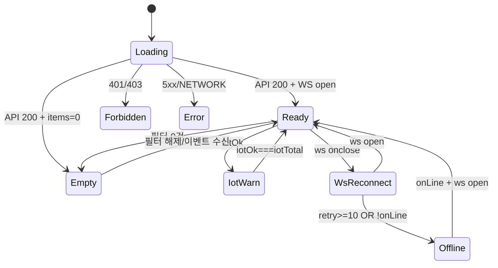

# SCR-I001 통합 출석 관리 — 기본화면 (마스터)

> 이 문서는 **화면 마스터 스펙**입니다. `01~08` 상태 문서는 이 문서를 상속(override/delta)합니다.
> 🚨 **IoT/WebSocket 핵심 화면**: 실시간 출석 스트림 + 장비 상태 배지 + 락커/체성분/HC 연계 정보를 하나의 운영 화면에 통합한다.
> 🚨 **현장 운영 화면**: `front`/`staff` 포함 8역할 모두 접근 가능하며, 역할별 액션(수동출석/퇴실/락커배정)에 차등이 있다.

---

## 0. 메타 & 원천 참조

| 항목 | 값 |
|------|----|
| 화면 ID | SCR-I001 |
| 화면명 | 통합 출석 관리 |
| 도메인 | D11-통합운영 |
| 경로 | `/attendance` |
| Next.js Route Group | `(operations)` |
| 파일 경로 | `src/app/(operations)/attendance/page.tsx` |
| 페이지 컴포넌트 | `IntegratedAttendance` |
| 역할 | superAdmin/primary ● / owner ● / manager ● / fc ● / trainer ○ / staff ● / front ● / readonly ○ |
| 우선순위 | P0 (현장 핵심 운영) |
| 플랫폼 | 데스크톱 우선 / 태블릿(프론트데스크) / 모바일 축약 |
| 멀티테넌트 | ✅ `branchId` 강제 (super/primary만 지점 전환) |
| 실시간 | ✅ WebSocket 구독 `/ws/attendance?branchId=` |

### 원천 문서 링크
| 문서 | 경로 | 섹션 |
|---|---|---|
| 화면설계서 | `docs/화면설계서/통합운영_IOT_헬스.md` | §SCR-I001 통합 출석 관리 |
| 기능명세서 | `docs/기능명세서/통합운영_IOT_헬스.md` | §1. 통합 출석 관리 |
| 상태전이도 | `docs/상태전이도.md` | §출석(AttendanceResult), §락커(ClothesLockerStatus) |
| 에러코드정의서 | `docs/에러코드정의서.md` | §4.5 출석/키오스크(400~499), §4.7 시설/락커(600~699), §공통 401/403/500/503 |
| 권한 매트릭스 R1 | `docs/다이어그램/10_권한매트릭스/R1_역할화면_매트릭스.md` | `/attendance` 전 역할 |
| 다이어그램 F1 진입 | `docs/다이어그램/D11_통합운영/SCR-I001_통합출석관리/F1_진입.md` | WebSocket 구독·KPI 병렬 로드 |
| 다이어그램 F2 메인 | `.../F2_메인.md` | 실시간 스트림 플로우 |
| 다이어그램 F3 버튼액션 | `.../F3_버튼액션.md` | 수동출석/퇴실/락커배정/엑셀 |
| 다이어그램 F4 필터검색 | `.../F4_필터검색.md` | 구분/결과/채널/락커상태 |
| 다이어그램 F5 모달트리거 | `.../F5_모달트리거.md` | DLG-I001 수동출석, DLG-I002 옷락커배정 |
| 다이어그램 F6 상태별 | `.../F6_상태별.md` | 로딩/정상/빈/권한/에러/IoT장애/WS재연결/오프라인 |
| 다이어그램 F7 권한 | `.../F7_권한.md` | 역할별 액션 분기 |
| 다이어그램 F8 에러 | `.../F8_에러.md` | API·IoT·WS 에러 트리 |
| 다이어그램 F9 토스트 | `.../F9_토스트.md` | 성공/실패/중복/재연결 메시지 |

---

## 1. 화면 목적 (Why)

- 회원과 직원의 **출석을 한 화면에서 실시간 관제**한다.
- 출석 결과에 따라 **옷 락커 배정 상태, 고정 물품 락커 보유, InBody 권장, HC 연계** 상태를 즉시 파악.
- 현장 데스크(front)는 이 화면만 보면 입장 응대가 끝나도록 **실시간 스트림 + 수동 조치 버튼**을 제공한다.
- IoT 장비 장애/WebSocket 재연결/오프라인 상황에서도 운영이 중단되지 않도록 **fallback UX**를 보장한다.

---

## 2. 화면 레이아웃 (Wireframe)

### 2.1 풀뷰 (데스크톱 1440px)

```
┌────────────────────────────────────────────────────────────────────────┐
│ AppLayout                                                               │
│ ┌Sidebar┐ ┌Main───────────────────────────────────────────────────────┐│
│ │        │ │ PageHeader                                                ││
│ │ 출석   │ │  통합 출석 관리   [지점 드롭다운▼] [WS●연결] [IoT●2/3]    ││
│ │ 회원   │ │  [수동 출석] [실패 로그] [키오스크 모니터] [엑셀] [새로고침]││
│ │ 시설   │ ├────────────────────────────────────────────────────────────┤│
│ │ ...    │ │ §A KPI 5개                                                ││
│ │        │ │ [오늘총출석 240] [회원 222] [직원 18] [락커미배정 12] [실패 3]││
│ │        │ ├────────────────────────────────────────────────────────────┤│
│ │        │ │ §B 필터 바                                                ││
│ │        │ │ [기간▼][구분▼][결과▼][채널▼][락커상태▼][검색____] [초기화] ││
│ │        │ ├────────────────────────────────────────────────────────────┤│
│ │        │ │ §C 실시간 스트림 (table)         🔴 LIVE · 마지막 갱신 09:30││
│ │        │ │ 시간 | 구분 | 이름 | 채널 | 결과 | 옷락커 | 고정락커 | 비고 | 액션│
│ │        │ │ 09:30 | 회원 | 김민준 | QR   | 성공 | 미배정 | P-12 | -    | [락커배정][퇴실]│
│ │        │ │ 09:28 | 직원 | 박서윤 | 얼굴 | 성공 | -      | -    | 출근  | [퇴근]    │
│ │        │ │ 09:27 | 회원 | 이수현 | QR   | 실패 | -      | -    |만료  | [상세]    │
│ │        │ │ ...                                                       ││
│ │        │ └────────────────────────────────────────────────────────────┘│
│ └────────┘                                                              │
└────────────────────────────────────────────────────────────────────────┘
```

### 2.2 영역 그리드/치수

| 영역 | 그리드/치수 | 비고 |
|---|---|---|
| PageHeader | `flex items-center justify-between px-6 py-4` | 지점드롭다운+IoT/WS 배지 우측 정렬 |
| §A KPI | `grid grid-cols-2 md:grid-cols-3 lg:grid-cols-5 gap-4` | 5개 StatCard |
| §B 필터 | `flex flex-wrap gap-2 items-center` 높이 56px | Chip 스타일 필터 |
| §C 스트림 테이블 | `w-full overflow-x-auto` 헤더 sticky | 행 높이 48px, 호버 `bg-gray-50` |

---

## 3. 디자인 토큰

### 3.1 색상
| 역할 | 클래스 | 용도 |
|---|---|---|
| bg.page | `bg-gray-50` | 배경 |
| card | `bg-white rounded-xl shadow-sm ring-1 ring-gray-100 p-5` | KPI/테이블 컨테이너 |
| stream.live.dot | `bg-red-500 animate-pulse size-2 rounded-full` | LIVE 인디케이터 |
| row.success | `bg-white hover:bg-emerald-50/30` | 출석 성공 |
| row.failed | `bg-rose-50/50 hover:bg-rose-50` | 출석 실패 |
| row.duplicate | `bg-amber-50/40` | 중복 |
| row.checked_out | `bg-slate-50 text-slate-500` | 퇴실 |
| row.new (WS 수신) | `bg-blue-50 animate-[flash_1.5s_ease-out]` | 신규 이벤트 플래시 |
| badge.ws.on | `bg-emerald-100 text-emerald-700` (● 연결) | WebSocket 상태 |
| badge.ws.reconnect | `bg-amber-100 text-amber-800 animate-pulse` | 재연결 중 |
| badge.ws.off | `bg-rose-100 text-rose-700` | 끊김 |
| badge.iot.ok | `bg-emerald-100 text-emerald-700` | IoT 전 장비 온라인 |
| badge.iot.warn | `bg-amber-100 text-amber-800` | 일부 오류 |
| badge.iot.err | `bg-rose-100 text-rose-700` | 전체 오프라인 |
| badge.locker.none | `bg-slate-100 text-slate-600` | 대상 아님(`not_applicable`) |
| badge.locker.unassigned | `bg-amber-100 text-amber-800` | 미배정 |
| badge.locker.manual | `bg-blue-100 text-blue-800` | 수동 배정 |
| badge.locker.auto | `bg-emerald-100 text-emerald-800` | 자동 배정 |
| badge.channel.qr | `bg-sky-100 text-sky-700` | QR(앱/키오스크) |
| badge.channel.face | `bg-violet-100 text-violet-700` | 얼굴인식 |
| badge.channel.manual | `bg-slate-100 text-slate-700` | 수동 |
| badge.fail.auth | `bg-rose-100 text-rose-700` | 인증 실패 |
| badge.fail.policy | `bg-amber-100 text-amber-800` | 정책 거절 |

### 3.2 타이포그래피
| 토큰 | 스타일 |
|---|---|
| page.title | `text-2xl font-bold tracking-tight text-gray-900` |
| page.meta | `text-xs text-gray-500` (마지막 갱신) |
| kpi.label | `text-xs uppercase tracking-wide font-medium text-gray-500` |
| kpi.value | `text-3xl font-bold tabular-nums text-gray-900` |
| table.header | `text-xs uppercase text-gray-500 font-medium` |
| table.cell | `text-sm text-gray-900 tabular-nums` |
| badge | `text-xs font-medium px-2 py-0.5 rounded-full` |

### 3.3 간격/반경/모션
- 카드 radius: `rounded-xl`, 테이블 radius: `rounded-xl overflow-hidden`
- 섹션 gap: `space-y-4`
- 신규 행 플래시: `@keyframes flash { 0%{bg-blue-100} 100%{bg-transparent} }`, 1.5s
- WS 재연결 점등: `animate-pulse`
- `prefers-reduced-motion` 시 플래시/펄스 제거

---

## 4. 반응형 규칙

| BP | §A KPI | §B 필터 | §C 테이블 |
|---|---|---|---|
| Mobile <640 | 2열 | 스크롤 가로 | 카드 리스트 변환 (시간/이름/결과/락커만) |
| Tablet 640~1024 | 3열 | 1행 | 주요 컬럼 7개 |
| Desktop ≥1024 | 5열 | 1행 | 전체 9컬럼 |
| XL ≥1440 | 5열 | 1행 | 전체 + 상세 플라이아웃 |

---

## 5. 🔐 역할별(RBAC) 매트릭스 — 핵심

> `●` = 표시+실행, `○` = 표시만, `—` = 미표시. 서버는 jwt 기반으로 강제.

| 요소 | super/primary | owner | manager | fc | trainer | staff | front | readonly |
|---|:---:|:---:|:---:|:---:|:---:|:---:|:---:|:---:|
| 페이지 접근 | ● | ● | ● | ● | ○(축약) | ● | ●(기본화면) | ○ |
| 지점 전환 드롭다운 | ● | ●(브랜드) | — | — | — | — | — | — |
| §A KPI 전부 | ● | ● | ● | ● | ○(본인담당) | ● | ● | ○ |
| §B 필터 전체 | ● | ● | ● | ● | ●(본인담당) | ● | ● | ○ |
| 스트림 테이블 표시 | ● | ● | ● | ● | ●(담당 회원) | ● | ● | ○ |
| [수동 출석] 버튼 | ● | ● | ● | ● | — | ● | ● | — |
| [퇴실 처리] | ● | ● | ● | ● | — | ● | ● | — |
| [락커 배정] | ● | ● | ● | ● | — | ● | ● | — |
| [실패 로그] 필터 | ● | ● | ● | ● | — | ○ | ○ | ○ |
| [키오스크 모니터] | ● | ● | ● | — | — | ○ | ● | — |
| [엑셀 다운로드] | ● | ● | ● | ○ | — | — | — | — |
| 직원 출석 표시 | ● | ● | ● | ○ | ○(본인) | ○ | ○ | ○ |
| 회원 상세 이동(행) | ● | ● | ● | ● | ●(담당) | ○ | ○(toast) | — |
| WebSocket 구독 | ● | ● | ● | ● | ● | ● | ● | ● |
| IoT 장애 배지 | ● | ● | ● | ● | ○ | ● | ● | ○ |

> `front`(프론트데스크)는 `iPad` 기본 거치 가정 → 수동 출석/퇴실/락커 배정 버튼이 **가장 크게** 노출되도록 본 화면의 주 CTA.
> `trainer` 옵션: 로그인 직후 `/calendar`로 리다이렉트가 기본이고, 본 화면 진입 시 "내 담당 회원" 자동 필터.

---

## 6. 컴포넌트 트리

```
<AppLayout role={user.role}>
  <IntegratedAttendance branchId={branchId}>
    <PageHeader title="통합 출석 관리" subtitle={`마지막 갱신: ${formatKST(updatedAt,'HH:mm:ss')}`}>
      {canSwitchBranch(role) && <BranchSwitcher value={branchId} onChange={switchBranch} />}
      <WsStatusBadge status={wsStatus} retryAt={wsRetryAt} />
      <IotStatusBadge ok={iotOk} total={iotTotal} href="/settings/iot" />
      <div className="flex gap-2">
        {can('manual') && <Button onClick={() => openDialog('DLG-I001')}>수동 출석</Button>}
        <Button variant="outline" onClick={() => setFilterFailed(true)}>실패 로그</Button>
        {can('kiosk-monitor') && <Button variant="outline" onClick={openKioskMonitor}>키오스크 모니터</Button>}
        {can('excel') && <Button variant="outline" onClick={exportExcel}>엑셀</Button>}
        <RefreshButton onClick={refetchAll} loading={isRefetching} />
      </div>
    </PageHeader>

    <section aria-label="주요 지표" className="grid grid-cols-2 md:grid-cols-3 lg:grid-cols-5 gap-4">
      <StatCard label="오늘 총 출석" value={stats.total} unit="건" variant="mint" />
      <StatCard label="회원 출석"    value={stats.member} unit="건" />
      <StatCard label="직원 출석"    value={stats.staff}  unit="건" />
      <StatCard label="락커 미배정"  value={stats.unassigned} unit="건"
                variant="amber" onClick={() => setFilterLocker('unassigned')} />
      <StatCard label="실패 로그"    value={stats.failed} unit="건"
                variant="rose"  onClick={() => setFilterResult('failed')} />
    </section>

    <FilterBar>
      <DateRangePicker value={range} onChange={setRange} />
      <Select label="구분" options={ACTOR_OPTS} value={actor} onChange={setActor} />
      <Select label="결과" options={RESULT_OPTS} value={result} onChange={setResult} />
      <Select label="채널" options={CHANNEL_OPTS} value={channel} onChange={setChannel} />
      <Select label="락커" options={LOCKER_OPTS} value={locker} onChange={setLocker} />
      <SearchInput placeholder="이름/연락처/회원번호/사번" value={q} onChange={setQ} />
      <Button variant="ghost" onClick={reset}>초기화</Button>
    </FilterBar>

    <AttendanceStreamTable
      rows={rows}
      columns={COLUMNS}
      onRowClick={(r) => can('memberDetail') && moveToPage('/members/detail', { id: r.actorId })}
      rowActions={(r) => renderActions(r, role)}
      liveFlashIds={newIds}
    />
  </IntegratedAttendance>
</AppLayout>
```

### 핵심 컴포넌트
| 컴포넌트 | 파일 | 핵심 Props |
|---|---|---|
| `WsStatusBadge` | `src/components/operations/WsStatusBadge.tsx` | `{status:'open'\|'reconnecting'\|'closed', retryAt?}` |
| `IotStatusBadge` | `src/components/operations/IotStatusBadge.tsx` | `{ok:number,total:number,href}` |
| `AttendanceStreamTable` | `src/components/attendance/AttendanceStreamTable.tsx` | `{rows,columns,onRowClick,rowActions,liveFlashIds}` |
| `LockerStatusBadge` | `src/components/attendance/LockerStatusBadge.tsx` | `{status:LockerAssignmentStatus, number?:string}` |
| `ChannelBadge` | `src/components/attendance/ChannelBadge.tsx` | `{channel:AttendanceChannel}` |
| `ResultBadge` | `src/components/attendance/ResultBadge.tsx` | `{result:AttendanceResult, failReason?}` |
| `FailReasonChip` | `src/components/attendance/FailReasonChip.tsx` | `{reason, tone:'auth'\|'policy'}` |
| `useReconnectingWebSocket` | `src/hooks/useReconnectingWebSocket.ts` | URL+exponential backoff (1s→2s→4s→8s, max 30s, maxRetries=10) |
| `useAttendanceStream` | `src/hooks/useAttendanceStream.ts` | 무한스크롤 + WS merge + dedupe |

---

## 7. 데이터 계약

### 7.1 TypeScript 타입 (from 기능명세서 §1.C)
```ts
export type AttendanceChannel = 'app_qr' | 'kiosk_qr' | 'face_recognition' | 'manual';
export type AttendanceActorType = 'member' | 'staff' | 'guest';
export type LockerAssignmentStatus = 'not_applicable' | 'unassigned' | 'manual_assigned' | 'auto_assigned';
export type AttendanceResult = 'success' | 'failed' | 'duplicate' | 'checked_out';

export interface AttendanceStreamRecord {
  id: number;
  actorType: AttendanceActorType;
  actorId: number;
  actorName: string;
  channel: AttendanceChannel;
  result: AttendanceResult;
  failReason?: string | null;
  lockerAssignmentStatus: LockerAssignmentStatus;
  lockerNumber?: string | null;
  fixedLockerNumber?: string | null;
  checkedInAt: string;
  checkedOutAt?: string | null;
  branchId: number;
}

export interface AttendanceKpi {
  total: number; member: number; staff: number;
  unassigned: number; failed: number;
}

export interface AttendanceFilter {
  range: [string, string];
  actor?: AttendanceActorType | 'all';
  result?: AttendanceResult | 'all';
  channel?: AttendanceChannel | 'all';
  locker?: LockerAssignmentStatus | 'all';
  q?: string;
  page?: number; pageSize?: number;
}
```

### 7.2 API 엔드포인트
| 엔드포인트 | 메서드 | 파라미터/바디 | 반환 |
|---|---|---|---|
| `GET /attendance` | GET | `AttendanceFilter + branchId` | `{ items: AttendanceStreamRecord[], total, page }` |
| `GET /attendance/stats` | GET | `{branchId, date=today}` | `AttendanceKpi` |
| `POST /attendance` | POST | `{actorType, actorId, channel, branchId, ...}` | 생성 레코드 |
| `POST /attendance/{id}/check-out` | POST | — | `AttendanceStreamRecord` |
| `POST /staff-attendance/{id}/check-out` | POST | — | 직원 퇴근 |
| `GET /iot/health` | GET | `{branchId}` | `{ok:number,total:number,devices:{id,status}[]}` |
| `WS /ws/attendance?branchId=` | WS | subprotocol `attendance.v1` | `{type:'event',record}` / `{type:'heartbeat'}` |

### 7.3 상태 관리
- **Store**: `useAuthStore`(user/role/branchId), `useBranchStore`
- **Server state**: React Query
  - `['attendance','list',filter]` staleTime `30_000`, keepPreviousData true
  - `['attendance','stats',branchId,date]` staleTime `30_000`, polling `60_000`
  - `['iot','health',branchId]` polling `30_000`
- **Realtime**: `useReconnectingWebSocket(`/ws/attendance?branchId=${branchId}`)`
  - event `attendance.checked_in` → 리스트에 unshift + 신규 id를 `newIds` Set에 1.5초 추가
  - heartbeat 20s 미수신 → 재연결
  - onclose(4401) → /login 리다이렉트

### 7.4 멀티테넌트 branchId 규칙
1. URL `?branch=<id>`이 있고 접근 가능하면 최우선
2. `useBranchStore.current`
3. `user.branchId` (단일 지점 역할)
4. super/primary는 최초 진입 시 "지점 선택" 안내 배너 + 기본 지점 제안

---

## 8. 비즈니스 룰

1. **출석 후 처리 정책**(지점 설정 `postCheckInPolicy`)에 따라 결과 메시지와 `lockerAssignmentStatus` 초기값이 달라진다.
   - `attendance_only` → `not_applicable`
   - `manual_locker_assignment` → `unassigned`
   - `auto_locker_assignment` → `auto_assigned` (실패 시 `unassigned`, 감사 로그 기록)
2. **직원 출석 허용**(`allowStaffCheckIn`=false) 지점은 직원 QR/얼굴인식 시도 시 `E403401` 정책 거절.
3. **중복 출석 방지 시간**(`duplicatePreventionMinutes`): 해당 시간 내 재시도는 `duplicate` 저장. 키오스크에는 "중복 시도" 메시지.
4. **고정 물품 락커**는 안내 정보일 뿐 출석 허용/거절에 영향 없음.
5. **실패 사유 구분**: `fail_auth`(미등록/인증실패) vs `fail_policy`(만료/영업시간/정지). 테이블에서 다른 badge 톤으로 표시.
6. **실시간 플래시**: WS 수신 시 해당 행 1.5초 `bg-blue-50` → fade out.
7. **자동 KPI 갱신**: WS event 수신 시 낙관적 증분(type별), 30초 polling으로 server 값과 reconcile.
8. **오프라인 모드**(`navigator.onLine=false`): 스트림 테이블은 마지막 캐시 표시, "오프라인(XX분 경과) — 복구 시 재동기화" 배너. WS 재연결 시도 중단.
9. **WS 재연결**: exponential backoff 1→2→4→8→16→30s, 최대 10회. 실패 시 `08-오프라인` 상태로 전환, 수동 재시도 버튼.
10. **IoT 장애**(`iotOk < iotTotal`): 헤더 배지 amber, 장비 오류 시 테이블 상단 `⚠ InBody 장비 오류 · 체성분 수집 일시 중단` 배너.
11. **front 역할 특별 UX**: 스트림 테이블 기본 정렬은 `checkedInAt DESC`, 최근 10분 내 건을 상단 고정.
12. **감사 로그**: 수동 출석/퇴실/락커 배정 모두 `AUDIT.ATTENDANCE_*` 기록.

---

## 9. 상태 목록

| 파일 | 상태 코드 | 한글 | 트리거 |
|---|---|---|---|
| `01-로딩.md` | `att-loading` | 로딩(스켈레톤) | 첫 진입, API pending |
| `02-정상-데이터있음.md` | `att-ready` | 정상·데이터 있음 | 데이터 수신 + WS open |
| `03-빈상태.md` | `att-empty` | 빈상태 | 필터 결과 0건 / 오늘 첫 출석 전 |
| `04-권한없음.md` | `att-forbidden` | 권한없음 | 401/403, readonly 일부 액션 |
| `05-에러.md` | `att-error` | 에러 | API 5xx/네트워크 실패 |
| `06-IoT장애.md` | `att-iot-warn` | IoT 장애 | `GET /iot/health` ok<total |
| `07-WebSocket재연결.md` | `att-ws-reconnect` | WS 재연결 | WS onclose → backoff 중 |
| `08-오프라인.md` | `att-offline` | 오프라인 | `navigator.onLine=false` 또는 WS 10회 실패 |

상태 전이: `docs/다이어그램/D11_통합운영/SCR-I001_통합출석관리/F6_상태별.md`

---

## 10. 에러 코드 매핑

| errorCode | HTTP | 시나리오 | 표시 | 대응 |
|---|---|---|---|---|
| E401002 | 401 | 세션 만료 | 전역 세션만료 DLG-000 → `/login` | 자동 |
| E403001 | 403 | 권한 없음 | `04-권한없음` | 가드 |
| E403003 | 403 | 지점 접근 제한 | toast + `/forbidden` | 리다이렉트 |
| E403400 | 403 | 재입장 제한(중복) | 결과 = `duplicate`, row amber | 테이블 표시 |
| E403401 | 403 | 영업시간 외 | `fail_policy` badge | 인라인 |
| E404400 | 404 | 미등록 출석번호 | `fail_auth` badge | 인라인 |
| E422400 | 422 | 이용권 없음/만료 | `fail_policy` badge + 회원상세 CTA | 인라인 |
| E422401 | 422 | 정지 회원 출석 | `fail_policy` badge | 인라인 |
| E409600 | 409 | 락커 중복 배정 | DLG-I002 내 토스트 | DLG 측에서 처리 |
| E500001 | 500 | 서버 오류 | `05-에러` 배너 + 재시도 | 배너 |
| E503001 | 503 | 외부 서비스 장애 | `05-에러` warn 톤 | 배너 |
| NETWORK | — | 네트워크/WS 전체 장애 | `08-오프라인` | 캐시 fallback |
| WS_CLOSE_4401 | — | WS 인증 만료 | 로그아웃 후 `/login` | 강제 로그아웃 |

---

## 11. 접근성 (WCAG 2.1 AA)
- `<main>` + 섹션별 `aria-label`
- 스트림 테이블: `<table role="table">` + 헤더 `scope="col"`, caption `sr-only`
- WS/IoT 배지: `role="status" aria-live="polite"`, 상태 변경 시 SR 공지 (예 "실시간 연결이 재연결 중입니다")
- 신규 행 플래시는 시각+SR 모두 포커스하지 않음 (공지 X, 리스트 안내 X) — 대신 상단 "최근 1분 NN건 신규" `aria-live="polite"`
- 새로고침 버튼: 60초 쿨다운 카운트다운 `aria-live`
- 필터 변경 즉시 반영: `aria-busy` 로 로딩 공지
- Tab 순서: 헤더 액션 → 필터 → 테이블 행
- `prefers-reduced-motion` 시 플래시/펄스 제거

---

## 12. 진입/이탈 연결

### 진입
- 사이드바 "출석 관리" 클릭
- 로그인 후 `front` 역할 자동 리다이렉트 (`/attendance`)
- 대시보드 KPI "오늘 출석" 카드 클릭
- DLG-I001 수동출석 저장 성공 후 리턴

### 이탈
| 액션 | 목적지 |
|---|---|
| 스트림 행 클릭 | `/members/detail?id={actorId}` (회원) / staff 상세 (직원) |
| [수동 출석] | DLG-I001 열림 |
| [락커 배정] | DLG-I002 열림 |
| [키오스크 모니터] | DLG 또는 `/settings/kiosk?tab=monitor` |
| [실패 로그] | 쿼리 유지 + `result=failed` 필터 적용 |
| IoT 배지 클릭 | `/settings/iot` (SCR-I003) |
| 회원/직원 이름 | 각 상세 페이지 |

---

## 13. 다이어그램 통합 뷰



---

## 14. 🧩 바이브코딩 프롬프트 (마스터)

```
Next.js 15 App Router + TypeScript + Tailwind + React Query + Supabase + Zustand 기반
'use client' 컴포넌트를 작성하라.

━━ 화면: SCR-I001 통합 출석 관리 (실시간/IoT/멀티테넌트/8역할) ━━
파일: src/app/(operations)/attendance/page.tsx
보조:
- src/components/attendance/{AttendanceStreamTable, LockerStatusBadge, ChannelBadge, ResultBadge, FailReasonChip}.tsx
- src/components/operations/{WsStatusBadge, IotStatusBadge}.tsx
- src/components/common/{StatCard, RefreshButton, FilterBar}.tsx
- src/hooks/{useReconnectingWebSocket, useAttendanceStream, useIotHealth}.ts
- src/lib/role-access.ts (canAttendanceAction)
- src/schemas/attendance.ts (zod)

━━ 레이아웃 ━━
<main className="min-h-screen bg-gray-50">
  <AppLayout role={user.role}>
    <div className="p-6 lg:p-8 space-y-4">
      <header className="flex flex-wrap items-center justify-between gap-3">
        <div>
          <h1 className="text-2xl font-bold tracking-tight text-gray-900">통합 출석 관리</h1>
          <p className="text-xs text-gray-500">마지막 갱신: {formatKST(updatedAt,'HH:mm:ss')}</p>
        </div>
        <div className="flex items-center gap-2">
          {canSwitchBranch(role) && <BranchSwitcher value={branchId} onChange={switchBranch} />}
          <WsStatusBadge status={wsStatus} retryAt={wsRetryAt} />
          <IotStatusBadge ok={iot.ok} total={iot.total} href="/settings/iot" />
          {can('manual',role) && <Button onClick={()=>openDialog('DLG-I001')}>수동 출석</Button>}
          <Button variant="outline" onClick={()=>setFilterResult('failed')}>실패 로그</Button>
          {can('kiosk',role) && <Button variant="outline" onClick={openKiosk}>키오스크 모니터</Button>}
          {can('excel',role) && <Button variant="outline" onClick={exportExcel}>엑셀</Button>}
          <RefreshButton onClick={refetchAll} loading={isRefetching} disabled={cooldown>0} />
        </div>
      </header>

      <section aria-label="주요 지표" className="grid grid-cols-2 md:grid-cols-3 lg:grid-cols-5 gap-4">
        <StatCard label="오늘 총 출석" value={stats.total}      unit="건" variant="mint" />
        <StatCard label="회원 출석"     value={stats.member}     unit="건" />
        <StatCard label="직원 출석"     value={stats.staff}      unit="건" />
        <StatCard label="락커 미배정"   value={stats.unassigned} unit="건" variant="amber"
                  onClick={()=>setFilterLocker('unassigned')} />
        <StatCard label="실패 로그"     value={stats.failed}     unit="건" variant="rose"
                  onClick={()=>setFilterResult('failed')} />
      </section>

      <FilterBar>
        <DateRangePicker value={range} onChange={setRange} />
        <Select label="구분" options={ACTOR_OPTS}   value={actor}   onChange={setActor} />
        <Select label="결과" options={RESULT_OPTS}  value={result}  onChange={setResult} />
        <Select label="채널" options={CHANNEL_OPTS} value={channel} onChange={setChannel} />
        <Select label="락커" options={LOCKER_OPTS}  value={locker}  onChange={setLocker} />
        <SearchInput placeholder="이름/연락처/회원번호/사번" value={q} onChange={setQ} />
        <Button variant="ghost" onClick={reset}>초기화</Button>
      </FilterBar>

      <AttendanceStreamTable
        rows={rows}
        columns={COLUMNS}
        rowActions={(r)=>renderActions(r, role)}
        onRowClick={(r)=> can('memberDetail',role) ? moveToPage('/members/detail',{id:r.actorId}) : toast('읽기 전용')}
        liveFlashIds={newIds} />
    </div>
  </AppLayout>
</main>

━━ 디자인 토큰 (정확히) ━━
bg.page: bg-gray-50
card: bg-white rounded-xl shadow-sm ring-1 ring-gray-100 p-5
kpi.label: text-xs uppercase tracking-wide font-medium text-gray-500
kpi.value: text-3xl font-bold tabular-nums text-gray-900
table.header: text-xs uppercase text-gray-500 font-medium bg-gray-50
row.success: hover:bg-emerald-50/30
row.failed:  bg-rose-50/50 hover:bg-rose-50
row.duplicate: bg-amber-50/40
row.checked_out: bg-slate-50 text-slate-500
row.new: bg-blue-50 animate-[flash_1.5s_ease-out]
badge.ws.on: bg-emerald-100 text-emerald-700
badge.ws.reconnect: bg-amber-100 text-amber-800 animate-pulse
badge.ws.off: bg-rose-100 text-rose-700
badge.iot.ok: bg-emerald-100 text-emerald-700
badge.iot.warn: bg-amber-100 text-amber-800
badge.iot.err: bg-rose-100 text-rose-700
badge.channel.qr: bg-sky-100 text-sky-700
badge.channel.face: bg-violet-100 text-violet-700
badge.channel.manual: bg-slate-100 text-slate-700
badge.locker.unassigned: bg-amber-100 text-amber-800
badge.locker.manual: bg-blue-100 text-blue-800
badge.locker.auto: bg-emerald-100 text-emerald-800
badge.locker.none: bg-slate-100 text-slate-600
badge.fail.auth: bg-rose-100 text-rose-700
badge.fail.policy: bg-amber-100 text-amber-800

━━ 데이터 훅 ━━
useAttendanceStream(filter, branchId) → {
  rows, stats, total, page, setPage, isLoading, isFetching, isRefetching,
  refetchAll, newIds, errors
}
- React Query useQueries: ['attendance','list',filter,branchId], ['attendance','stats',branchId,today]
- staleTime 30_000, keepPreviousData true, polling stats 60_000
- WS merge: useReconnectingWebSocket(`/ws/attendance?branchId=${branchId}`)
  - onMessage(type==='event') → queryClient.setQueryData(['attendance','list',...], prev => [evt, ...prev].slice(0,200))
  - setNewIds(prev => new Set([...prev, evt.id])), setTimeout(()=>removeFromNewIds, 1500)
- stats 낙관적 증분: event type별 + result별 mutate
- reconnect backoff: [1000,2000,4000,8000,16000,30000], maxRetries=10, 4401→logout

useReconnectingWebSocket(url) → { status:'open'|'connecting'|'reconnecting'|'closed', send, retryAt, retryCount }
useIotHealth(branchId) → { ok, total, devices, isError }

━━ 인터랙션 ━━
- 행 클릭: canMemberDetail ? push(/members/detail?id) : toast('읽기 전용')
- [락커 배정]: openDialog('DLG-I002', { attendanceId, memberId })
- [퇴실]: mutateCheckOut(id) → toast '퇴실 처리되었습니다'
- 필터 변경: debounce 200ms로 refetch, URL ?filter= 반영(shareable)
- WS 재연결 → WsStatusBadge 플래시, 복구 시 toast '실시간 연결이 복구되었습니다'
- IoT 오류 → 상단 배너 amber '⚠ {deviceName} {errorReason} · 체성분 수집 일시 중단' + [IoT 설정 바로가기]
- 오프라인 감지: window.addEventListener('online'/'offline') → setState

━━ 접근성 ━━
- section aria-label 필수
- 테이블 caption sr-only "오늘의 출석 스트림"
- WS/IoT 배지 role="status" aria-live="polite"
- 플래시 행은 공지하지 않음
- 새로고침 쿨다운 `aria-live="polite"` "30초 후 다시 시도"
- reduced-motion: 플래시/펄스 제거

━━ 반응형 ━━
모바일: KPI 2열, 테이블 → 카드 리스트로 자동 변환 (ResultBadge+LockerBadge+시간만)
태블릿: KPI 3열, 필터 1행(스크롤), 테이블 7컬럼
데스크톱: KPI 5열, 테이블 9컬럼

━━ 에러/오프라인 ━━
- API 5xx → 상단 에러 배너 + 재시도
- 401/403 → 04-권한없음 또는 SCR-106 리다이렉트
- WS onclose(4401) → logout
- navigator.onLine=false → 08-오프라인 전환

━━ 유틸 ━━
import { useForm } from 'react-hook-form'
import { zodResolver } from '@hookform/resolvers/zod'
import { useAuthStore } from '@/stores/authStore'
import { useBranchStore } from '@/stores/branchStore'
import { moveToPage } from '@/internal'
import { Wifi, WifiOff, Zap, Download, UserPlus, LogOut, RefreshCw } from 'lucide-react'
```

---

## 15. QA 체크리스트 (수용 기준)

- [ ] 로그인 후 `front` 자동 `/attendance` 리다이렉트
- [ ] super/primary만 지점 전환 드롭다운 노출
- [ ] KPI 5개 정확한 값(오늘 날짜 기준) 표시
- [ ] 필터 변경 시 URL ?filter= 갱신
- [ ] WebSocket 수신 시 스트림 최상단 삽입 + 1.5초 플래시
- [ ] WS onclose → 재연결 배지 + backoff 동작(1→2→4→8…)
- [ ] 재연결 10회 실패 시 08-오프라인 전환
- [ ] IoT 장비 오류 시 amber 배너 + 배지 색 변경
- [ ] readonly 역할은 행 클릭 시 toast, 액션 버튼 없음
- [ ] staff/front 는 직원 출석도 표시되지만 퇴실 처리는 본인 지점만
- [ ] 중복 출석(`duplicate`)은 amber 톤으로 구분 표시
- [ ] `fail_auth` / `fail_policy` 사유 다른 badge로 표시
- [ ] 엑셀 다운로드는 현재 필터 결과만 내려받음
- [ ] reduced-motion 시 플래시 애니메이션 제거
- [ ] 접근성: 테이블 헤더 scope, 배지 role=status, SR 공지
- [ ] 서버 스코프 강제(branchId 조작 차단) 검증
